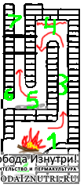
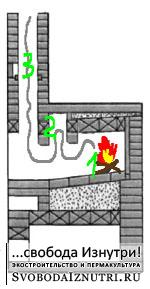
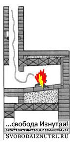

В [прошлый раз](http://svobodaiznutri.ru/?p=30) была теория про пассивные дома и водяное отопление. Сегодня про печное.

Про печное отопление написано очень много. Что неудивительно, ведь это самый древний способ отопления жилища. Огонь вообще занимает особое место в мифологии всех без исключения народов. Как нас уверяют историки, он служил не только для обогрева, но и для защиты от хищников и приготовления пищи. Да и вообще в огне есть что-то магическое. Недаром ведь говорят, что на него можно смотреть безконечно.

Печи бывают разные. По всему миру у разных народов их видов такое великое множество, что глаза разбегаются. И у каждой свои условия эксплуатации, характеристики и задачи. Свои плюсы и минусы. Попробуем среди них найти идеальную, ну или хотя бы максимально близкую к идеалу.

Но начать нужно с азов.

Нам более всего знакомы те печи, которые ныне встречаются в старых деревянных домах. Многие считают это "русской печкой", хотя это не так. То, что сейчас распространено повсеместно правильнее называть голландскими печами. Насколько мне известно, к внедрению этой технологии на Руси приложил руку Петр I. Давайте посмотрим как такая печка работает.

**Голландка**

Возьмём самую простую в три колодца.

В топочной камере горит огонь (1). Пепел от сгоревших дров падает через колосниковую решётку вниз, в зольник (2). В зольнике предусмотрена дверца для прочистки, она же поддувало, регулирующее количество поступающего к огню воздуха.

Дым поднимается вверх по первому колодцу (3). Поднявшись в его вершину (4), он поворачивает и идёт вниз по второму колодцу. Потом опять поворачивает вверх и уходит в третий колпак, а потом и трубу (7). В основании второго и третьего колодцев (5) скапливается пепел и сажа. Для их удаления предусмотрена соответствующая дверца (6).

По ходу путешествия дым отдаёт часть своего тепла стенкам печи. Печь греет помещение. Профит.

Такая система имеет ряд недостатков. Во-первых, необходимо очень хорошо прогреть трубу (7), чтобы была тяга. Ведь дым приходится спускать вниз. А он горячий и сопротивляется. Помните физику? Горячее стремится подняться вверх.

Во-вторых, необходимо следить за печью, чтобы не пропустить момент когда дрова прогорят. Если этот момент упустить, то печь начнёт пропускать через себя воздух из помещения, тем самым охлаждая и помещение, и печь. Конечно, упускать момент окончания топки нежелательно в любой печи, но голландки к этому чувствительны особенно.

**Русская печь**

На такой печи готовили. Для этого глиняный горшок с приготавливаемым блюдом ставили у выхода топливной камеры, прямо под трубой.

Существует разновидность русской печи с колпаком. На рисунке справа видно как продукты сгорания дров из топочной камеры (1) прежде чем попасть в трубу (3), задерживаются в колпаке (2).

Я этот колпак изобразил схематично. На самом деле иногда они имели внушительные размеры, зачастую даже больше топливной камеры.

Идея колпака оказалась очень удачной и получила развитие в ХХ веке.

[Читать далее.](http://svobodaiznutri.ru/?p=28)
