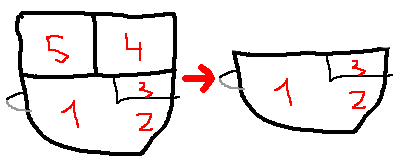

Если помните, [закончили](http://svobodaiznutri.ru/?p=25) мы на том, что поставили палатку и выкосили поляну под дом и тропинки. И без ответа был лишь вопрос о доставке стройматериала.

Как я сказал, я уже был убеждён в том, что нужно прокладывать дорогу по верху холма. Сначала посмотрели фотки со спутника и увидели дорогу недалеко от нашего участка. Чтобы определить как далеко это "недалеко", мы провели пешую разведку по джунглям и нашли неплохую просёлочную дорогу в 200 метрах к северо-востоку.

Но надо было ещё и проложить тракт от неё к нашему участку, а как это сделать мы пока не имели представления. Рассчитывали на свои силы и думали, что займёмся этим вручную...

**Весёлая логистика**

Думал я так: траспорт привозит стройматериал на вершину нашего холма, а потом я по подготовленной тропинке буду таскать груз частями до места стройки. И всё вроде бы ничего, но от места предполагаемой разгрузки транспорта до места стройки метров 50. С одной стороны хорошо, что сверху вниз. С другой — примерно 10 метров из 50 угол наклона составляет около 40 градусов. Остальные 40 метров — от 20 до 30 градусов. Плюс, тропинка проходит через окоп, через который предполагалось сделать небольшой мостик.

Про окоп. Вообще, вся территория в нескольких километрах вокруг нас изрыта окопами для личного состава и "копаньерами" — огневыми точками для тяжёлой техники. Как я понимаю, копалось это всё ещё во времена Советского Союза на случай тёрок с Китаем. Напомню, наш регион — Амурская область. Наш участок земли примерно в 30 километрах от границы с Китаем.

Но от геополитики перейдём назад к политике семейной. Конкретнее, к обеспечению отдельно взятой ячейки общества тропинкой для доставки стройматериала...

**Оптимизация**

 

Короче, я понимал что будет тяжело. Но выбранное место под дом нравилось и мы были уверены в своих силах. И предприняли отптимизацию проекта дома.

Предпоследний наш проект представлял из себя квадратную северную часть и полукруглую южную часть, практически полностью состоящую из окон. На рисунке слева мы видим прихожую-гостинную (1), кухню (2), санузел (3), спальню (4) и мастерскую (5). Мастерскую сначала планировалось использовать по назначению, потом как кабинет, и по мере необходимости она превратилась бы в детскую.

Мы рассудили так: лучше построить небольшой дом и уже зимовать в нём, чем недостроить и зимовать неизвестно где. Поэтому решили уменьшить строительный объём в два раза. И строить в этом сезоне лишь гостинную с кухней и санузлом. Думали, годик-другой будем ютиться в том, что построим, а потом уже пристроим комнаты 4 и 5.

**Про отлёженные бока**

Идея была утверждена. Но возникло одно важное обстоятельсво. Жить в палатке для меня было привычно. В общем, и жене было нормально. Первую неделю.

Потом... Короче, мы поняли, что не создав минимального комфорта, мы растранжирим много сил и нервов друг на друга, и будем делать это с энтузиазмом, достойным лучшего применения. И в неравном бою жена убедила меня, что нужно построить что-то типа беседки.

Причины. У соседей, которые тоже строились у себя на земле, была "палуба", на которой стояла огромная двухкомнатная армейская палатка. Когда шёл дождь, мы либо сидели у них, в комфорте и тепле (и даже с ноутбуком), либо находились в своей, обычной туристической палатке. Чаще всего в положении лёжа. И лежание доходило до того, что у нас начинали болеть спины, почки и прочие части тела.

Плюс к тому же лето 2013 года было очень дождливым. Настолько, что этим летом случилось одно из крупнейших наводнений в Амурской области за не знаю сколько лет. От него пострадали все города, стоящие на берегу Амура, в том числе наш родной Благовещенск и Хабаровск. Так что отлёживать части тела приходилось довольно часто. Поэтому было принято решение построить такую же палубу, как у соседей, только с крышей.

**Дорога**. **Трактор!**

И произошло то, что можно считать нулевым этапом стройки — мы купили доски! Точнее, горбыль. Горбыль потому, что за 200 досок горбыля мы заплатили всего 3000 рублей! Привезти доски из города помог мой отец, у которого был рабочий грузовик.

Но довёз он их только до деревни. Ибо, во-первых, у нас ещё не была проложена дорога от найдённого на северо-востоке просёлка до нашего участка. Там по прежнему были джунгли. Во-вторых, грузовик всё равно не смог бы подняться (там в одном месте на просёлке есть довольно крутой подъём с грязью). И мы пошли искать тракториста. Деревня жеж!

И нашли его довольно быстро. Причём даже двоих, так что была возможность выбрать. И так получилось, что мы наняли **Константина**. Это тот человек, без которого мы не смогли бы построить дом, и на страницах этого блога мы с женой хотим выразить ему огромную благодарность. Во всеуслышание. **От души благодарим!**

Константин со своим 25-сильным тракторишкой советского производства демонстрировал такие чудеса проходимости, которые и не снились 300-сильным джиппам. Вот уж зверь-машина! И чудо-водитель! Увидев такое, я навсегда зауважал людей этой нелёгкой профессии.

Фото трактора — из интернета. Так получилось, что у нас нет ни одного фото ни того самого трактора, ни Константина. Но трактор такой же. Только этот на фотке выглядит гораздо чище и менее раздолбанно, чем герой нашего рассказа.

Константин не только помог нам поднять на гору 200 горбылёвых досок и две чугунные ванны, но и проложил дорогу жизни через джунгли! Потом по этой дороге к нам проезжали отец на грузовике и микроавтобусе и дед на легковушке (Toyota Probox).

**Сумасшедшее решение и Дом на дереве**

Сидим мы такие на куче досок на вершине нашего холма. Довооооольные! Настроение великолепное. Изнутри так и прёт энергия. И в этом творческом порыве, я беру и заявляю жене:

_— Может, прямо тут дом и построим?_

_— Где? - переспрашивает она._

_— Да вот тут, смотри. Полянка вроде неплохая. Как раз от вооон того дерева до вот этих места хватит на маленький временный домик. И кустов не так много косить..._

Короче, через пять минут мы уже косили кусты...

...а через час уже размечали палками, втыкаемыми в землю где у нас что будет. Ну и естественно решили, что "беседка" должна быть рядом со стройплощадкой. Пошли искать подходящее место. Ровных площадок не было, но мы нашли четыре дерева, составляюще прямоугольник, и решили подвесить нашу "беседку" на них.

Ходили мы так долго, что мне казалось, метров 30 до стройплощадки от беседки будет. Говорю жене: _«Ничего, вроде недалеко...»_ И пока говорю эту фразу, оборачиваюсь, и вижу в пяти метрах палки, которые мы натыкали в землю! _«Так вот он, дом!»_

А потом на выходные приехал отец, и с его помощью мы за двое суток воздвигли наш дом на дереве!

 

**Выводы**

 

1) Повторюсь, сначала думайте головой, потом начинайте работать руками.

2) Трактор — это круто! С ним нет ничего невозможного. 3) Максимально упростите себе работу. Проектируйте дом применительно к конкретному участку.

4) Практика показала, что сумасшедшее решение, принятое в последний момент, но на подъёме чувств и во взаимном творческом порыве, оказалось самым верным. И мы ещё ни разу не пожалели, что приняли его!

[Продолжение следует...](http://svobodaiznutri.ru/?p=23)
