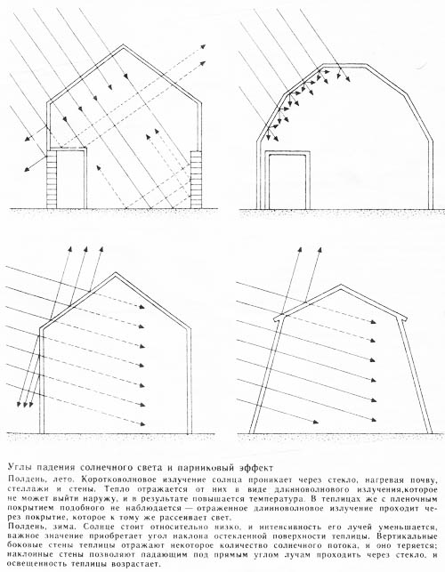

Итак, мы определились, что дом у нас будет [круглый](http://svobodaiznutri.ru/?p=33), [вкопанный в холм](http://svobodaiznutri.ru/?p=32) и [сориентированный по Солнцу](http://svobodaiznutri.ru/?p=31). И перед нами встал выбор способа отопления.

Признаюсь честно, пока отопительного прибора в нашем доме нет. Естественно, есть задумки что это будет и как это будет. Но жизнь богата на сюрпризы и всё может измениться в последний момент. А пока можно просто порассуждать.

Я перелопатил очень много информации на эту тему. Это были и методички по рассчёту теплопотерь советского издания, и книги по печному делу, а уж сколько статей перечитано в интернете и видео пересмотрено — даже не вспомню. Всё прочитанное и посмотренное долго варилось в моей голове и навело на определённые выводы. Их и попробую сформулировать.

Для удобочитаемости придётся поделить тему про отопление на несколько частей. Начнём с теории. Точнее, про то, к чему мы стремимся — про пассивные дома. И про водяное отопление.

**Пассивный дом. Passive house**

Cлышали про такие? Естественно, пассивность имеется ввиду энергетическая.

Определений что же такое пассивный дом много. Либо это дом, вообще не потребляющий ничего из коммунальных сетей. Либо это дом, для отопления которого достаточно энергии, выделяемой живущими в нём людьми. Как бы то ни было, идея, я надеюсь, ясна. Это просто следующий шаг в цепи «обычный дом — энергоэффективный дом — пассивный дом».

Идея пассивного дома родилась в Европе. Но там требования к пассивному дому гораздо ниже чем у нас. Климат диктует европейцам одни правила игры, для нас же они будут совершенно другие. Но правила правилами, а принципы одни и те же.

Во-первых, дом должен быть очень хорошо утеплённый. Для нас это стены от 70 до 100 см по почти любой из экотехнологий (либо их сочетанию). Перекрытие по толщине не меньше стен (зачастую больше в 1,5 раза). Окна — тройные или даже четверные стеклопакеты.

Во-вторых, дом должен быть сориентированн по Солнцу. Это понятно, об этом уже писал. В некоторых пассивных домах все южные стены — это окна, а все северные — глухие, без окон вообще.

В-третьих, в доме должен быть предпринят максимум мер электросбережения: электроприборы только класса А, только энергосберегающие лампы и т.п. Ну и электричество по-максимуму из альтернативных источников: солнечные панели, ветрогенераторы, минигидроэлектростанции и т.д. В идеале — полная автономность.

В-четвёртых, автономное водоснабжение и канализация.

В-пятых, обязательна система рекуперации вентиляции. Это когда заходящий в дом воздух (холодный, но богатый кислородом) обогревается выходящим из дома (тёплым, но бедным кислородом). Некоторые такие системы ещё и автоматически регулируют влажность, отбирая таковую из отработанного воздуха и подмешивая к заходящему. Пока не до конца понимаю как, но я сделаю себе такую систему, может без влажностного обмена, но с теплообменом — точно. Даёт крайне ощутимый прирост теплосбережения.

В-шестых, конструктивные меры энергосбережения. Это самое интересное. Например, обязательно наличие тамбура (сеней) на входе в дом. Понятно, вкопанность как дополнительное утепление очень приветствуется. Приветствуются круглые формы. Ещё иногда делают дома изогнутой фасолевидной формы, чтобы изолировать от ветра внутренний дворик и сохранить в нём дополнительное солнечное тепло. Иногда с этой же целью не весь дом загибают, а просто защитные стены-отростки городят.  Сюда же можно отнести пристраивание дому теплиц, аранжерей, балконов, гаражей, и т.п. Это — дополнительный теплоизоляционный буфер. И это одно из лучших решений, которое можно предпринять, чтобы снизить теплопотери. Это отдельная большая тема. Чтобы стало ясно насколько большая, привожу картинку справа, без комментариев. Скажу сразу, мы хотим в будущем такую штуку себе пристроить.

В-седьмых, система отопления питается либо от Солнца, либо тепловым насосом. Тепловые насосы — очень интересная штука, но я слышал и о негативном опыте. Система труб под домом засорилась, а прочистить считай невозможно, т.к. под домом. Так что не буду за них агитировать. Про солнечные водонагреватели же скажу пару лестных слов.

Они уже не один год успешно применяются по всему земному шару, не только в европейских пассивных домах, но и на даче у дяди Васи. Используются в совершенно разном климате. Один мой товарищ, имеющий отношение к этой отрасли, рассказывал, что во Владивостоке в условиях пасмурной и малосолнечной погоды его коллеги сталкивались с проблемой не то что кипения воды, а расплавления водонагревательных трубок...

Так что солнечный водонагреватель, на мой взгляд — это штука, которая нужна. Must have, ткскзть. Это и горячая вода, и отопление (даже если не основное, то неплохое дополнительное).

**Батареи**

Все люди, живущие проживающие в квартирах, уже настолько привыкли к батареям, что иногда даже не замечают их. Самое большее, что им известно, что есть советские чугунные батареи и современные, типа европейские. И чаще всего первые ассоциируются с "плохо", а вторые — с "хорошо". Что в корне не верно.

Батареи могут греть двумя способами: инфракрасным излучением (излучение греет предметы: стены, мебель) и конвекцией (батареи греют воздух, он расходится по помещению). Абсолютно все батареи работают и по первому и по второму принципу одновременно. Просто в разных батареях они представлены в разных пропорциях.

И советские чугунные батареи как раз и относятся больше к первому. Потому что они вмещают большую массу воды при малой площади излучающей тепло поверхности. Конвекционные батареи наоборот, берут в себя не так много воды, но имеют большую излучающую площадь.

Нельзя сказать что один способ лучше другого. С одной стороны, конвекторы несколько эффективней по теплоотдаче. С другой, они греют воздух, и часть этого нагретого воздуха просто улетает в вентиляцию. Инфракрасники же греют всё окружающее: и человека, и пол, и стены, и мебель, и воздух (часть его тоже улетает, но зато у нас нагрето всё остальное, в том числе нежное тельце хозяина).

Что выбрать из этих двух вариантов — не очевидно. Надо рассматривать конкретные случаи. Но практика такова, что чаще всего лучше в инерционный дом ставить инфракрасники (стены накопят тепло и будут потихоньку отдавать), а в безинерционный – конвекторы (т.к. стены греть нет смысла).

Конечно, можно получить и инфракрасное тепло, и конвекцию одновременно. Поставить рядом два прибора: инфракрасный и конвекционный. А можно сделать ход конём и выбрать третий вариант — тёплый пол!

**Тёплый пол**

Тёплый пол — вещь с одной стороны очень древняя. Он был очень распространён в Римской Империи, многие европейские церкви имеют тёплый пол, корейцы, опять же с их системой "ондоль"... Но там пол греется дымоходами печи и об этом мы поговорим в следующий раз.

С другой стороны тёплый пол — вещь довольно новая. Почему лет 30 назад никому в голову не приходило проложить трубы отопления в полу и избавить жильцов квартир от громоздких батарей? Приходило, уж поверьте мне, только вот труб пластиковых не было. Были стальные, но они ржавеют от постоянного обновления воды и обладают ограниченным скроком службы. Поэтому-то и ставили батареи, а не тёплый пол: чтобы можно было добраться до них для обслуживания и замены.

Квартиры — это центральное отопление целого города: километры труб и сотни тонн воды. И, как я понимаю, система эта не замкнута. Если же делать замкнутую систему, чтобы вода в трубах гонялась одна и та же, то можно и сталь в пол замуровать. Но можно и пластик. Кому как.

Но что очевидно — так это то, что тёплый пол гораздо эффективней батарей. Количество воды в трубах тёплого пола примерно такое же как в батареях. Но зато греть эту воду нужно не до 70-80°С, а до 30 (±5-10 в зависимости от много чего). Это раз.

Надеюсь, всем известна физика: тепло поднимается наверх. Чем ниже находится отопительный прибор, тем равномернее прогреется помещение. Ну а куда ниже плинтуса? Только пол!

Соответственно, тёплый пол греет стены и греет воздух. И делает это снизу, что приводит к равномерному прогреву. Это два..

Короче, кто был в доме с отоплением через тёплые полы — как и я сделает вывод, что это практически безальтернативная технология отопления посредством воды в будущем. Ибо достаточно дешёвая, но очень эффективная.

**Выводы**

Учитывая, что из изложенных мер мы будем применять все, то велик шанс, что мы получим уж если не пассивный дом, то уж точно очень энергоэффективный.

Сделаем рекуперацию вентиляции, пристроим теплицу, сделаем тёплый пол, работающий от солнечной водогрейки. Но гарантировать, что этого хватит при сорокаградусном морозе я не могу. Поэтому мы решили сделать печку. Да не простую, а золотую высокотехнологичную. Об этом читайте в [следующий раз](http://svobodaiznutri.ru/?p=29).
