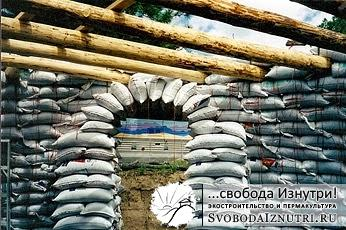
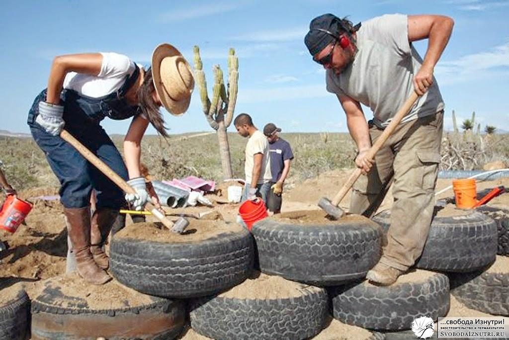
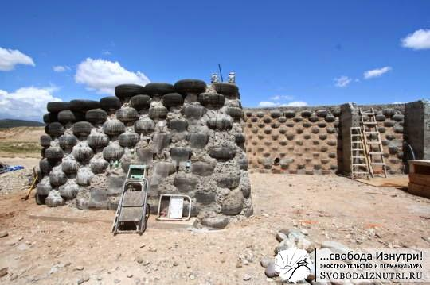

Учитывая сказанное в [предыдущих](/dom-za-100-tysyach-rubley) [постах](/s-chego-vsyo-nachalos), ограничения перед нами стояли следующие:

1\. Денег не было. Чтобы стало совсем понятно, начали стройку имея в кармане 10 тыс. рублей и подработку, приносящую в среднем 2000 рублей в неделю.

2\. Небольшой (изначально планировалось что временный) домик, чтобы успеть построить за этот сезон и зимовать уже в нём.

Также стояла задача опробовать технологии, которые будут в дальнейшем применены в строительстве большого дома.

С такими ограничениями строить из современных материалов невозможно, да и **не было желания** (вдоволь нафилософствуюсь на эту тему в отдельном посте!). И само собой мы пришли к технологиям экологического строительства, ведь они доступны и...экологичны!

Если бы меня спросили перед началом стройки: «Из чего строишь?» — я даже не знал бы что ответить. Это потому, что не было ясно какие материалы будут доступны и одновременно рассматривалось несколько технологий, а именно: - **соломенные блоки**, - **лёгкий саман**, - **тяжёлый саман**, - **глинобит**, - **глинохворост**,

Технологии рассматривалить не только в отдельности, планировали сочетать несколько. Также рассматривали варианты этого всего не в монолите, а в виде кирпичей собственного производства. Технологиями-аутсайдерами были **суперсаман** и **глиночурка**.

Все технологии хороши, но каждая из перечисленных технологий обладает не только преимуществами, но и недостатками. Чтобы было ясно с каким багажом знаний мы приступали к стройке, вкратце опишу каждую:

Картинки кликабельны. Наведя мышь можно прочитать короткое описание.

**Соломенные блоки** **(straw bale)** - делается каркас (чаще всего деревянный), накрывается крышей, стены выкладываются из блоков соломы, в идеале — ржаной. Штукатуриться (чаще всего глиняной штукатуркой).

Плюсы_:_ лёгкий фундамент,  высокая скорость возведения. Минусы: блоки нужно покупать (практика показала, что их можно изготавливать самостоятельно, но это ОЧЕНЬ долго. Думаю, посвящу этому отдельный пост). Из-за деревянного каркаса технологичней (проще) делать прямоугольное здание.

**Лёгкий саман** **(устойчивого термина за рубежом нет)** - всё как в соломенных блоках, только стены выкладываются не из блоков, а из вымоченной в глине свободной соломы, она закладывается в опалубку и утаптывается. Штукатурится, тоже чаще всего глиняной штукатуркой.

Плюсы: лёгкий фундамент, свободная солома на порядок дешевле блоков, или даже даром (если самому косить). Минусы: солому всё ж таки нужно покупать. Косить самостоятельно долго и тяжело, но если время позволяет, то этим минусом можно пренебречь. Технологичней делать прямоугольное здание. Трудозатратная технология.

**Тяжёлый саман (cob, adobe)** \- делается нормальный фундамент (какой именно — зависит от грунта), из саманной смеси лепятся стены, это дело накрывается крышей. Саманная смесь - это песок, глина и солома, чаще всего  в соотношении 4/1/2. В средней азии очень распространен саман не в монолите, а виде кирпичей.

Плюсы: глину и песок, а может даже готовую смесь можно найти прямо под домом или возле него. Крайний случай — купить. Это дёшево. Строить можно произвольные формы (т.е. НЕ-четырёхугольники).  Высокая сейсмоустойчивость. Минусы: затраты на фундамент. Очень трудозатратная технология (замешивать смесь физически тяжело).

**Землебит, глинобит (rammed earth)** - делаем фундамент, наполняем опалубку (скользящую или на каркасе) глиняной смесью (саманная без соломы), тщательно трамбуем. Кроем крышей.

Плюсы: как у самана кроме сейсмоустойчивости. Минусы: как у самана.

**Глинохворост (в зарубежных источниках не встречен)** - всё как в самане, только вместо соломы каждый ряд лепки прокладывается хворостом под 45 градусов к линии стены. Следующий ряд - 45 градусов в другую сторону. Плюсы и минусы как у самана. Технология редкая, фотографий не нашёл.

**Глиночурка (cobwood)** - сухие дрова или деревянные чурки складываются в стены с перевязкой швов глиняной смесью. Проще говоря, дрова на растворе.

Плюсы: Стены произвольной формы. Высокая скорость возведения. Минусы: Необходимы заранее заготовленные сухие чурки.

**Суперсаман, мешки с грунтом (superadobe, earthbag)** - тканные полипропиленовые рукава наполняются грунтом и из этих "сосисок" выкладываются стены. Каждый выложенный ряд тщательно трамбуется. Можно вместо рукавов использовать мешки (тогда будет earthbag). Также можно вместо тканных рукавов/мешков использовать полипропиленовые сетки (тоже бывают и рукавами, и мешками), но тогда необходима саманная или глиняная смесь.

Плюсы: упрощённый фундамент, сейсмоустойчивость, стены произвольной формы кроме прямоугольника. Минусы: мешки полипропиленовые, что уже немного не-эко (после оштукатурки мешки вечны и абсолютно безопасны для здоровья). Если пользоваться брезентовыми мешками (или из другого натурального материала), тогда будет совсем трушно. Также рекомендуют каждый ряд прокладывать колючей проволокой (но практика показала, что это необязательно).

Такой вот краткий ликбез. Каждая технология имеет свои тонкости и ограничения. Так, нужно иметь ввиду, например, что солома появляется в июле-августе; в сентябре она начинает дорожать и к ноябрю уже стоит баснословных денег. Или вот возведение стен из самана необходимо закончить к 1 августа, чтобы до зимы успели высохнуть. Иногда в глиняную смесь добавляют опилки, чтоб теплее было. При строительстве из суперсамана и землебита иногда к грунту подмешивают цемент 10/1 (тогда это называется стабилизированный грунт). Это всё так, для примера.

Ещё я не упомянул совсем экзотические способы строительства: из **стеклянных** или **пластиковых бутылок**, из **алюминиевых банок**, из **автомобильных покрышек** (последний, кстати, довольно популярен в америке, даже имеет собственный термин — **earthship**).

## Бутылки

[ источник освещения")](/wp-content/uploads/2013/12/23.jpg "Бутылки иногда намеренно не закрывают и используют как дополнительный (или даже основной) источник освещения")

**Earthship** Вообще, автор термина вкладывал в него идею о строительстве полностью автономных домов из отходов (и бутылки с банками тоже под него подпадают). Но он строил в основном из покрышек, и поэтому ныне термин устоялся именно в смысле строительства из покрышек.

В разные периоды времени начиная от проектирования дома и до окончания заливки фундамента каждая технология была той, по которой мы будем строить. Т.е. сегодня мы уверены, что будем строить из глинохвороста, а завтра — мы убеждены что ошибались, и по-любому будут саманные кирпичи...пока не наступит послезавтра! :)

Так какую технологию выбрали мы? Как водиться — ждите ответа в [следующей серии](/zachem-ya-zakruglil-svoy-dom)! И не забывайте оставлять комментарии, это важно!

P.S.: Запланировал посвятить отдельные посты каждой технологии с подробным описанием, фотографиями, видео и т.д.
