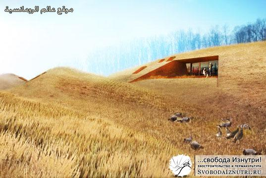
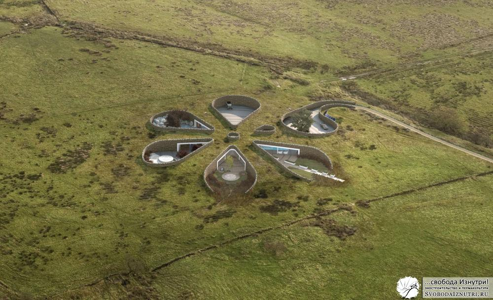
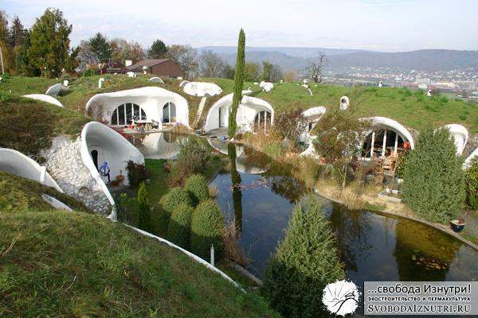

Про причины выбора круглой формы дома я рассказывал в [прошлый раз](/zachem-ya-zakruglil-svoy-dom), сегодня разберёмся с вкопанностью.

## Дом будет вкопан в холм и обвалован

Обычная реакция на такую фразу: _«Блин, чё за хрень, это же землянка! Что за каменный век?»_

Причина такой реакции на подземный дом проста: традиционно русскому человеку знакомы именно военные землянки, которые реально кондовы, с голыми стенами, нарами, буржуйкой, дикой влажностью, без света... А как вам землянка на картинке выше?

Ребята, на западе богачи строят себе "землянки" один за другим. То ли мания у них у всех, то ли паранойя, то ли просто модно нынче под землю закапываться... Или, может, пытаются спрятаться там от своей совести?

Может и так, но если хорошенько подумать, то закопанный в землю дом будет требовать гораздо меньше затрат на отопление.

И для нашего климата обваловка актуальна особенно, ведь земля — не просто инертный теплоизолятор. На глубине 10 метров температура в любое время года +10 градусов. Закопаемся на 4-5 метров и получим на фундаменте плюс 5-7 градусов. Сравните с минус 30-40, которые у нас бывают и задайте себе вопрос: «При какой температуре за бортом я потрачусь меньше на отопление: при -30 или при +5?»

Многие обитатели современных коттеджей боятся, что если им зимой придётся надолго оставить дом без отопления, то вода в батареях замёрзнет со всеми вытекающими во всех смыслах последствиями. Трубы тёплого пола в правильно сделанном обвалованном доме не замёрзнут НИКОГДА. Неплохая пища для размышлений, не правда ли?

Периодически зимой я вижу, что кто-то залез на свою крышу и счищает с неё снег. Для себя я объясняю это тем, что у человека пологая крыша, угол наклона которой недостаточен для сползания с неё снега под собственным весом. И ещё человек боиться, что под весом снега с крышей что-то случиться (прогнётся, сломается и т.п.). Поэтому чистит. Но если учесть эти самые снеговые нагрузки при проектировании, то мы получим два бонуса: отсутствие необходимости чистить снег и дополнительный теплоизолятор на крыше.

Да-да, вы не ослышались, снег — замечательный теплоизолятор. Недаром альпинисты, ночующие в горах, специально закапывают палатки снегом. Да и медведи в берлогах вполне довольны его теплоизоляционными качествами.

Так что если у нас дом закопан в землю, то он зимой ещё и будет накрыт дополнительным теплоизолятором! И учитывая, что довольно сильно на теплопотери влияет ветер, дом, защищённый от ветра землёй и снегом выигрывает вдвойне!

_«А как же влажность?»_

Вариантов масса. Сейчас полно материалов, которые заизолируют что угодно от чего угодно. Но часто они неэкологичны в производстве, эксплуатации и утилизации.

Хочется экологичности — 20 см жирной глины и никакой влажности. Не уверены в надёжности — почитайте как делают дно у искусственных водоёмов. Чтобы вода не утекала в грунт, делают т.н. "глиняный замок".

Но если лень ковыряться в глине — просто сделайте между стенами дома и грунтом вентиляционный зазор, и гидроизолятором послужит обычный воздух. Мало зазора — сделайте целый вентилируемый корридор, который к тому же послужит замечательным погребом, или просто местом для складирования хлама.

Что выбрать — платить деньги за материал, который неэкологичен, рыть глину, или просто продумать конструктив так, чтобы был вентзазор — решать читателю. Лично я выбрал третий вариант, и практика показала что он гораздо надёжней первого (с вторым сравнить пока не было возможности).

## Зелёная кровля

Это когда на крыше растёт трава. _«Зачем это надо?»_ — спросите вы.

Все кровельные материалы (и современные, и традиционные) обладают ограниченным сроком годности. Связано это с тем, что крыша — часть дома, подверженная наибольшему количеству негативных факторов. Это дождь и снег, ветер, солнечное излучение, да и просто механические воздействия (птицы, например). При наличии на металлочерепице небольшой царапины — дожди превратят её в дырку в течение двух-трёх лет, и ураганный ветер срывает её на раз. Битумные соединения мягкой кровли выгорают под ультрафиолетом за 15-20 лет. Этот же ультрафиолет разрушает любую краску и прочие виниловые фасады.

Планета Земля подвержена бомбардировке различными излучениями 24/7 уже не один миллиард лет. И от каждого из излучений ныне она защищена по разному. Ионосферы и прочие озоновые слои защищают практически от всего, но до поверхности долетает ультрафиолет. Сомневаюсь, что не долетай он до поверхности было бы лучше (вообще вряд ли бы жизнь была), но именно он разрушительно воздействует на кровельные материалы.

А как Земля защищает свою поверхность от него?

Земля пронизана слоем корней, покрыта слоем гниющей прошлогодней травы и слоем свежей зелёной — и довольно хорошо защищена  не только от  ультрафиолета, но и от всего перечисленного из негативных факторов. Так что сама природа подсказывает нам в очередной раз чем пользоваться.

Плюс, трава и плодородный грунт — дополнительные утеплители!

Да и с эстетической точки зрения дом, вкопанный в холм и сверху накрытый ковром из зелёной травы выглядит более приятно чем серая коробка. И в окружающий ландшафт он вписывается лучше. Он выглядит органичной частью этого ландшафта, а не чем-то чужеродным. Плюс, это дополнительная маскировка на случай бомбёжки — скажут параноики и будут правы! :)

Кстати, зелёные кровли актуальны и в городе, и на селе — на обычных домах.

Первая причина —  дополнительные площади для огорода! Если участок в 10 соток и дом занимает половину этого пространства — то не использовать крышу как огород даже как-то глупо, что ли. Особенно в условиях постоянного дорожания этой самой земли. Обратите внимание, наклонная поверхность имеет бОльшую площадь, чем её проекция на плоскость. И плюс если крыша имеет южный наклон, то и солнечного света на неё упадёт больше, а это повышение урожайности!

Вторая причина — экология. Дополнительная растительность, утилизирующая яды и вырабатывающая кислород не повредит ни одному городу. Никакие парки и аллеи между бетонными коробками не сравняться по выработке кислорода с тем лесом, который здесь был до их строительства. И, озеленив кровли бетонных коробок, мы всё ж таки скомпенсируем эти потери, хотя бы частично. Актуальность таких шагов логична не только для жителей окутанных смогом мегаполисов, но и моего небольшого города, который уже тоже столкнулся с проблемой пробок и загазованности.

## Мыши

Обычно когда начинаешь говорить с кем-то о подземном доме и зелёной кровле, встаёт вопрос: _«А как же мыши?!»_

А очень просто, и я уже частично отвечал на этот вопрос. Либо перед насыпкой грунта пользуйтесь толстым прочным гидроизоляционным материалом, либо используйте слой 10 см жирной глины или стабилизированного грунта (грунт/цемент 10/1), либо, если совсем паранойя заела — накройте весь дом металлической сеткой. Заодно от радиоизлучений изолируетесь :)

Существует масса примеров тому, что мыши заводятся и в надземных частных домах. Не только деревянных, но и кирпичных и бетонных. И не столько в полах, сколько на чердаках... Так что чтобы наверняка — заведите кошку. Это самый лучший и проверенный веками способ избавить себя от мышей.

**Подведём итог.** Закопав дом в землю и сделав зелёную кровлю, мы сэкономим на отоплении четыре раза: раз (тепло земли), два (защита от ветра), три (утепление грунтом и травой), четыре (утепление снегом). Во-вторых, участок земли, занимаемый домом, не выключается из процесса очистки воздуха и выработки кислорода. И заодно мы получаем дом, органично вписанный в ландшафт вашего участка, возможно даже с огородом на крыше!

Так что для нас выбор в пользу подземного варианта был очевиден. Тем более, я уже упоминал, что участок у нас на склоне холма, и не вкопать его в холм для нас было технологически гораздо сложнее чем вкопать. Ну а раз вкопан, то и зелёная кровля не повредит.

Напоследок несколько фотографий подземных домов и домов с зелёной кровлей:

[")](/wp-content/uploads/2013/12/dom_lnora1_3.gif)

Надеюсь, было интересно. В следующий раз расскажу [про ориентацию по Солнцу](/orientiruem-dom-po-solntsu) и почему это так важно.

Комментируем, не стесняемся!

> **Интересное дополнение из комментариев в ЖЖ:**
> 
> Про теплоизоляцию снегом, взято с форумхауса
> 
> _"Отступление про промерзание. Меняем например трубу ввода воды в девятиэтажку. Февраль месяц. Разводка труб отопления нижняя, т. е. в подвале, соответственно температура там больше 20 градусов. Начинаем копать от дома. Корка мерзлоты сантиметров 10 (под отмосткой). Копаем через газон, тоже легко берется, корка 40см. Тропинка проходит через газон, под ней уже около метра промерзло. Дальше опять газон, опять 40 см. Дальше тротуар, очищаемый дворником- около 1,5 метров мерзлоты. Дальше дорога, по ней автобусы ходят т. е. чистится постоянно- около 2,5 метров мерзлоты. Это я к тому что если не топтаться вокруг дома и там снег лежать будет то и не промерзнет глубоко."_
> 
> У автора место жительства указано "Свердловская область"
> 
> _"Отступление про первый мой опыт разметки траншеи газопровода на г. Касли. Я, молодой помошник экскаваторщика, моя первая зима на трассе... Нужно разметить ось траншеи на болоте метров 800-900. Экскаваторщик говорит " Иди в том направлении и метров за 200 воткни палку, где я тебе покажу", сам поворачивает ковш в забой и начинает копать. Я молодой и шустрый бегу куда указано, вскоре слышу что сзади кричат, ну думаю надо подальше еще убежать. Запышавшись, поворачиваюсь к экскаватору и вижу что машинист кричит и машет руками в кабине, только куда ставить палку я не понимаю, ну вообщем палку я все таки воткнул. Иду назад, а он орет пуще прежнего. Когда пришел к экскаватору, мне популярно объяснили что только чудаки на букву "М" ходят размечать траншею по оси, что теперь на болоте придеться рыхлить. И всю неделю, я под укоризненным взором машиниста смотрел как мои следы в снегу промерзают вглубь каждый день на 15-20 см, смыкаясь в одну ровную линию точно по центру траншеи. Последнии десятки метров наш ЭО - 652 копал под звон тросов и маты машиниста."_
