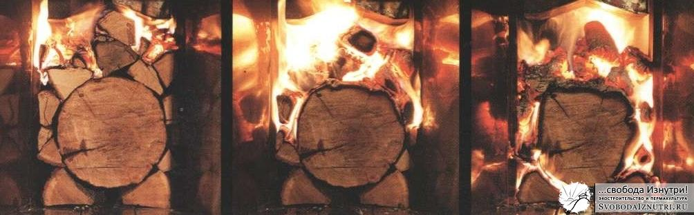

В поисках идеальной системы отопления для [нашего экодома](/dom-za-100-tysyach-rubley) я уже рассказал [про пассивные дома](/otoplenie-passivnie-doma-i-vodyanoe-otoplenie), а также про печи почти всех видов: [голландки и русские](/otoplenie-pechi-gollandki-i-russkie), [колпаковые и двухколпаковые](/otoplenie-pechi-kolpakovye-i-dvuhkolpakovye). Теперь же настала пора рассказать про новые веяния в печкостроении.

А именно, про **ракетные печи.**

Они же печи-ракеты, они же rocket stove или rocket stove mass heater. Придумал этот агрегат Ларри Виниарски (Larry Winiarsky), технический директор пермакультурной организации [«Aprovecho»](http://www.aprovecho.org/lab/home). Занимается организация всякими хитрыми приблудами готовки/обогрева для стран третьего мира.

Принцип работы ракетной печи на первый взгляд нетривиален, но на самом деле довольно прост.

<!-- READMORE -->

## Принцип работы

**Дрова ставятся вертикально** (!) в соответствующее отверстие. Поджигаются снизу.

Пламя идёт до вертикального дымохода, который делается из металла. Делают и из кирпича, но металлический дымоход разогревается практически моментально, и печка при розжиге меньше дымит. Этот **металлический дымоход хорошо утепляется**.

Сверху на это хозяйство ставиться обычная отработавшая своё **металлическая бочка**, дном вверх. Поднимающиеся горячие газы ударяются в дно бочки, расходятся по сторонам и вдоль стенок бочки уходят вниз.

Дальше они идут по горизонтальному дымоходу, который чаще всего вмуровывается в **саманный диван**. На выходе дивана — вертикальная выхлопная труба, как у обычных печей, для тяги.

Кстати, анимированный gif взят [отсюда](http://www.richsoil.com/rocket-stove-mass-heater.jsp). Там большущая статья про ракетные печи на английском, с морем видео и фотографий. Рекомендую хотя бы фотки посмотреть, чтобы стало яснее что это за штука.

## Физика

Когда я первый раз ознакомился с механизмом работы этой печи, я не поверил что эта штука вообще работает. Но огромное количество видео в ютюбах говорило об обратном. **Стал разбираться** и развеял нестыковки в своей голове одну за другой.

Первое, что вызвало моё подозрение (наверняка ваше тоже), так это вертикальное расположение дров. «Пламя же пойдёт вверх при розжиге!» - думал я. Но практика показала, что в большинстве случаев в основании трубы дымохода (который уже через крышу выводится) делается прочистное отверстие, в котором **перед розжигом печи сжигают газету**. Тем самым сначала устанавливается тяга. И пламя засасывается внутрь печи.

Второе. Мне эта система показалась ненадёжной, ибо в моём представлении должна была засоряться наглухо за месяц. А вот и нет! Газы из первого вертикального дымохода ударяются в дно металлической бочки, нагревая его до совершенно диких температур. И несгоревшие летучие компоненты, в обычных печах оседающие в виде сажи, **полностью сгорают**. Плюс, в этом месте получается разрежение. Поэтому давление газов снижается, а с ним снижается и температура сгорания этих самых летучих компонентов. Физика: ниже давление — ниже температура сгораяния (а также кипения и оттаивания).

И, как говорят очевидцы, на выходе этой печи лишь водяной пар и углекислый газ. Сгорание топлива почти 100%. Невероятно, но факт. Ну а раз топливо сгорает так эффективно, то и **пепла после протопки очень мало**.

Но всё же эта печка засоряется, но не сажей, а пеплом. Поэтому либо дно бочки, либо саму бочку делают съёмными. Также делают прочистное отверстие в начале горизонтального дымохода (который под саманным диваном). Но некоторые не делают и его: сняв дно бочки, засовывают шланг пылесоса прямо в дымоход. Справа фотография **долго не чистившейся** ракетной печи. Такая картина предстала после снятия бочки.

## Плюсы и минусы

Печь универсальна. И в этом и её преимущества, и её недостатки.

Металлическая бочка быстро нагревается и может быстро разогреть помещение. Но нужно понимать, что чем быстрее прогреется помещение, тем меньше тепла накопит саманный диванчик. С другой стороны, саманный диван находится снизу, и это даёт **нижний прогрев** помещения. Это гораздо эффективнее классических печей.

На дне бочки можно готовить. Некоторые даже вместо бочки вмуровывают в печь чугунный котёл. Или вместо бочки используют просто металлический лист, как на фото слева. Лично мне оба этих решения кажутся более эффективными. Изготовление ракетной печи практически **не стоит денег** при наличии старой бочки, либо котла, либо листа железа..

Но, так или иначе, <del>я не встречал упоминаний об использовании такой печи в местностях, где зимой ниже -10°С</del> (позже нашёл: [тут](http://ozzyzello.livejournal.com/457380.html) прикольная статья про реализацию ракетной печи в условиях Урала). Именно поэтому мы в своё время отказались от такой печи. Хотя любопытство заставило нас сделать мини печь-ракету из десятка кирпичей, для готовки летом. Сделали без всякого раствора, просто чтобы поэкспериментировать. Эксперименты показали отличные результаты, но всё же делать полноразмерный аналог мы не решились.

Лично мне был особенно интересен феномен вертикальной подачи дров. Ведь есть несколько очень жирных плюсов:
1. **Нет необходимости "подбадривать" огонь**, ведь дерево по ходу сгорания само опустится ниже. Особенно интересен этот плюс в сочетании со следующим.
2. **Не обязательно использовать короткие палки.** Встречал видео, на котором чувак жёг бревно выше собственного роста, используя специальные держатели. Причём бревно было довольно толстым, и колоть его чувак явно не собирался :) Жаль, что сейчас не могу найти это видео. Меня в своё время оно очень впечатлило.
3. В классическом огне самая горячая часть — **угли** — остаётся внизу и не взаимодействует с пламенем. Здесь угли тоже падают вниз, но **падают перед огнём** (им помогает тяга), и таким образом они **участвуют в дожиге летучих компонентов**.
4. Такой **способ горения экономичен**. Это перевёрнутый с ног на голову верхний розжиг.

## Верхний розжиг

Он активно рекламируется очень многими. Конторы, делающие банные и отопительные печи, сейчас выпускают модели, изначально предназначенные для верхнего розжига. Даже **промышленные котлы** такими делать стали (или я просто отстал от жизни и их всегда такими делали?). Скажу честно, я ещё не имел достаточного **э**мпирического опыта с верхним горением, чтобы что-то утверждать. Но это ни коим образом не помешает мне вам про него рассказать.

Классически печь растапливается так: снизу растопка (щепки+бумага), на неё щепки покрупнее, а уже сверху — крупные дровины. При верхнем розжиге снизу кладутся крупные дровины, на них кладётся растопка, а на неё щепки покрупнее. Короче, **огонь разводится сверху**.

Как утверждают апологеты такого способа, это даёт **более длительное горение и более эффективное сжигание топлива**. Если прикинуть в голове, то теоретически так оно и есть. Ведь когда разжигаешь снизу, сначала из трубы валит густой дым, и уже потом, когда печь хорошо разгорелась, дым становится прозрачным.

Если кто не знал, прозрачность дыма говорит о том, что все летучие компоненты сгорели, и из трубы выходит лишь углекислый газ и вода в виде пара.

В начале горения стенки топочной камеры ещё **не нагрелись**, и не помогают пламени. Даже наоборот, они **отнимают у него энергию** на собственный обогрев и тем **остужают пламя**. Плюс, пламя ещё не такое жаркое, да и дрова испаряют оставшуюся в них влагу. И, поднимаясь вдоль стенок топки и обтекая ещё холодные поленья, **воздух остывает**, превращаясь из пламени в дым, насыщенный водой. Его мы и видим выходящим из трубы на начальном этапе горения первой закладки дров.

Но если разжигать сверху, то воздух не течёт вдоль всей высоты стен топочной камеры, и не обтекает все дрова, отдавая им тепло и отбирая их влагу. В этом процессе участвует **только верхняя часть топочной камеры и верхняя часть дров**.

И процесс нагрева стенок с поленьями и испарения оставшейся в них влаги из начала растопки растягивается почти на всё время горения. **Распределяется равномерно**. Что в теории должно дать **больший КПД** сгорания дров...

Так что идите экспериментируйте с верхним розжигом. Приду — проверю! :)

Я же на сегодня заканчиваю. В следующий раз расскажу про [способы дальнейшего повышения КПД печи](/otoplenie-pechi-vneshniy-pritok-i-vtorichniy-vozduh).

P.S.: Напоследок небольшой [бонус](http://www.youtube.com/watch?v=NeXf6xJJ2fw).

**Дополнение 29.05.2014:** В комментариях подкинули ссылку на канадский негативный опыт использования ракетной печи: [Ссылка]( http://canadiandirtbags.wordpress.com/2013/12/15/a-scientist-and-a-technologist-walk-into-a-bar/ ) (Внимание, английский язык!)
