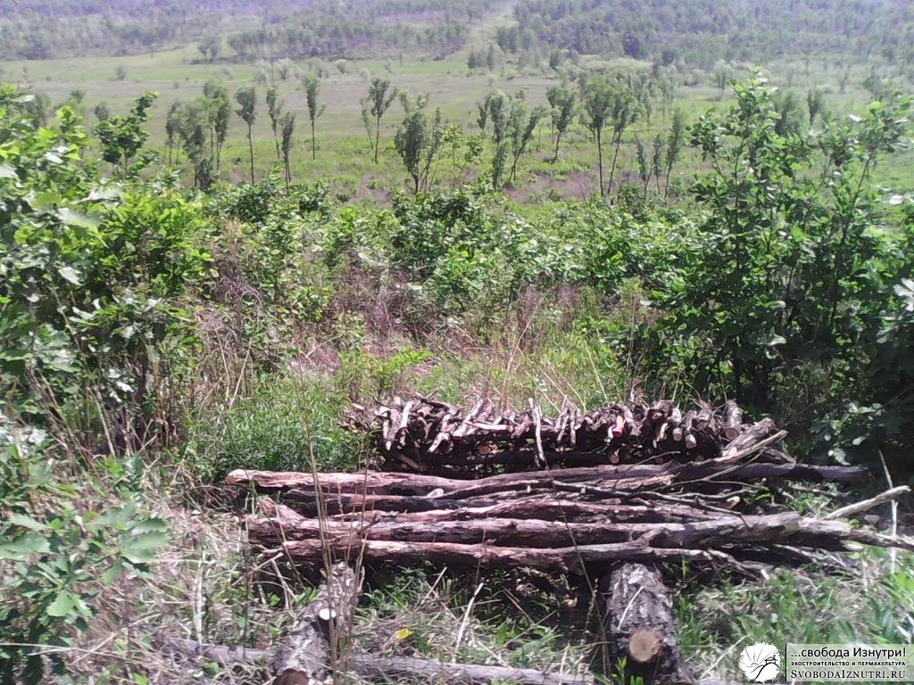
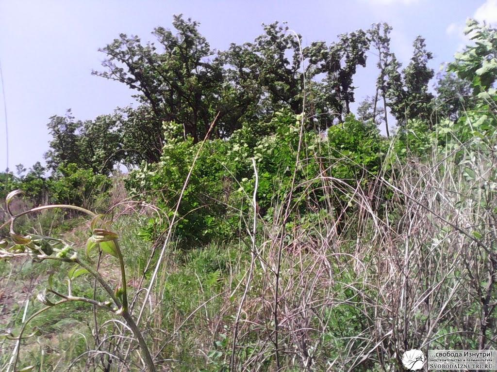
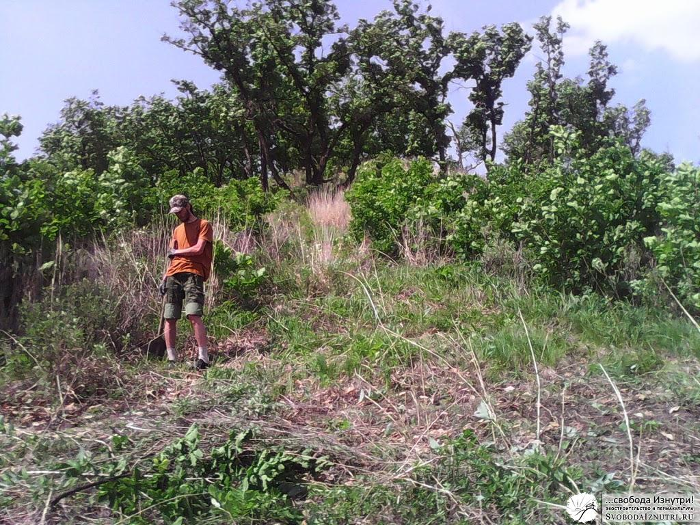
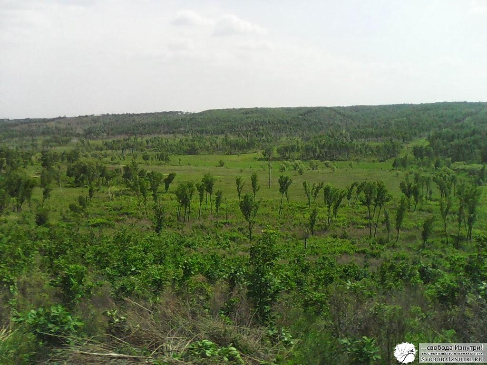

Почти всё из теории, о чём я писал в [предыдущих постах](http://svobodaiznutri.ru/?p=36), было у меня в голове ко времени начала стройки.

В первых числах мая мы окончательно решили, что этим летом будем строиться. И началось планомерное освоение нашего гектара.

Мы переселились на нашу землю со всем необходимым: инструментами, рабочей одеждой, палаткой и двумя кошками.

Это были оставшиеся у нас к тому моменту Манька и её дочка Пумка. К сожалению, через неделю Манька пропала и дальнейшая судьба её нам до сих пор не известна... Но от кошек перейдём к первомаю!

**Первомай**

Первомай у нас случился второго мая. В этот день был заложен первый рукотворный объект на нашей земле — хольцеровская гряда. Если вы не знаете что это такое — вбейте в поисковик. Я же тему пермакультуры раскрою позже, когда опыта будет побольше.

Огородничеством в первое наше лето мы не занимались (в приоритете была стройка), но гряда стала замечательной площадкой для экспериментов!

Ещё я потихоньку пилил на дрова лежащие вокруг гряды деревья (попадали от ветра) и складывал вот в такую конструкцию. Это самое начало, потом она заметно выросла в высоту.

Весь наш участок представляет из себя заросли леспедеции и порослевого дуба. Это отлично видно по фотографии справа. Чтобы расчистить место под дрова, пришлось вырубить целую поляну. Но то ли ещё будет...

**Кочуем**

Я уже упоминал, что место расположения нашего будущего дома кочевало то туда, то сюда. Причин было три: мои хотелки, хотелки жены и объективные факторы. Последнее постоянно приходило в противоречие с первыми двумя, а первые два — в противоречия друг с другом. Ну вы понимаете, семейная жизнь и всё такое :)

Первое место казалось очень удобным: не очень высоко, не очень низко (напомню, у нас склон холма), небольшой распадок без деревьев. Как раз неподалёку от него и сделали гряду. Но потом жена ткнула меня носом в то, что по этому самому распадку по весне будут стекать ручьи и дом будет медленно, но верно подмываться.

Так дом переехал в первый раз. Мы просто сместили его немного выше и в сторону от распадка. На фото слева можно увидеть как выглядело новое место под дом до того как я приложил к нему руки.

Как видите, в начале дня это были непроходимые джунгли. Пришлось немного поработать. Через сутки поляна выглядела как на фото справа. Человек в оранжевой футболке — это я. Вот сейчас отдохну и продолжу борьбу с джунглями...

Второе место под дом тоже казалось нам очень удобным. И вид оттуда открывался прелестнейший, фото слева.

Единственный вопрос, на который пока не был до конца ясен ответ — это логистика доставки стройматериала.

Мне было ясно, что надо прокладывать автодорогу наверх сопки, ибо таскать лучше сверху, а не снизу. Хотя, была задумка натянуть тросс и сделать "фуникулёр", но, крепко подумав, идея была признана бредом :)

**Палатка**

 

[")](http://svobodaiznutri.ru/wp-content/uploads/2014/01/IMG_20130606_154332.jpg)

Ну и как не сказать про самое главное, про наше временное жилище — палатку. Её мы поставили немного в стороне. Врылись немного в холм и сделали ровную площадку.

Рядом с палаткой тоже пришлось искоренять джунгли, чтобы выходить из палатки не прямо в кусты, а на свежий воздух. Актуально это было в первую очередь из-за насекомых.

Также пришлось немного прорубать тропинку к месту размещения палатки.

**Выводы**

Первый важнейший вывод: **прежде чем работать руками, поработайте головой**. Решение где лучше разместить дом принимайте не наскоком, а подумайте с неделю, а лучше — с месяц или даже больше. Только думайте не лёжа на диване, а ходите по участку в поисках идеального места. Моделируйте различные ситуации: куда подъедет машина, где она развернётся? Откуда дует ветер зимой, откуда летом? Как и куда я буду идти за водой? Где будет огород?

Мы по неопытности бросались с горячим сердцем косить джунгли налево и направо, потратив много сил и времени. Не совершайте наших ошибок, критически относитесь к принимаемым решениям. Неплохо будет задать друзьям те вопросы, на которые сами ищете ответы. Только не говорите им ваш вариант ответа, пусть думают сами. Не отметайте нестандартные решения: порой самый сумасшедший на первый взгляд вариант оказывается самым верным.

Второй важнейший вывод: **сразу делайте широкие и как можно более прямые удобные тропинки**. Чтобы потом, когда будете идти, скажем, с бревном, не цепляться за колючие кусты и не петлять туда-сюда на поворотах.

Разумеется, полноценные тропинки вы будете делать тогда, когда уже подумали над размещением дома и дворовых объектов. Чтобы делать их не в пустоту, а туда, куда надо.

Продолжение читайте во [второй части](http://svobodaiznutri.ru/?p=24).
