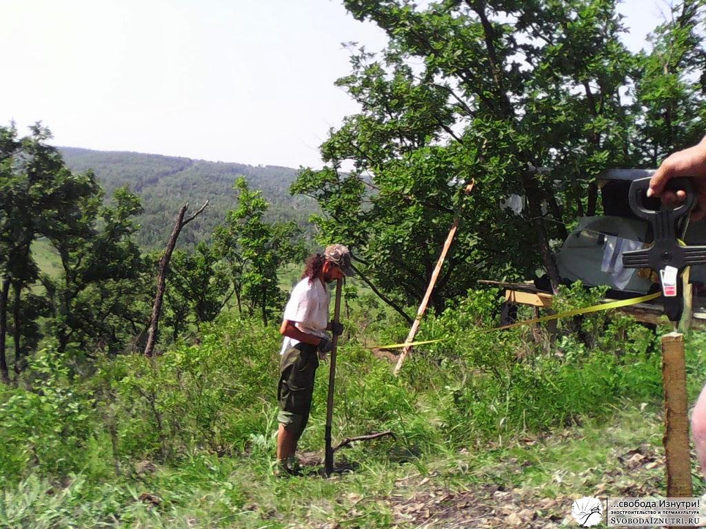
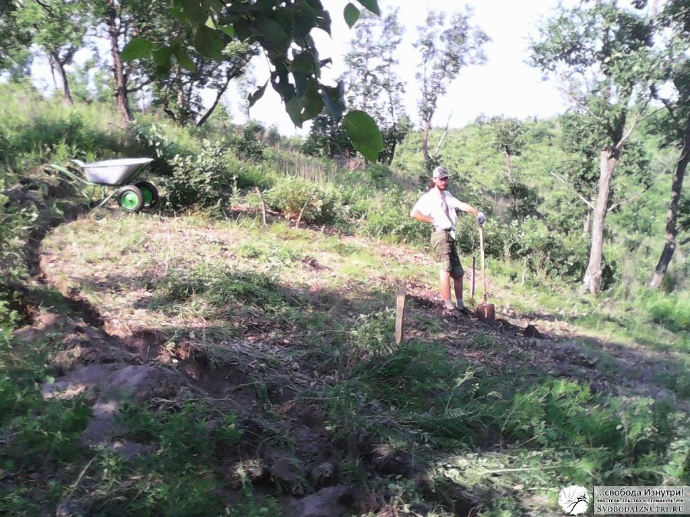

[Посторойка дома на дереве](/poisk-mesta-pod-dom-2) дала ожидаемые преимущества. Днём, когда стояла страшная жара, и работать было невозможно, мы заползали в тенёчек и прикидывались морскими котиками. Морскими котиками на лежбище.

Это время не тратилось зря. Мы обсуждали планировку будущего дома, конструктивные моменты, думали над оптимизацией техпроцессов. Причём делали это даже с некоторым уровнем комфорта. Это важно. Этот **комфорт** позволял взять ручку, бумагу, и начать набрасывать обсуждаемые или принятые решения в виде чертежей, планов, разрезов или просто рисунков. Вот так, лёжа в тени свежепостроенного дома на дереве, мы и накидали первый примерный **план** нашего будущего домика. И с этим планом наперевес пошли размечать местность.

### Разметка

В этом нехитром деле, как и при постройке дома на дереве, нам **помогал мой отец**. Когда упоминаешь о круглом доме в присутствии профессионального строителя (привыкшего строить прямоугольные коробки), первый вопрос, который он задаёт: «И как вы будете **размечать фундамент**?"

А очень просто.Находим предполагаемый **центр постройки**. Ставим колышек. Один человек держит рулетку на центральном колышке. У нас радиус дома — 4 метра, поэтому рулеткой мы отмерили 4 метра, и я прошёл по предполагаемому периметру дома. Если что-то не устраивает, центр дома смещается и процедура повторяется.

Дом мы планировали [ориентировать по Солнцу](/orientiruem-dom-po-solntsu), поэтому на каждом этапе разметки мы сверялись **с компасом**. Нам повезло, у нас линия склона пролегает точно с юга на север. Т.е. самая верхняя точка разметки точно соответствует северу, самая нижняя — югу.

Очень важно при разметке на наклонной поверхности учесть, что проекция круга на наклонную плоскость имеет **форму овала**, вытянутого вверх и вниз относительно склона. Мы накинули полметра в самых крайних точках (северной и южной). Практика показала, что расчёт был верным, но не был учтён один важный фактор, о котором мы на тот момент не знали. О нём расскажу в следующий раз.

Также мы накинули полметра на **вентзазор** между стенами котлована и стенами будущего дома. Плюс, по чертежу в начале статьи видно, что этот вентзазор в западной части расширяется и превращается в сени-тамбур-погреб. Из-за упомянутого неучтённого фактора, в итоге получилось немого не так.

Вот так, нарезав несколько кругов по периметру будущего дома, мы утвердили местоположение центра и **начали разметку** (фото сверху). Я встал в самой южной точке, отмерил 5 метров (4 метра радиус дома + полметра на кривизну овала + полметра на вентзазор), отсмотрел ровно сверху вниз в точку на земле, воткнул в неё лопату и вырезал кусок дёрна диаметром в штык лопаты.

А дальше пошёл метить по кругу, также с замером рулеткой и лопатой. Не забывая про расширение вентзазора в западной части и превращение его в сени-тамбур (см чертёж в начале статьи). Метил точки с расстоянием в шаг (чуть меньше метра). Весь описанный процесс мы проделали **с утра до обеда**.

## Начало рытья

На обеде опять лежали в тени, т.к. стояла невыносимая жара. Но как только Солнышко стало опускаться к горизонту и стало возможно шевелиться, я **начал работу**. Я соединял выкопанные лунки. Получалась траншея со снятым дёрном.

Дёрн не пропадал зря. Из него мы выкладывали дренажные стены вокруг котлована. **Стены из дёрна**, поливаемые дождями и согреваемые солнечными лучами, по моим расчётам за лето должны были намертво врасти в землю и срастись между собой. Так и получилось.

Дренажными я их назвал потому, что в первую очередь их цель — **заставить** дождевую **воду обтекать** будущий **дом**, ну а в период стройки — не дать ей размывать котлован. Это было отличное решение, соседи без таких стен столкнулись с проблемой размытия и обрушения стен котлована.

За вечер **траншея** была прорыта полностью. Я прокопал весь периметр дома, около **50 метров**.

На фото слева по западному колышку видно, что линия внешнего периметра котлована больше дома. Но и линию стен я тоже прокопал. Чтобы можно было походить по виртуальным помещениям дома и попредставлять как тут будет **хорошо и уютно**!

Всё описанное произошло **23 июня 2013 года**, и эту дату мы считаем датой **начала стройки** нашего дома! С этого дня начались наши трудовые будни.

[Продолжение следует...](/pro-jizn-na-dereve)
