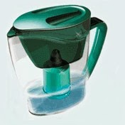

[Обещал](http://svobodaiznutri.ru/?p=23) рассказать про рытьё. Но решил сначала написать о том, что сильно облегчило нашу жизнь. И о том, на что следует обращать особое внимание тем, кто решит повторить наш «подвиг» переселения на землю.

Если постоянно испытываешь неудобство, выполняя простые ежедневные вещи, да ещё в условиях постоянного тяжёлого физического труда, то жизнь быстро перестаёт радовать. Понимая это, мы как могли налаживали свой быт.

**Быт**

Пока я занимался тяжёлым физическим трудом, жена **обустраивала быт**. Меня очень удивляла моя реакция на каждое новое усовершенствование нашей жизни в диких условиях. Я радовался как ребёнок. Как ни ругай цивиллизацию, но прелести её прелестны. :)

Понятно, что самое главное — это хорошая **палатка**, два слоя сантиметрового пенофола под ней (чтоб помягче было) и спальник (у нас был двухместный, «Берлога»). Но это тот минимум, без которого вообще на природу соваться я бы не стал, так что считаю, что всё это у благоразумного читателя имеется.

Первое, чего нам не хватало — это место для **сушки вещей**, и оно в избытке появилось в качестве верёвочных «перил» дома на дереве.

Второе — **место под крышей** вне палатки. Я уже [писал](http://svobodaiznutri.ru/?p=24) как мы отлёживали бока, не имея такового. Конечно, крыша дома на дереве не защищала от дождя при сильном боковом ветре, но от палящего Солнца защищала ещё как! Про нас в роли морских котиков я тоже писал, там же.

Постоянно сидеть в палатке по любому поводу — угнетает. Плюс, постоянно тащишь в палатку **грязь и песок**, приходится её постоянно вытряхивать. С появлением «палубы» эта проблема практически отпала.

**Кухня**

Жену очень сильно порадовало появление места для хранения кухонных принадлежностей. На фото сверху видно, как всякие тазики, тарелки и кружки стоят с краю палубы. Стоят они  не под крышей, и во время дождя **посуда моется автоматически**. Очень удобно.

Подпалубное пространство было неплохим бонусом к палубе: там **хранились инструменты** и прочий хлам, который желательно было защитить от дождя, но которому на палубе место не нашлось. В балки палубы мы закрутили саморезы и вешали на них всё подряд. На фотке видны несколько пакетов, висящих под палубой.

**Продукты** мы хранили в таких баках. Сначала был куплен тот, который справа. Думали, что закручивающаяся крышка надёжнее. Нифига подобного, она очень неудобно и долго закручивается и чаще всего мы захлопывали её ударом кулака. Тот бак, который слева оказался гораздо удобнее в эксплуатации. Он с удобной крышкой и с ручками, больше по объёму, да ещё и стоил дешевле.

Бак справа вкопан в землю неспроста. Это был наш «**холодильник**». Не минусовая температура в нём, но достаточно чтобы продукты хранились подольше. Т.к. он был менее удобен, в нём хранились продукты редкого использования и запасы круп. Левый же использовался постоянно. В нём лежали вскрытые пакеты с крупами, приправы и всякие вкусняшки к чаю.

Кстати, о чае. Для чайных принадлежностей и вещей первой необходимости жена самостоятельно сколхозила вот такую **полочку**.

На этой же фотке виден **термос**, который не только экономит время и газ, но и в целом существенно повышает комфортность существования. У нас было правило, чтобы термос всегда был полон кипятка. И в случае резко налетевшей непогоды мы просто забирались в палатку с термосом и грелись чаем :)

Готовили на портативной **газовой плитке** типо той, что справа. Работает на поллитровых газовых баллонах, которые довольно дёшевы. Крышка чемоданчика защищает огонь от ветра, удобно. Плитка достаточно компактна, так что её можно занести в палатку, что мы и делали, опять же во время непогоды. Погреться и согреть чайник в случае если термос всё-таки оказался пуст. :)

Но газ имеет свойство кончаться, и крышка чемодана спасает лишь от лёгкого ветра. В такие моменты нас выручала сложенная мной **мини-печь**. Я уже писал, что сложил тестовую [ракетную печь](http://svobodaiznutri.ru/?p=27) из 10 кирпичей (фотки, к сожалению не сохранилось).

Печь на фото — не ракетная, обычная. Сложил такую чтобы **сравнить эффективность** разных печей. Оказалась хуже ракетной, но так и прослужила нам до переселения в дом. Сложена без всякого раствора, все щели довольно быстро забились сажей.

**Вода**

 

Запасы питьевой воды мы хранили в 50-литровом **пластиковом баке**. Её чаще всего нам привозил отец. Но иногда мы ходили пополнять запасы к соседям. Чаще это были соседи ближайшие (Ванька с Илонкой), которым наличие машины позволяло ездить на родник. Но иногда приходилось и за полтора километра ходить к дальним соседям (Роме с Машей), у которых помпа появилась раньше всех.

 Но иногда нам было лень куда-то ходить и мы процеживали дождевую воду через **фильтр** типа того что на фото справа.

Я уже упоминал про окопы, имеющиеся в изобилии вокруг. Таковой имеется и у нас на участке (я ещё через него мостик делать собирался, [там же](http://svobodaiznutri.ru/?p=24)). Этот окоп мы застелили огромным куском полиэтилена и таким нехитрым образом **собирали дождевую воду**. Но полиэтилену мы не доверяли и собранную воду перетаскивали в две 250-литровые чугунные ванны. Не доверяли потому, что полиэтилен в любой момент мог быть повреждён когтями и зубами зверей.

**Звери**

Ну и какое хозяйство без животины? Как говорится, их есть у нас.

Я уже [упоминал](http://svobodaiznutri.ru/?p=25) про **двух кошек** с которыми мы переселились на землю. Манька и Пумка (мама и дочка соответственно). Уже говорил, что Манька через неделю дикой жизни куда-то пропала. Было очень жаль, мы её очень любили.

После пропажи мы были в лёгком трансе. Пумчик (так мы называли Пумку) как могла пыталась **веселить** нас своими проказами.

Кстати, Пумка была одним из шести Манькиных котят.  Троих мы раздали в добрые руки, двое скрылись в неизвестном направлении буквально за день до переезда на землю. Если б не скрылись — у нас было бы четыре кошки. Но получилось что скрылись. И Манька скрылась.

Пумка была самая **дикая** и неручная из приплода. Но когда пропали две последние её сестрички, она очень изменилась. Видимо, скучала по ним. Но это не мешало ей продолжать быть дикой, и она демонстрировала это периодическими «подарками», которые мы обнаруживали в палатке.

Однажды мы залезли в палатку, а она полная перьев. И в спальнике трупик птички. Пумчик так демонстрирует нам, что очень нас любит. С пропажей Маньки она стала совсем ручной.

Ведь осталась одна оденёшенька... Пока в городе, на ВДНХ, нам не предложили купить за 5 рублей **собаку** дворянской породы.

Собаку назвали **Тризором**. Сразу прочитали как надо дрессировать и воспитывать. Чем и занимались в свободное от работы время. Поначалу это не особо помогало, но потом сказалось сторицей.

Со вторым зверем стало гораздо веселей. Тризор с Пумкой **подружились** почти сразу, и потом даже кушали долгое время из одной миски. Ну и игрались соответственно. Особенно они любили игру «Получи мохнатой лапой по мордасам». Нам с Катей она тоже очень нравилась, мы с упоением наблюдали за этим процессом. :)

Таким вот весёлым семейством мы жили и строились. Точнее, пока не строились, а [копали котлован](http://svobodaiznutri.ru/?p=21)...

 

