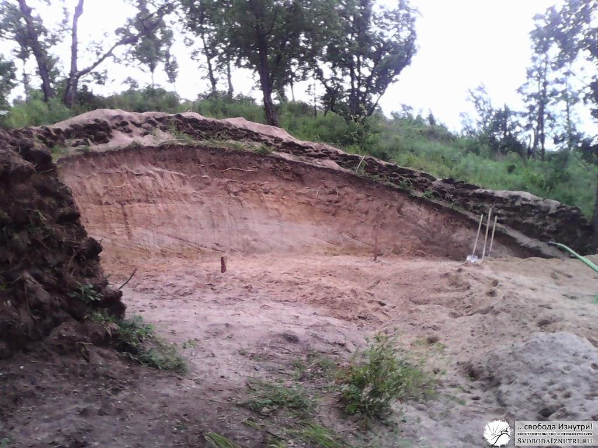

Закончили на том, как [жили в доме на дереве](http://svobodaiznutri.ru/?p=22) и [начали рыть котлован](http://svobodaiznutri.ru/?p=23) для нашего будущего [экодома](http://svobodaiznutri.ru/?p=36). Разумеется, нам в голову приходила мысль нанять экскаватор. И у нас были на него деньги.

Но мы понимали, что экскаватор может нанести вреда не меньше чем пользы. И платить за этот вред придётся своим временем (и, возможно, деньгами). На восстановление. Но некоторые вещи вообще невосстановимы. Так что мы прикинулись рыцарями и стали рыться :)

У нас перед глазами был пример соседей, которые копали **экскаватором** озёра, и решили заодно котлованчик и для дома копнуть. Результат: постоянно **обрушивающиеся стены** котлована из-за повреждений, нанесённых ковшом. Плюс, дёрн и грунт хаотично лежали на краю котлована сверху, тем самым давили на стены котлована и тоже способствовали их разрушению. Напомню, и мы, и соседи построили дома, [вкопанные в холм](http://svobodaiznutri.ru/?p=32).

Наиболее яркие примеры негативных последствий применения тяжёлой техники при строительстве приводятся в книге Янто Эванса **«Дом из самана. Философия и практика»**. Кстати, очень рекоммендую. На мой взгляд, в этой книге философское содержание гораздо ценнее практического. Но всё же от философии перейдём к практике!

**Снимаем дёрн**

Процесс рытья любой большой ямы чаще всего делится на две части: снятие дёрна и непосредственно рытьё. Особенно интересно, если вы хотите **сохранить дёрн** для хозяйственных целей: накрыть им крышу или защитить от эрозии открытый участок грунта.

Сначала мы хотели оставить дёрн для крыши, но увидев как у соседа дожди размывают стены котлована, решили делать из него **дренажную стену**. Т.е. стену, которая не даст воде течь в котлован (и в будущем в дом) и отведёт её в сторону.

В начале возведения может показаться что дерновая стена ненадёжна. У нас даже возникала необходимость местами проколоть её деревянными кольями для прочности. Но к осени она срослась так, что отодрать отдельный кирпичик от стены довольно тяжело. То ли ещё будет через год: по весне растения в стене так **сцепятся корнями**, что и не отдерёшь. Плюс вся стена **врастёт в землю**.

В помощь будущим снимальщикам дёрна: 1) **Пользуйтесь гравитацией.** Старайтесь по максимуму использовать свой вес и резать сверху. 2) Лучше делать дерновые **кирпичики побольше**: меньше таскать придётся и в целом удобнее и надёжнее. 3) Старайтесь не тратить силы на разрубание кочек с травой. Лучше **обойти растение** стороной и сохранить его корневую систему. Благодаря этому дерновые кирпичи будут прочнее. 4) Гораздо эффективнее сначала **нарезать много** кирпичей, а **потом таскать** их и раскладывать. Пореже меняйте вид деятельности. С другой стороны, совсем не меняя его быстрее устаёшь. Ищите гармонию :)

Мы освобождали от дёрна примерно **80 м² площади** и потратили на это **5 рабочих дней** (на самом деле полторы недели, но это я постоянно мотался в город по делам). Напомню, дом у нас около 40 м² внутренней площади. Остальное — для создания вентиляционного зазора между стенами дома и стенами котлована.

**Копаем котлован**

Копать — дело нехитрое. Копай да копай. Наши инструменты: две штыковые лопаты, одна подборная (ей почти не пользовались) и **садовая телега** на 150 кг. Телега — крайне полезное изобретение!

О чём стоит упомянуть ещё: 1) Чтобы грунт не рассыпался по всему склону, я возвёл **небольшую стеночку** из горбыля. 2) На первых этапах грунт необязательно свозить вниз, его можно **закидывать наверх** и тем самым укреплять дренажную стену. Главное не переусердствовать, чтоб не получилось как у нашего соседа. 3) Состав нашего грунта: **глина/песок**, примерно 1/4-10. Разброс такой потому что кое-где попадались очень твёрдые куски глины с песком, примерно 1/4-5 (готовая саманная смесь!), но их было мало. Попадались места практически с чистым песком, но их тоже было мало. Основная масса грунта примерно **1/8**. Копается такая смесь очень легко. 4) У нас было дерево на востоке и группа деревьев на западе от котлована. Получалось, что с утра (как только пропадали комары) мы работали **в тени** восточного дерева, потом в отсутствие тени отдыхали, а ближе к вечеру работали в тени от западных деревьев (до появления комаров). Если бы тени не было вообще, копать было бы в разы тяжелее. Подумайте над этим когда будете выбирать место строительства своего дома. 5) На последних этапах удобно делать **терассы** и скидывать грунт в телегу сверху, не поднимая лопаты. На самом деле так можно делать и на первых этапах, но то ли мы не догадались, то ли виноват пункт 4... 6) Готовые **стены котлована не вертикальны**, а имеют некоторый угол. Так прочнее, устойчивее и в целом надёжнее. По сравнению с верхней гранью котлована, нижняя часть стены выпирает сантиметров на 30-50. Мы рассчитывали на 20, и эту цифру закладывали в расчёты при разметке. Но реальность оказалась иной, поэтому проект пришлось немного корректировать. Короче, вместо полноценного вентиляционного корридора (который можно использовать в качестве погреба) у нас получился просто вентзазор в 20-50 см.

Результат наших телодвижений предстал перед нами 22 июля 2013 года. Учитывая, что разметку мы начали 23 июня, можно считать, что **снятие дёрна и копка заняли** **месяц**. Но напомню, что работал я в среднем 4 дня в неделю, остальное время находился в городе: отдыхал от работы работая на работе :)

**Философия**

Я уже писал, что мы принципиально не хотели использовать тяжёлую технику и электроинструмент. Почему? Загляните в упомянутую в начале статьи книгу, там очень подробно про это написано. Я же поделюсь **собственным опытом**.

Вручную работа **точнее и деликатнее**. Наш готовый котлован не только красивее котлована наших соседей. Он конструктивно лучше. У него есть дренажная стена из дёрна (со временем она будет набирать прочность), причём с переменной высотой и толщиной, эстетически приятная на вид. Стены котлована не вертикальны и имеют уклон. Плюс, они не повреждены. Наш котлован круглый, и это многократно повышает прочность и устойчивость грунта.

Всё это плюсы ручной работы. Есть и минусы. Это долго и тяжело. Не сказать что совсем тяжело (мы вообще старались **работать в удовольствие**), но определённо не легко. Тяжёлой техникой быстрее и легче.

НО! **Тяжёлую технику** нанимают на время, поэтому чаще всего работы с ней производятся в спешке, в целях экономии. _«Поспешишь — людей насмешишь»_: 1) Соседу экскаватор повредил стены котлована, оставив борозды от зубьев ковша. 2) Несмотря на то, что сосед просил экскаваторщика сделать наклонные стены, экскаваторщик сделал вертикальные, _"для красоты"_, как он потом сказал. 3) Сосед не подумал и сказал экскаваторщику закидывать грунт сверху, над котлованом и с его сторон. Закинуто было как попало, хаотично. 4) Быстрее и проще было сделать квадратный котлован. Именно такой и был сделан. Совокупность этих факторов привела к тому, что эта квадратная "красота" осыпáлась от ветра, дождей и под действием веса лежащего сверху грунта. В одном из **углов** осыпалось 1,5 метра грунта в глубину, вместе с грунтом, лежащим сверху... Это я ещё не сказал про побочный вред типа уплотнённого грунта везде, где проехали гусеницы экскаватора и "нечаянно" поваленные деревья. А что если именно из-за этого дерева вы и решили строить дом именно этом месте? Выиграли время, что скажешь...

Мы же никуда не спешили. Мы делали так, **как дóлжно**. И ни разу не жалели о _"просранном месяце"_ (слова одного персонажа, убеждавшего нас нанять экскаватор). Более того, именно во время рытья котлована к нам пришли большинство небольших идей по улучшению, оптимизации и прочим "мелочам", которые в совокупности сделали наш дом лучше, красивее, теплее, эргономичнее, экономичнее, уютнее. По субъективным ощущениям благодаря этим идеям дом стал **лучше раза в два**. Ну уж в полтора — как минимум.

Это потому, что во время копки **мы думали о доме**. Можно в этой монотонной медитации думать над каким-то, скажем, научным изобретением. И гарантирую, что результат будет отличный!

Пожалуй, хватит на сегодня информации к размышлению. Не стесняйтесь задавать вопросы в комментариях.

[Продолжение следует...](http://svobodaiznutri.ru/?p=20)
