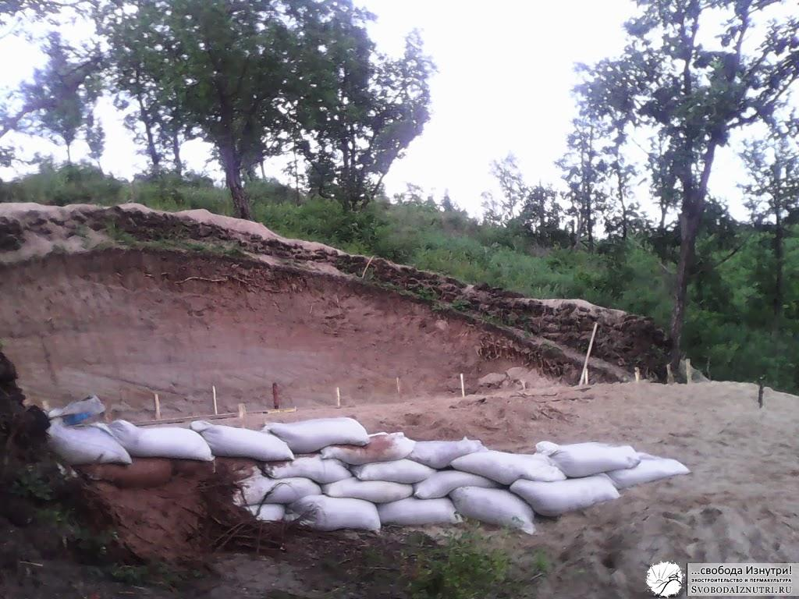

В прошлый раз мы [рыли котлован без экскаватора](/?p=21). Пришла пора делать фундамент. Но прежде необходимо было разметить площадку. А чтобы площадку размечать, нужно чтобы она вообще была. И желательно чтобы была ровная.

Ну а как мы могли разравнивать площадку, если рыли котлован без экскаватора? Не бульдозером же! Естественно, вручную! Так что пришлось ещё изрядно покопаться.

Напомню, дом у нас [круглый](/?p=33), и способ разравнивания у нас был не простой, а золотой соответствующий. И даже инструмент имелся соответствующий. Способ изготовления такого инструмента прост: берём строительный уровень любой длины, четырёхметровую доску и верёвку...

У нас нашёлся уровень длиной 50 см, доска 25х100х4000 мм и полипропиленовый шпагат. Приматываем уровень к доске верёвкой и получаем четырёхметровый строительный уровень! Такой вот нехитрый **инструмент** для разравнивания площадок.

**Разравнивание площадки**

**Технология** разравнивания круглой площадки ещё проще чем инструмент, которым она производится: находим **центр** будущего дома, ставим колышек. И начинаем выравнивать площадку нашим четырёхметровым уровнем, таская его по грунту туда-сюда. Для удобства мы ещё и закопали в центре бетонное кольцо диаметром примерно 15 см (отец много всякого строительного хлама привёз). Так что жена стояла в центре и удерживала один конец доски на кольце, а я производил доской, как это модно нынче говорить, возвратно-поступательные движения. Естественно, постоянно проверяя уровень.

Сначала пришлось ещё покопать, т.к. по всей площадке то тут, то там торчали холмики. А потом пришлось немного потаскать грунта, чтобы досыпать площадку. Грунт брали из ямы, которую выкопали неподалёку. ВНИМАНИЕ: крайне важно **насыпной** **грунт очень хорошо утрамбовывать**.

Во время трамбовки грунт постоянно расползался в стороны.  А на западной стороне не хватало довольно большой высоты, около полуметра. И мы поняли, что если эти полметра засыпать так, как мы засыпаем всё остальное, то при трамбовке грунт расползётся метров на пять. Во-первых столько грунта натаскать тяжело, долго и неохота. Во-вторых, у нас склон холма, и для этих пяти метров грунта тоже **нужна опора**, которая расползётся метров на десять... Ахтунг, экспонента!

Решили проблему радикально и эффективно: в наличии имелось штук 20 полипропиленовых мешков, и мы сгородили из этих мешков **плотину для грунта**! В мешки насыпáли грунт, укладывали и тщательно утрамбовывали. Положив "ряд" мешков, досыпали грунт до высоты этого"ряда", затем ложился ещё один ряд мешков и т.д., пока не выровняли площадку. Ряды взял в кавычки потому, что они были неровные и ассиметричные, см фото.

 

**Фундамент**

На этапе разравнивания площадки было принято окончательное **решение по фундаменту**. Это был ленточный фундамент сечения 30х30 см, дополненный торчащими вглубь земли "шипами", эдакими курьими ножками. На строительном жаргоне их называют "бурки". Внутри ленты — четыре арматурины, и по две арматурины в каждой бурке. Бурки — каждые два метра

Выбор был сделан не с потолка. Было прочитано много литературы бумажной и электронной. Весь процесс принятия решения долог и неинтересен, поэтому укажу лишь **главные факторы**, повлиявшие на него:

1) Глубина промерзания грунта у нас (Амурская область) — до 2,8 метров. 2) [Наш грунт](/?p=21) — в основном песок. Это непучинистый грунт. Т.е. особо заглубляться не требуется. 3) [Мы вкапываемся в песчаную сопку](/?p=32). Почти у её вершины, причём на отроге. В таких условиях не то что про грунтовые воды речи не идёт. Тут в принципе наличие влажности грунта под вопросом. Она очень низкая, её почти нет. Это ещё один плюс к непучинистости. 4) Фундамент должен выдерживать нагрузку стен, выполненных из тяжёлых материалов.

Взяв во внимание всё это и ещё много чего, **проанализировав аргументы** обоих сторон в войне за глубину залегания фундамента, а также учтя опыт обоих сторон и знакомых строителей, решили остановиться на среднем варианте.

С одной стороны у нас **ленточный фундамент** поверхностного залегания. С другой, он имеет бурки, которые не позволят ему «съехать с холма». Но при этом **бурки не глубокие**, всего 1 метр, т.е. не доходят до глубины промерзания. Но порассуждав теоретически, пора бы уже и приняться за работу!

**Курьи ножки**

Выравнивание площадки заняло у нас целую неделю. Но теперь мы знали какой фундамент делаем, и главное — у нас была ровная площадка! Рулетку в зубы и в бой — **размечать** её!  Жена в центре, я хожу по периметру и вколачиваю колышки ровно каждый метр.

Затем ручным садовым буром **проковыряли лунки** диаметром 20 см, метровой глубины с расстоянием между ними в два метра (каждый второй колышек) и вставили в лунки по две **арматурины**. Ещё была лунка в центре дома, в неё вставили 3 арматурины. Арматурины вставили длинные, чтобы потом загнуть их на ленту в качестве двух из четырёх арматурин ленты. Таким образом получался монолит ленты с шипами.

По хорошему, желательно было бы залить бурки бетоном одновременно с лентой, но так получилось, что сначала мы залили бурки, а потом уже копали ленту. Мне это кажется моей ошибкой, но консультации со строителями показали, что не такая уж критичная, ведь арматура скрепит "курьи ножки" с лентой, и **фундамент будет работать как единое целое**.

Ну а дальше просто **залили лунки бетоном**. Бетон замешивали в той же самой садовой телеге. Нам показалось, что это довольно удобно: подкатил телегу куда надо, насыпал песка с цементом, подкатил к месту выгрузки, залил воды, перемешал и перекидал бетон в лунку лопатой, а то и вообще вылил.

Работа над бурками заняла один день. Но это был до-о-олгий день. :)

[Продолжение следует...](/?p=19)
