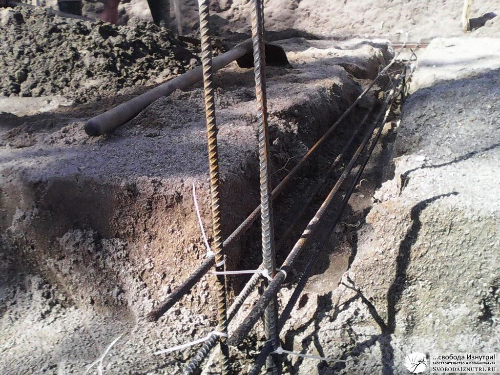

Итак, мы сделали [«курьи ножки» фундамента](/fundament-dlya-ekodoma-1) нашего [экодома](/dom-za-100-tysyach-rubley). А на следующий день приехал отец и работа закипела!
  
Выкопали траншею под ленточный фундамент. Траншея получилась примерно 30х30см в сечении. Далее загнули в траншею торчащие из бурок пары арматурин, доложили ещё по две арматурины. Каждый метр-полтора несущие арматурины соединяли коротышами.  
  
Вязали всё пластиковыми хомутами, но их было немного и они быстро кончились.После этого стали вязать полипропиленовым шпагатом. Им оказалось надёжнее, крепче и быстрее! Самое интересное, что при этом он дешевле!  

## Месим

Ну а дальше всё это хозяйство стали заливать бетоном. Отец, когда увидел как мы замешиваем бетон в телеге, долго смеялся и показал старый, проверенный и многократно более эффективный способ замешивания.  
  
Грунт из траншеи у нас был практически чистым песком, и его кучи лежали повсеместно рядом с траншеями. Такая вот куча песка перемещается лопатами ближе к месту, которое будет бетонироваться, количество лопат считается. Мы накидывали 40 лопат песка.  
  
Затем у кучи песка разравнивается верхняя часть, получается ровная площадка-плато. Сверху на это плато мы накидывали 10 лопат цемента (т.е. у нас раствор был 1/4). И после этого куча перекапывается.
  
Удобно перекапывать вдвоём, стоя напротив друг друга, и двигаяться по кругу. Не обязательно перекапывать до идеально равномерного распределения цемента. Из получившейся песчано-цементной кучи делается "вулкан", в "жерле" которого делается небольшая горка. В "жерло" заливается вода, причём льётся на лопату, чтобы не размывать ни сам вулкан, ни горку в его центре.  
  
Ждём пока вода впитается. Главное — чтобы "вулкан" был такой формы, чтобы вода уходила не в землю, а равномерно пропитывала тело "вулкана". Когда вода впиталась, доливается ещё. Раствор с краёв кучи перемещается в "жерло", по его внешнему краю. Иногда вода начинает переливаться, тогда раствор перекидывается, чтобы преградить ей путь.  
  
Но рано или поздно приходит время перемешать влажный вулкан. Обычно мы перед этим подливали ещё воды, чтобы раствор был пожиже и легче перемешивался. Перемешиваем, и получаем огромную кучу бетона, который лопатами перемещаем в траншею.  
  
Способ реально очень эффективный. Я написал, что нужно считать лопаты. Поначалу мы так и делали. Но в итоге дошло до того, что мы на глаз определяли сколько цемента высыпать на соответствующую кучу песка и сколько воды туда вылить. Т.е. не тратили время на подсчёт лопат.  
  
Единственный минус этого способа, который мы выявили — после замеса кучи идеально выровненный нами грунт стал гораздо менее ровным. Это потому, что при перекопке кучи иногда цепляешь лишку. Но этот минус легко исправим, если все операции производить на листе железа (оргалита, фанеры и т.п.).  

Работа над лентой заняла три дня. Чтобы фундамент был прочнее, мы делали нахлёст сегодняшнего бетона на завтрашний в виде постепенно понижающегося скоса. Мы называли его "язык", он был длиной чуть больше метра.  
  
Вот так весело, с шутками и прибаутками мы за рабочую неделю залили фундамент нашего экодома! И приближалось самое интересное — возведение стен!  
  
[Продолжение следует...](/likbez-po-fundamentam-grunt-voda)
