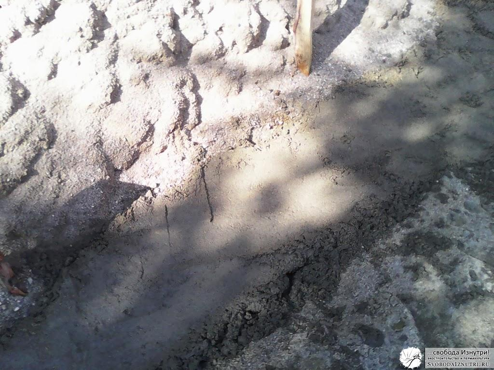

Напомню, в прошлый раз я [рассказал про виды грунтов](/likbez-po-fundamentam-grunt-voda) с точки зрения возведения на них любых строений, в том числе и [экодома](/dom-za-100-tysyach-rubley).

Я знаю, что экостроители не любят бетон. На то есть причины. Но чтобы понять в чём смысл фундаментов, я подробно опишу процесс изготовления самого распространённого ныне ленточного фундамента из бетона. И не менее подробно прокомментирую. Так будет проще понять принципы, зная которые можно сделать и эко-фундамент, без бетона.

## Процесс

### 1\. Размечаем площадку.

Если площадка неровная (как было у нас), необходимо её выровнять. Если необходимы прямые углы (90 градусов), есть два правила. **Первое**: диагонали прямоугольника равны. Если не равны, то углы не прямые.  **Второе**: в прямоугольном треугольнике с катетами равными 3 и 4, гипотенуза равна 5. Это могут быть метры, ярды, попугаи — что угодно, лишь бы пропорция сохранялась.

### 2\. Копаем

Обязательно нужно удалить дёрн и чернозёмный слой. Это около 50 см в глубину. Строительные стандарты рекомендуют удалять ещё больше грунта. Рекоммендации варьируются от полуметра (при непучинистом грунте) до глубины промерзания (при пучинистом).

### 3\. Делаем обратную засыпку.

**Насыпаем щебень** или гравий. Лучше щебень. Рекоммендуемый учебниками слой в 20 см щебня вручную утрамбовать в достаточной степени не удастся, поэтому напишу 5-10 см, чтоб наверняка. Насыпали слой 5-10 см, утрамбовали, ещё 5-10, утрамбовали и т.д. Трамбовать не ногами, а большим тяжёлым предметом. Например, бревном. Общая толщина слоя щебня, на мой взгляд, должна быть 10-20 см. Щебень насыпается **для дренажа**, т.е. чтобы вода не поднималась вверх. Или чтоб попавшая под фундамент вода безпрепятственно утекала вниз, не задерживаясь около конструкций фундамента. Некоторые в целях экономии перед щебнем сыплют ПГС (песчано-гравийную смесь).

### 4\. Геотекстиль. (?)

Как видно из картинки поста, нынче модно на (или под) засыпку класть всякий "геотекстиль" для "более равномерного распределения веса". На мой взгляд, это собачья чушь, нынче называемая словом "маркетинг".

### 5\. Кладём гидроизоляцию.

Чтобы вода не проникала в конструкции даже в виде пара. Иногда гидроизоляцию кладут после выполнения пункта 6. Если уж делаете гидроизоляцию на этом этапе (мы не делали), то желательно чтобы образовался эдакий "карман" из гидроизоляции. Таким образом защищается не только низ, но и стенки будущей бетонной ленты/плиты. Плюс, благодаря этому вода из раствора уходит гораздо медленнее. А чем медленнее сохнет бетон, тем крепче он будет.

### 6\. Выставляем опалубку.

Это нужно только если вы решили поднять основание стен повыше над землёй. Обычно это делается с целью защитить стены от поднимающейся от земли влаги в виде пара, брызг дождя, а также сугробов. Учитывайте, что бетон будет давить на опалубку с огромным усилием. Не поленитесь позаботится об укреплении её любыми доступными способами.

### 7\. Выкладываем арматуру и заливаем бетоном.

Рисунок арматуры зависит от типа вашего фундамента. Для ленты это 4 арматурины прямоугольником (пара сверху, пара снизу). Расстояние от арматуры до опалубки не менее 5 см.

Развею распространённый миф: **арматуру лучше вязать**, а не скреплять сваркой. После затвердевания бетона вязки не несут никакой нагрузки, работает лишь арматура в бетоне. **Сварка ослабляет арматуру**, делает её более хрупкой.

Арматуру вяжут исключительно с целью, чтобы она не переместилась при заливке бетона. Вязки можно делать как из проволоки, так и из пластиковых хомутов, или даже полипропиленового шпагата (это даже прочнее). **Перехлёст арматурин** по длине должен быть **минимум полметра** (лучше метр), в противном случае арматура работать не будет.

### 8\. Снимаем опалубку.

Время затвердевания бетона и набора им нормальной прочности — 28 дней. Поэтому рекоммендуют дать фундаменту "выстояться" и набрать прочность. И начать возводить стены только через эти 28 дней.

На мой взгляд, так нужно делать только если планируется нанять сотню китайцев, которые возведут стены за 1 день. Реальность же такова, что стены обычно возводятся как раз около месяца. Соответственно, нагрузка от стен на фундамент растёт постепенно, причём **линейно**. Но график затвердевания бетона — **логарифм**: в первую неделю он набирает около 50% прочности, а дальше скорость набора прочности постепенно снижается. Т.е. бетон в любом случае затвердевает быстрее чем возводятся стены.

Практика показывает, что достаточную прочность для снятия опалубки бетон имеет уже через сутки, но я бы подождал **2-3 дня**.

### 9\. Гидроизолируем фундамент от стен.

Как хорошо ни гидроизолируй ленту снизу, она будет сосать воду из любого доступного источника. Поэтому обязательно тщательно гидроизолируем стены от фундамента. Если этого не сделать, то вся вода, впитываемая лентой, окажется в стенах, а потом и в помещении. Поверьте мне, приятного мало. В лучшем случае у вас в доме потом будет очень влажно, и появится грибок. В худшем может происходить постепенное разрушение влажных стен циклами замерзания-оттаивания.

## Критика: лишняя работа

Выскажу свои мысли по каждому пункту. Разметка — вещь, без сомнения, нужная. Поэтому начну с копки. **Чем больше выкопаешь, тем больше сделаешь обратной засыпки**. Зачем добавлять себе работу трижды: сначала при лишней копке, а потом при обратной засыпке и трамбовке? Если грунт пучинистый, то спору нет, это делать нужно. Но если под домом песок, а до воды очень далеко, совершать лишние телодвижения просто глупо: этот **песок лежал тысячи, миллионы лет**, и, поверьте, за это время он **очень хорошо уплотнился**. Если хочется работы, можно пройтись трамбовочкой по песку, доуплотнить его. Это будет полезно.

**Рациональность гидроизоляции** под бетонной лентой (и с боков) для меня **неочевидна**. Да, в "кармане" бетон дольше сохнет. Но вдруг так получится, что гидроизоляция нецелостна, и откуда-то через щелку в "карман" натечёт вода. Испарятся ей некуда, будет впитываться бетоном. А вдруг резко похолодает и водичка начнёт замерзать?

Опыт очень многих строителей показывает, что гидроизолировать на этом этапе не обязательно. Более того, есть мнение, что при постоянном присутствии естественной влажности, **бетон с каждым годом становится всё прочнее и прочнее**. Как поступить вам — решайте сами. Для нас экономия времени и денег была первична, у нас песок, до воды очень далеко, поэтому никакой гидроизоляции ленты от грунта.

## Критика: опалубка

То же самое с опалубкой. На мой взгляд это **большая трата времени и дерева** (а значит и денег). Дерево, контактировавшее с бетоном, годится мало для чего. Прежде чем работать по нему любым инструментом, его нужно отчистить, ибо инструмент затупится. Да, если была гидроизоляция, то доски остались чистыми. Но в моём понимании тогда гидроизоляция опалубки — это скорее костыль, которым оправдывается нерациональный поступок.

Чтобы лучше понять мою логику, нужно знать, что я сторонник **[закапывать дома в землю](/zachem-ya-zakopal-svoy-dom)**. Прочитайте статью по ссылке, там всё очень подробно и обстоятельно описывается. Если мы закапываем дом, то чем выше он будет, тем больше закапывать. Это двойная работа: сначала поднять дом повыше, потом закапывать ту высоту, на которую подняли...

**Проще и логичней** выкопать траншею под ленту, и залить туда бетон. Это надёжно в достаточной степени при непучинистом грунте. Но главное — **быстро**. Чтобы оценить это, приведу фотографии из моего [поста про заливку нашей ленты](/fundament-dlya-ekodoma-2).

Для меня весь сыр-бор выглядит так: если хочешь **поднять дом**, тебе придётся совершить **больше работы с опалубкой** и дом будет открыт всем ветрам, будет **холоднее**. Если хочешь **закопать дом**, то тебе придётся **больше копать**, но дом будет **гораздо теплее**.

Вот гидроизолировать стены — это да. С этим я абсолютно согласен. И я лучше **трижды гидроизолирую стены** снизу и сбоку, чем буду тратить время на опалубку. Но это моё мнение, поступайте как знаете. Если будете спрашивать мнение "профессионалов", будьте готовы выслушать **маркетологические страшилки**. И после этого отдать маркетологам свои баблишки.

## **Итоги**

Надеюсь, статья помогла прояснить в голове читающего некоторые вопросы. Получилась несколько философской. И это хорошо. Важно то, что я искренне поделился опытом. Не только моим, скорее строителей со стажем, под влиянием которых формировались мои взгляды. Главное — **мой опыт подтверждает всё сказанное**.

С этим багажом знаний прошу проследовать далее: **какими бывают фундаменты, как сделать эко-фундамент без бетона**. Об этом — [в следующий раз](/likbez-po-fundamentam-eko-i-ne-eko).
