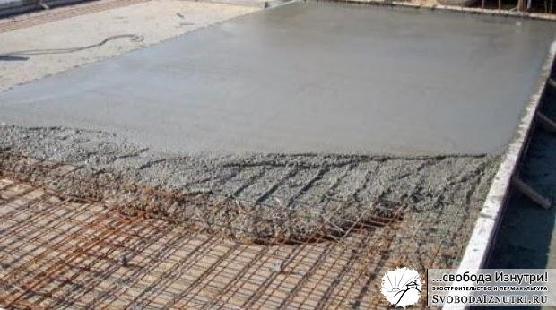
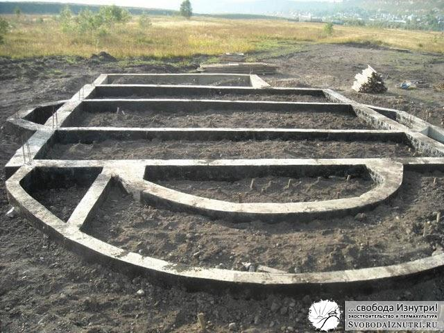

[Изучили грунты](/?p=18), [покритиковали технологию](/?p=17), теперь пора, наконец, и к конструкциям фундаментов перейти. Если вы не прочитали статьи про грунты и критику, рекоммендую сначала прочесть их. В них подробно раскрывается то, что важно знать читая эту статью.

Но не лишним всё же будет повторить: **дом держит** не фундамент, а **грунт**. **Фундамент** лишь передаёт вес дома на грунт, просто **распределяет нагрузку**. И заодно защищает стены от влаги, поднимающейся от земли.

У нас экостроительство, так что помимо бетонных опишу и эко-фундаменты.

Разные авторы по-разному классифицируют виды фундаментов. Но на мой взгляд, их существует три вида: столбчатый, ленточный и плитный. Остальные — лишь вариации на тему этих трёх.

## Плита

Начну с **самого дорогого** в изготовлении и, по мнению многих, наиболее надёжного. Я это мнение не разделяю, уж слишком много оговорок нужно сделать. Но тем не менее, поприветствуйте, плитный фундамент.

Как нетрудно догадаться из названия, под всем строением заливается плита из бетона. "Скелетом" плиты является пространственная сетка из арматуры.

**Плюсы:** Распределяет вес сооружения наиболее равномерно. Выдерживает большой вес. **Минусы:** На порядок (а то и несколько порядков) дороже любого другого типа фундамента.

## Лента

Думаю, с ленточным фундаментом вы уже знакомы из [статей](/?p=20) про [наш фундамент](/?p=19), а также из упомянутой [статьи с критикой технологии](/?p=17). Поэтому подробно описывать смысла нет. Ленточный фундамент отличается от плитного тем, что вместо плиты под всем домом, заливается **лента только под стенами**.

Внутрь бетона также закладывается арматура. Какую роль играет арматура, читайте отдельную статью.

**Плюсы**: Не слишком дорого, достаточно надёжно. Может нести большой вес. Если у вас не пятиэтажный замок, то этот вариант вам точно подойдёт. Золотая середина. **Минусы:** Много возни с опалубкой если хочется сделать высокий фундамент. Но это я уже критиковал в упомянутой [статье](/?p=17).

## Столбы

Если дом будет изготовлен не из камня, кирпича или [тяжёлого самана](/?p=34), а из лёгких материалов (дерево, лёгкий саман, соломенные блоки, все виды каркасных технологий), то не обязательно даже делать фундамент под всеми стенами. Будет достаточно столбов. Их количество и расположение рассчитывается индивидуально, но чаще всего их делают **под углами и узловыми точками**, и не реже чем **каждые 2 метра**.

**Плюсы:** Быстро и дёшево. **Минусы:** Рассчитаны на сооружения из лёгких материалов.

## Сочетания

Это и есть три вида фундаментов в чистом виде. Но зачем выбирать какой-то один вид, если можно **сочетать** их? Именно так часто и делают. [Сделали](/?p=20) так и мы.

В местностях, где **глубина промерзания** доходит до 2,8 м. (как у нас в Амурской области), делать классическую ленту или плиту не рационально. Скажем, дом 50 м². Посчитайте сами сколько бетона уйдёт на плиту площадью 50 м² и глубину **почти три метра**... Понятно, что не обязательно делать плиту такой глубины, можно сэкономить насыпкой щебня, но и щебня сколько уйдёт? А ведь его ещё и утрамбовать надо послойно...

То же самое с лентой. Зачем делать ленту глубиной три метра, если можно сделать обычную ленту, и **опереть её о непромерзающий грунт столбами**? Такие столбы не сильно удорожат ваш фундамент, но надёжности прибавят на порядок. Строители называют их «бурки».

## Эко-фундаменты

Люди, радеющие за экологию, считают, что фундамент из бетона не экологичен. Причина: **изготовление цемента — очень энергозатратная процедура**, а потому большим бременем ложится на окружающую среду. Пока не научились извлекать энергию из эфира или чего ещё, и основным источником энергии остаются углеводороды — это действительно так.

Критиковать эту позицию или нет — дело ваше. Важно другое. Важно то, что **качественный фундамент можно сделать и без применения бетона** или сведя его количество к минимуму.

Картинка слева взята из уже не раз упомянутой в моих статьях книги **«Дом из самана. Философия и практика»**. Несмотря на то, что после её прочтения я понял, что дом из самана строить не буду, очень рекоммендую её прочесть. Не столько из-за практики, сколько из-за философии.

На картинке изображены не раз **проверенные на надёжность** способы сделать фундамент. Это литой бетон, бетонные блоки, кирпич, "урбанит" (осколки отслуживших своё стен и фундаментов из бетона) и камень.

## Камень

Последние два как раз и можно отнести к эко-фундаменту. Если делать максимально экологично, совсем без раствора, то необходимо использовать **большие камни**. Если выложить **один ряд**, то получится эдакий **столбчатый по принципу функционирования фундамент**. Если **два ряда**, то получится **эко-аналог современных сборных фундаментов** (см. фото ниже).

Но большие камни доступны не всегда, а вот камни поменьше — гораздо более частое явление. Если повезёт, их можно найти прямо на участке или неподалёку от него. Стоит сказать, что **фундамент из небольших камней лучше всё же делать с раствором**. Если верхний камень будет опираться на нижний только двумя точками, под влиянием нагрузки он деформируется или сломается. **Камень, опирающийся всей плоскостью, выдерживает гораздо большие нагрузки**. Заполняя пространство между камнями раствором, мы как раз и получаем опирание всей плоскостью. (см. картинку).

Также каменную кладку нужно стараться выполнять **с разрезкой швов**, т.е. "по-кирпичному". Причём укладывать так, **чтобы не произошел сдвиг камней**. Внимательно следите за плоскостями опирания. Раствор раствором, но на этапе возведения фундамента надёжности мало не бывает. Некоторые рекоммендуют сначала уложить фрагмент фундамента без раствора, и проверить правильность расположения камней хорошенько попрыгав по ним. **Камни не должны ни свдигаться, ни шататься.** И уже после проверки уложить камни точно так же, но уже с раствором.

При работе с "урбанитом" придерживайтесь тех же правил, что и с небольшими камнями.

## Щебень

В моей [статье про эко-технологии строительства](/?p=34) упоминается технология строительства из мешков (earthbag). Эта технология предполагает устройство фундамента из тех же мешков, но тольео не с грунтом, а с щебнем. Выкладывается ряд мешков, **очень тщательно трамбуется**, выкладывается следующий, трамбуется и т.д.

Щебень хорош тем, что **является замечательным дренажём**. Именно как дренаж он используется в современных фундаментах. Вода не может подняться по нему вверх, к стенам (в отличие от песка). И этим щебень лучше гидроизоляции из рулонных (или жидких) материалов. Гидроизоляция может порваться, а с щебнем ничего не случится. Т.е. это конструктивный способ гидроизоляции.

Но я ни в коем случае **не противопоставляю щебень рулонным материалам**. Понятно, что для гидроизоляции стен от фундамента необходимо использовать рубероид (или любой его современный аналог). Ведь воду в виде пара никто не отменял. Но если будет ещё и щебень — будет гораздо надёжнее.

Кто-то рекоммендует ряды с мешками **прокалывать кольями** и прокладывать между рядами колючую проволоку (чтобы мешки не сдвигались). С кольями я согласен, они ощутимо повышают надёжность, использование же колючей проволоки спорно. Практика показала что ничего никуда не сдвигается и без неё.

## Другие эко-фундаменты

Экостроители также делают фундаменты из покрышек, заполненных хорошо утрамбованным грунтом, или тем же щебнем. Но кое у кого, в том числе и у меня, есть сомнения по поводу этого метода. Не понятно как поведёт себя резина при больших нагрузках на протяжении долгого времени.

На протяжении веков фундаменты для деревянных домов делали из...дерева! Лучше всего для этой цели подходит лиственница. Она же применялась и при устройстве мостов: в воде лиственница превращается практически в камень.

Брёвна обжигались и промасливались. Фундамент был либо столбчатый, либо фундаментом служили первые несколько венцов сруба. Хотя, различных вариантов технологии была масса, об этом красноречиво рассказывает изображение слева.

## Глина

Многие современные строители утверждают, что присутствие глины в грунтах резко понижает надёжность грунта и повышает пучинистость. Это действительно так если речь идёт о **примесях глины**.

Но если речь идёт о жирной глине (т.е. почти 100% глина), то всё с точностью до наоборот. Жирная глина имеет свойство выталкивать из своей массы воду. А вытолкнув, она не пропускает её в себя. Т.е. **глина является замечательным гидроизолятором**.

Недаром именно с этой целью её использовали во все времена при устройстве крыш [заглубленных строений](/?p=32). Недаром именно жирной глиной связывали волокна соломы при устройстве соломенных крыш. Строители и в Советском Союзе, и в дремучей древности жирную глину использовали для устройства "гидрозамка" фундамента (изображение справа).

Цитата:

> "До середины XIX века при строительстве подвалов на увлажненных грунтах использовалась традиционная и надежная технология: фундамент, сложенный из кирпича либо бута на известковом растворе, обмазывался слоем глины толщиной 8-10 см, которая затем закрывалась натуральной рогожей. Снизу в качестве дренажа подсыпался слой щебня"

И вообще, глина — волшебный материал, достойный [отдельной статьи](/glina-i-glinobeton/). На этом ликбез по фундаментам подошёл к концу. Надеюсь, было интересно и полезно. Если так, то поделитесь статьёй с другом!

[Продолжение следует...](/?p=15)
