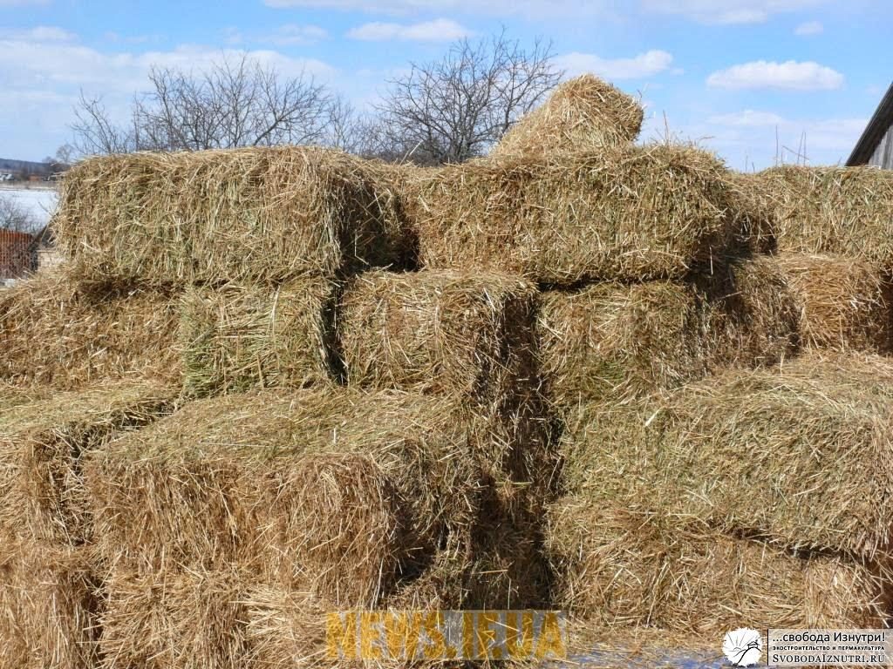
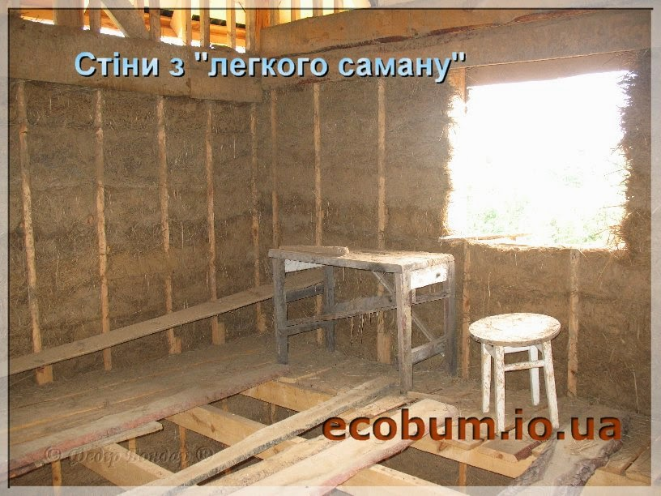
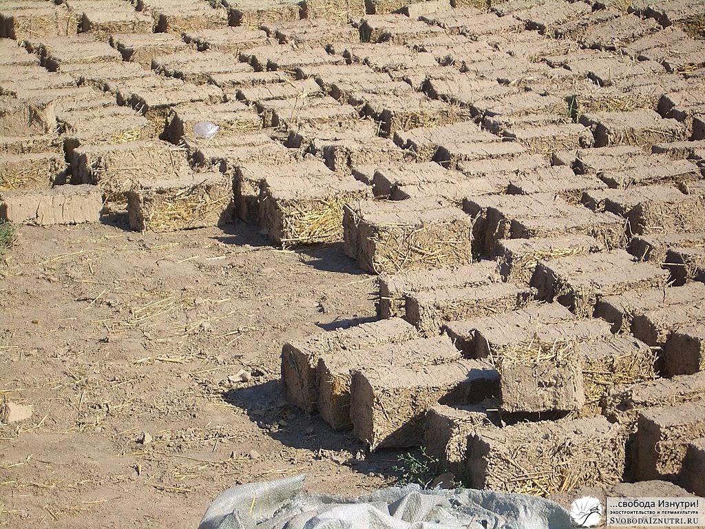
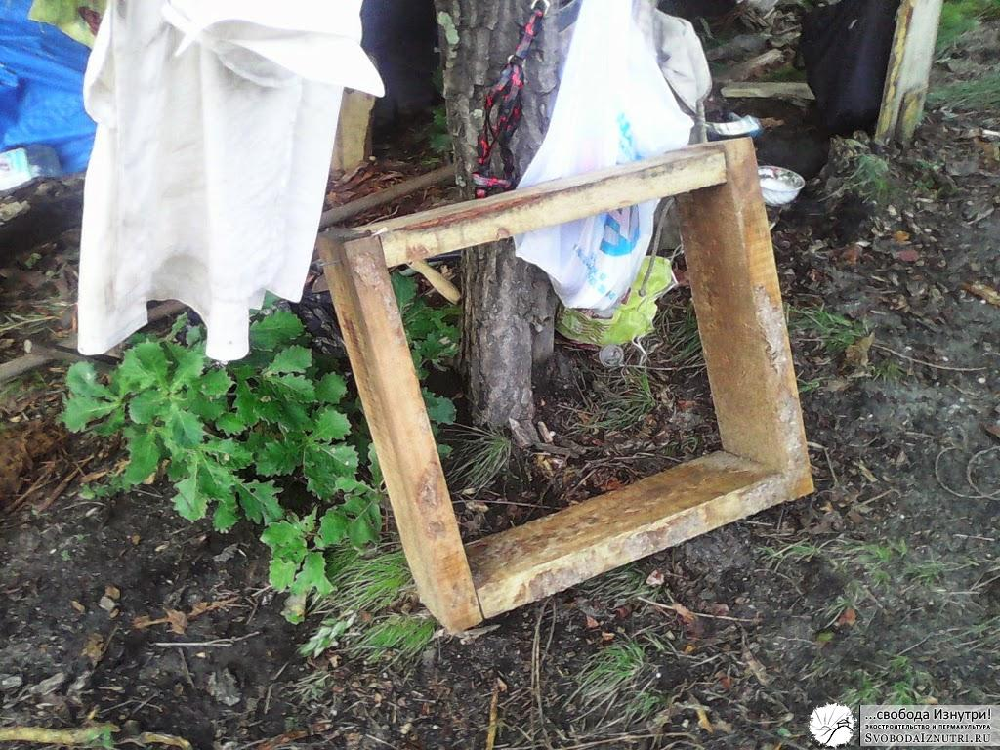

Итак, мы [сделали фундамент](http://svobodaiznutri.ru/?p=20) [нашего экодома](http://svobodaiznutri.ru/?p=36), и пришла пора возводить стены. Помните, в [ликбезе по экотехнологиям](http://svobodaiznutri.ru/?p=34) я упоминал, что мы никак не могли выбрать из чего же строить наш дом? Так вот, мы не могли определиться до самого момента возведения стен.

Чтобы подстраховаться, мы [сделали фундамент](http://svobodaiznutri.ru/?p=19), который выдержит стены из любого материала: хоть из самана, хоть из соломы. Но вот настала пора определяться. А чтобы определиться, нужна информация и опыт. А как их заполучить, кроме как в эксперименте?

Но прежде чем описывать эксперименты, расскажу об эволиции наших планов на материалы стен.

## Соломенные блоки

Изначально мы планировали дом из соломенных блоков. Это довольно просто, быстро и дёшево. Но стоит обратить внимание на последнее слово — "дёшево". Это значит, что всё-таки **стоит денег**, а их у нас не было считай что вообще.

Но дело не только в деньгах. Чтобы купить соломенные блоки, нужно чтобы они были в продаже. Мы искали их с упорством, достойного лучшего применения, но раз за разом находили только сеноблоки. И не за 30-90 рублей за блок (такие цены на западе России), а **за 300-500 рублей**. Учитывая, что по расчётам нам было необходимо около 1000 штук, такой коленкор нас не устраивал. Да и из сеноблоков никто не строит (сено гораздо больше подвержено гниению и более привлекательно для грызунов чем солома).

Проскальзывали мысли купить соломенные блоки на западе и привезти, но это убивает весь принцип экологичности: **строить из того, что под рукой, а не везти с другого полушария планеты**. Да и за доставку тоже нужно платить. Вообщем, этот вариант нас не устраивал.

## Саман: лёгкий и тяжёлый

От идеи соломенных блоков пришлось отказаться. На их место пришёл **лёгкий саман**. А что? Тот же каркас, та же солома (соломы в стогах/рулонах в продаже полно). Макай в глину да в опалубку утрамбовывай — нет ничего проще. Более того, лёгкий саман мы планировали **совместить с тяжёлым**. Экостроители часто прибегают к такому принципу: строят северную часть стен из лёгких и тёплых материалов, а южную — из тяжёлых. Солнце нагревает южные стены, и тяжёлый материал накапливает это тепло. Как не вспомнить [про инерционность](http://svobodaiznutri.ru/?p=15).

Кстати, и ту, и другую технологию мы рассматривали не только в виде монолита, и в виде кирпичей-блоков. Так решался вопрос со скоростью высыхания. Но на этом оптимизации не заканчивались. По проекту южная часть стен более чем наполовину должна была состоять из окон. Таким образом количество тяжёлого самана снижалось и, как нам казалось, решался вопрос с трудозатратностью возведения стен по этой технологии.

Для строительства из лёгкого самана нужно много соломы и немного глины. Для тяжёлого самана — много глины, много песка и много соломы. И ещё для обоих технологий нужна вода в огромных количествах. По поводу соломы мы не волновались: планировалось её купить, средства имелись. Песка тоже [было море](http://svobodaiznutri.ru/?p=21). Сбор дождевой воды мы организовали и почему-то за её количество не волновались (так и получилось: в это лето в Приамурье произошло сильнейшее наводнение). А вот **наличие глины было под вопросом**. Делать нечего — пошли искать.

Месторождение глины **нашли на расстоянии около 100-150 метров** от места стройки. Сразу прикидывали: как мы будем её доставлять, где складировать и т.п. Лопаты у нас были. Была и садовая тачка/телега. Куски мозаики сложились в более-менее ясную картину и мы приступили к эксперименту.

## Эксперимент

Хорошо всё представлять. **В воображении всё получается легко и непринуждённо**. Нужен дом — пожалуйста! Он будет такой-растакой, видно все детали. А красиво — страсть! А некрасиво — может стену передвинем вот сюда? — пожалуйста! Вот и наш чудо-экодом по совмещённой технологии лёгкого и тяжёлого самана казался нам считай уже построенным. **Осталось только немного поработать** — и будем жить, не тужить. Решится проблема обеспечения молодой семьи жильём. Но прежде предстояло решить проблему смешивания соломы с глиной и водой.

Наиболее авторитетной книгой по саманному строительству считается уже не раз мной рекламируемая книга за авторством Янто Эванса **«Строительство из самана. Философия и практика»** ([читать онлайн](https://docs.google.com/viewer?a=v&pid=sites&srcid=ZGVmYXVsdGRvbWFpbnxnb3R0ZXJiaWxkMjN8Z3g6N2FkNjhmNjc2ZjFmN2MyZQ), [скачать](https://sites.google.com/site/gotterbild23/%D0%94%D0%BE%D0%BC%20%D0%B8%D0%B7%20%D1%81%D0%B0%D0%BC%D0%B0%D0%BD%D0%B0.pdf?attredirects=0&d=1)). Помимо прочего, там описывается несколько способов замешивания самана. Мы решили попробовать самую простую и доступную нам. Даже изготовили опалубку для экспериментального "кирпича".

**Результаты эксперимента оказались неутешительны**. Месить саман не просто тяжело, а очень тяжело. И это усугублялось тем, что источник глины — на немалом расстоянии, и её доставка тоже связана с немалыми трудозатратами. Нам с женой сразу стало понятно почему в великом множестве видео строительства домов из самана всегда фигурирует толпа волонтёров. Потому что в одного, и даже вдвоём это практически неподъёмная задача: слепить целый дом. И мы крепко задумались...

## Решение найдёно

Думы привели нас к технологии, которую поначалу мы откидывали, как неподходящую. Эксперименты заставили нас **переосмыслить всю концепцию**. До этого мы изходили из своих фантазий: хотим вот так, и всё. Но как эти фантазии соотносятся с реальностью?

Теперь же наше целеполагание поменялось. Мы стали думать так: **что у нас уже есть?** Прямо здесь, возле дома? И нам сразу стало ясно из чего строить. Более того, материалы для этой технологии стоят реально копейки и ничего не нужно смешивать, выдерживая рецептуру.

Так что же это за технология?!! — спросит нетерпеливый читатель. Отвечаю: технология, на которой мы остановились, называется...

А фигушки, сохраню интригу до следующей статьи! :D

[Продолжение следует...](http://svobodaiznutri.ru/?p=13)
