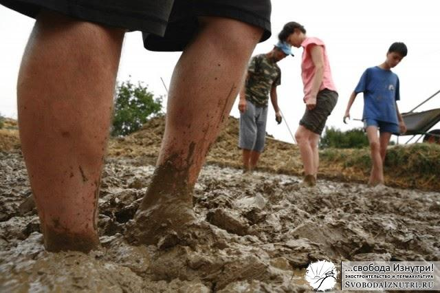
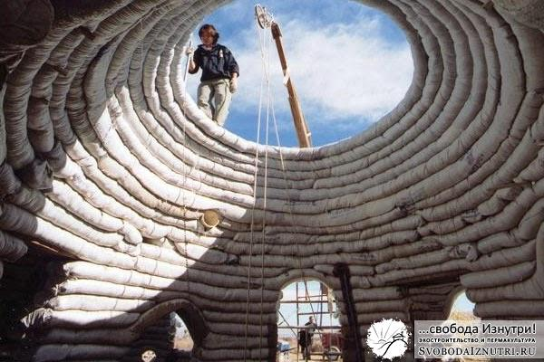
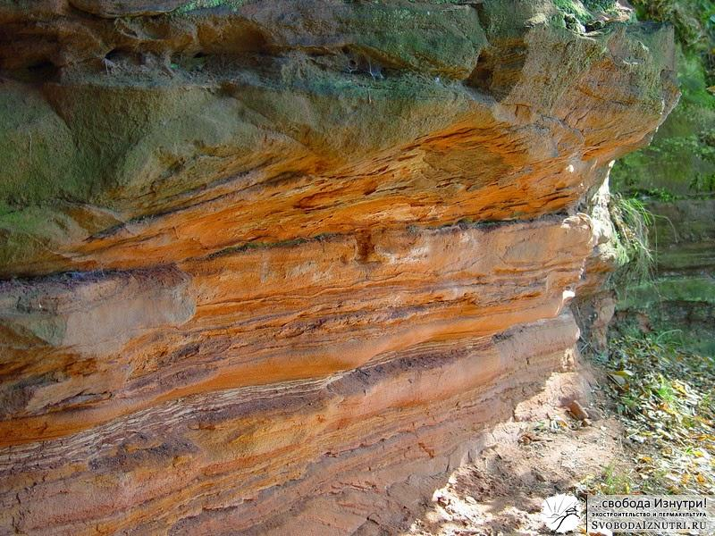
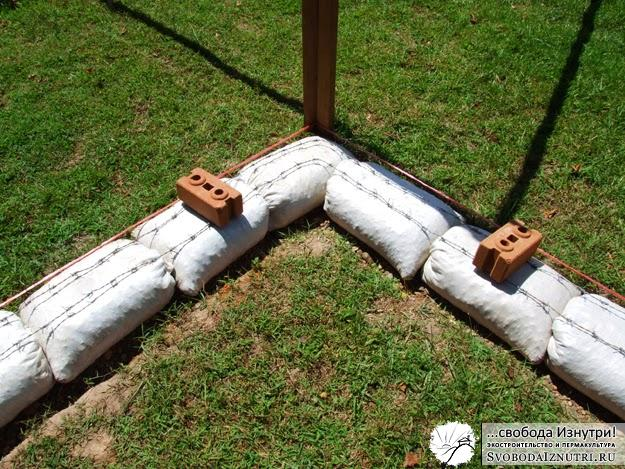

«Из чего строить стены экодома?» — задавал я вопрос в [прошлой статье](/iz-chego-stroit-steny-ekodoma/ "Из чего строить стены экодома?"). Какая из [технологий экостроительства](/?p=34) подошла нам? Думаю, все читатели с нетерпением ждали ответа на этот вопрос.

Разрабатывая проект своего будущего дома (и экодома тем более), большинство из нас руководствуется своими мечтами и думает категориями идеального — и это нормально. Но очень важно соотносить мечты с реальностью.

Вот и мы мечтали сначала о соломенных блоках, потом о лёгком и тяжёлом самане. Но практика [показала](/?p=14), что строить ни из первого, ни из второго, ни из третьего мы не будем, т.к. в нашем конкретном случае трудозатраты будут слишком велики.

## Так из чего же тогда строиться?

Если помните, когда выравнивали площадку под дом, чтобы не отсыпать слишком много, мы сделали "дамбу" из мешков с грунтом? И получилось, что тем самым мы **опробовали технологию под названием "суперсаман"** (superadobe, earthbag), в народе называемую..."мешки с грунтом"!

Суть технологии проста: берутся тканные мешки (чаще всего тканные полипропиленовые мешки или безразмерная полипропиленовая "кишка", из которой они изготавливаются) и заполняются грунтом. Из заполненных мешков выкладываются ряды стен, каждый ряд тщательно трамбуется. Особенность технгологии такова, что желательно строить не прямые, а криволинейные стены. Чаще всего просто **строят круглые, и даже купольные дома**.

Чем эта технология лучше самана всех типов и соломенных блоков? Соломенные блоки хоть и доступны, но всё же стоят денег. Можно делать их самостоятельно вручную, но это ОЧЕНЬ долго. Саман же предполагает **заготовку смеси**. И процесс замешивания зачастую занимает больше времени, чем непосредственно укладка стен. Более того, расчёты показали, что, строясь из самана, мы просто не успеем построить дом к августу — а это необходимо технологически, иначе стены до зимы не высохнут. Мы же хотели успеть построиться за этот сезон и зимовать уже в построенном доме.

## Жирный кусок мозаики

Многие считают, что грунт в мешках тоже должен быть определённой рецептуры. [Создатель этой технологии Надир Халили](http://hojja-nusreddin.livejournal.com/370104.html) в [своём фильме](http://www.youtube.com/watch?v=bnWw_PrJB48) рекоммендует смесь цемента с грунтом 1 к 10, эту смесь он называет **"стабилизированный грунт"** ("stabilized earth"). Но как я уже неоднократно упоминал, экостроители не любят цемент и стараются либо вообще не пользоваться им, либо свести его количество к минимуму. И тогда используется та же смесь, что и в самане: глина с песком 1/4, плюс солома (либо без неё).

Сильного предубеждения к цементу я не испытываю, но он всё ж таки стоит денег. Да и **тратить силы, и, главное — время — на замешивание ни глины с песком, ни цемента с грунтом не хотелось** (напомню, мы не пользовались ни бензо-, ни электроинструментом). Именно поэтому для меня эта технология была в аутсайдерах: зачем строить из того же самана, только ещё и тратиться на мешки или на цемент?

Но неожиданно я натолкнулся на информацию, ставшую жирным куском в этой мозаике. Информация была о [строительной технологии "Sandbag"](http://www.sandbaghouse.com/Infos_files/Sandbag%20House%202.pdf), на которую выдан патент в ЮАР. Эксперты заключили, что дома, построенные по этой технологии, обладают **наивысшей степенью сейсмоустойчивости**. Технология такова: делается деревянный каркас с вертикальными стойками не реже, чем каждые 90 см. Стойки немного с выдумкой, называются "ecobeam", загляните по ссылке чтобы на них посмотреть. Но дело не в них, а в том, что в промежутки между стойками утрамбовываются...**мешки с песком**! И потом это всё штукатурится по сетке.

Что привлекло моё внимание: необходим чистый песок, без примеси глины. Забавно, не правда ли? Одни говорят, что обязательно нужна глина, другие говорят, что глины в песке ни в коем случае быть не должно... Но если можно заштукатурить стену из мешков с песком, и это будет очень сейсмоустойчивая конструкция, то **зачем тогда заморачиваться замешиванием?** Этот кусок мозаики стал последним, и в голове созрел план.

## Наша технология

Я [уже говорил](/?p=21), что **наш грунт — глина с песком, примерно 1 к 8** (варьируется от 1 к 4 до 1 к 10). Причём грунт послойный: сантиметр глины, три сантиметра песка, сантиметр глины, восемь сантиметров песка и т.д. То есть если копать этот грунт, то пропадает необходимость что-то замешивать. Всё **смешивается автоматом пока копаешь**. И в итоге получается смесь глина с песком 1 к 8 естественной влажности. Не саманная смесь, не чистый песок — нечто среднее. Но чем не "стабилизированный грунт"? Только стабилизированный не цементом, а глиной!

Критикам этой технологии не нравится полипропиленовость мешков. Ведь они "фонят" хлором. Плюс, хлор испарится, мешки станут хрупкие, и стены развалятся. Отвечу так: фонят хлором мешки только **при воздействии солнечного света**, причём фонят они в таких малых дозах, что можно пренебречь. Ну а закрытые штукатуркой — они не фонят вообще, и не "испаряются". Не, я бы и сам использовал брезентовые, льняные, конопляные или ещё какие. Только в продаже их нет. А если бы были, то цена бы явно кусалась...

Тем же, кто боится, что "мешки сгниют и стены развалятся", сообщаю: **мешки нужны лишь на этапе трамбовки**. Утрамбованный и высохший грунт никуда не девается даже если мешки разрезать, разорвать или аннигилировать любым другим способом. Что уж говорить о заштукатуренной стене... Если чистый песок удерживается штукатуркой в стене, то песок, стабилизированный небольшим количеством глины — и подавно. И это не теоретичекая прикидка, это проверенный результат: экспериментальные стены из нашего грунта стоят с августа 2013 года (на момент написания статьи — полгода) незаштукатуренными, под открытым Солнцем. Мешки стали хрупкие, но их содержимое никуда и не думает деваться.

Некоторые строители по технологии earthbag прокладывают колючую проволоку после каждого ряда мешков. Мотивируют они это так: чтобы мешки не двигались во время трамбовки. Но практика показала, что если класть мешки очень плотно — то они и не могут никуда сдвинуться. А самое забавное — колючая проволока как раз мешает плотно положить мешки. Так зачем она тогда нужна? И **мы не пользовались проволокой**. Вместо этого мы **прокалывали каждый ряд мешков деревянными кольями** на три ряда в глубину. Практика показала, что этого было достаточно.

## Из грязи в князи

Вот так технология, изначально определённая в аутсайдеры, отвоевала своё место под Солнцем, во всех смыслах. Надеюсь, вам было интересно наблюдать за мотивировкой наших с женой решений и поступков. Но ещё больше надеюсь, что эта информация окажется полезной. И когда придёт время, вы сможете принять правильные решения.

Ни в коем случае не хотел сказать, что не нужно строить из соломенных блоков или самана (лёгкого или тяжёлого). Просто в наших условиях использование этих технологий было бы не оправдано. Нам было проще и удобнее строиться из мешков, что мы и сделали.

Но это всё была теория. Пора бы перейти к практике! Как проходил процесс строительства по этой технологии, выстраданной часами размышлений?

[Читать продолжение >>>](/?p=12)
