Итак, от [теории](http://svobodaiznutri.ru/?p=13) перейдём к практике! Напомню, мы [решили](http://svobodaiznutri.ru/?p=13) строить дом из суперсамана (в народе — дом из мешков, earthbag, superadobe). Но прежде чем возводить стены, было необходимо решить несколько технических вопросов...

Мы с женой решили, что на юге у нас должно быть большое окно, ведь [дом ориентирован по Солнцу](http://svobodaiznutri.ru/?p=31). Но примеров изготовления больших окон в суперсаманных домах мы не нашли. Не беда! На то человеку и дана голова, чтобы думать. Вот мы и придумали то, что между собой называли "чёртики".

Каждый "чёртик" делался из двух досок 100х25х4000, соединённых между собой в двух местах двумя отрезками того же сечения, один 60 см, другой 80. 60-тисантиметровый — в основание (это измеренная нами ширина утрамбованного мешка), 80-тисантиметровый — на высоте будущего перекрытия, с выносом. **Чёртики устанавливались в вертикальное положение и фиксировались мешком**. См. фото.

[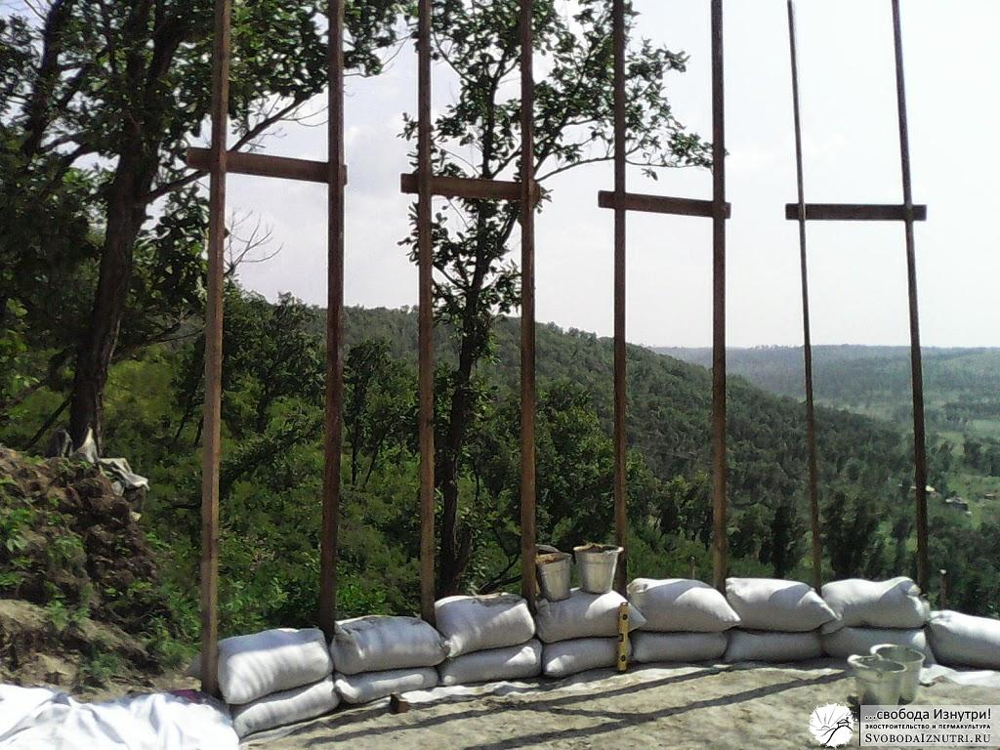](http://svobodaiznutri.ru/wp-content/uploads/2014/04/IMG_20130821_140303.jpg "«Четыре чёрненьких чумазеньких чертёнка». Вид изнутри дома")

[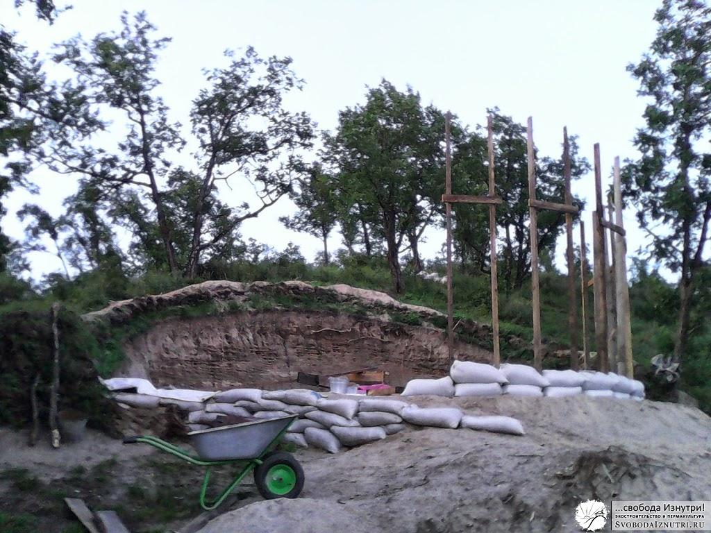](http://svobodaiznutri.ru/wp-content/uploads/2014/04/IMG_20130821_192357.jpg "Вид снаружи дома")

## Центральный столб

Ещё одним важным инженерным сооружением был центральный столб. Сделал его, скрепив три лиственичные доски 50х150х4000 12-тисантиметровыми саморезами, плюс ещё полтора метра наростил. **В столб была врезана площадка для опирания балок перекрытия.**

Мы уж было начали возводить стены, как вдруг поняли, что столб пять с половиной метров в высоту, а диаметр дома — 4 метра. Т.е. **столб необходимо поставить до возведения стен**. Мы долго не понимали как сделаем это, ведь вся эта монструозная конструкция из лиственицы с площадкой была жутко тяжёлой...

Как обычно, **выручил случай**: однажды к нам в гости пришёл наш товарищ Лёша, и одновременно к нам на холм поднялся наш сосед, тоже Лёша, с подругой Ларисой. Так, с двумя Лёшами и одной Ларисой наперевес, мы, как бравые ковбои, накинули на столб лассо, подняли его, и закрепили четырьмя укосинами. Жаль, процесс не был запечатлён на видео: было весело, с шутками и прибаутками.

[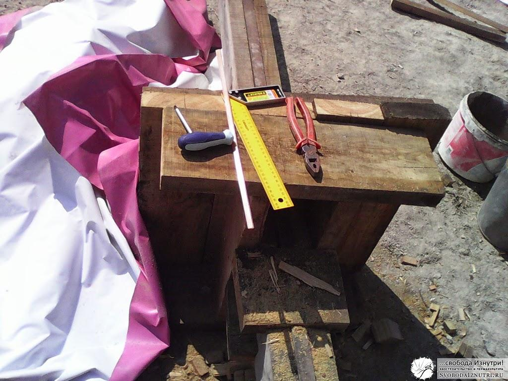](http://svobodaiznutri.ru/wp-content/uploads/2014/04/IMG_20130821_140421.jpg "Врезка площадки и применяемый инструмент. Ещё в кадр не попала ижсталевская ручная пила с крупным зубом")

[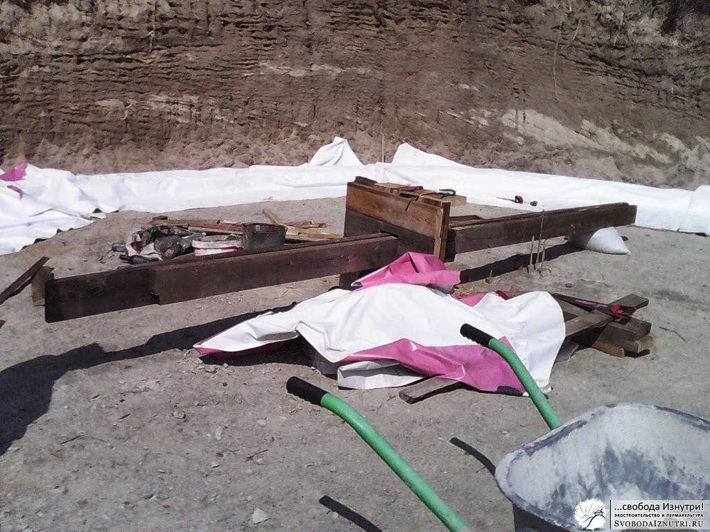](http://svobodaiznutri.ru/wp-content/uploads/2014/04/IMG_20130821_140226.jpg "Столб в лежачем положении")

[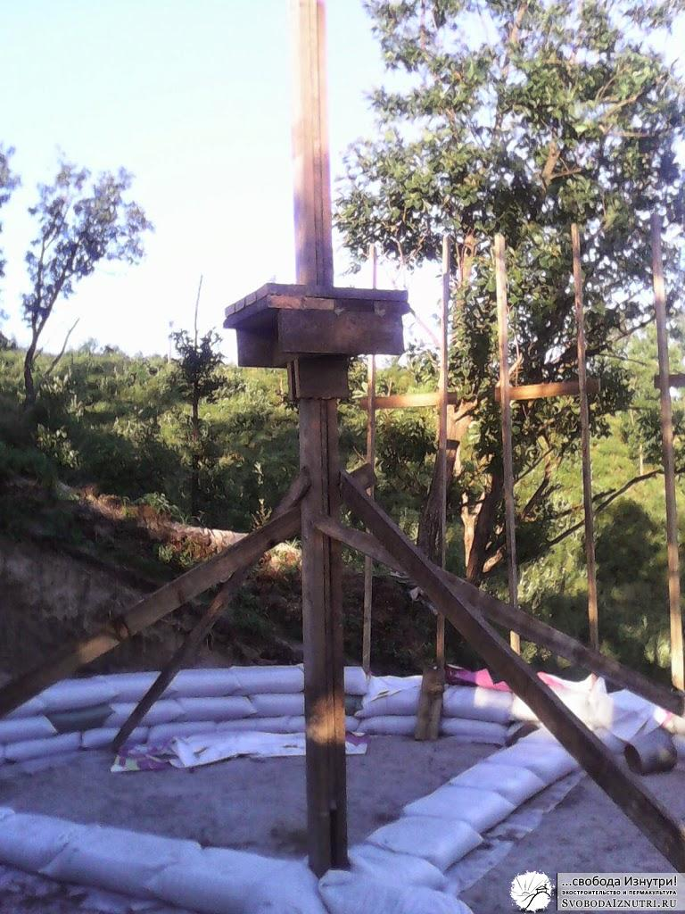](http://svobodaiznutri.ru/wp-content/uploads/2014/04/IMG_20130825_193051.jpg "Столб в стоячем положении. Четыре укосины. В последствие одна из них была убрана, т.к. жутко мешала ходить. Столб замечательно стоял и без неё")

## Стены!

Но дом — это не "чёртики" и не столбы. Это в первую очередь стены! Наша технология возведения стен из мешков была проста как три копейки. Напомню, мы не замешивали никаких смесей, у нас всё замешивалось автоматом. Благодаря послойности грунта (глина-песок), при копке получался песок, стабилизированный глиной. **Грунт мы брали из будущих септика и погреба** (две ямы в разных местах).

Этот грунт лопатами грузится в обычные оцинкованные 10-литровые вёдра и в них перемещается на стену. Там вёдра высыпаются в мешок (6 вёдер на мешок), мешок завязывается и плотно утыкается в соседний. Цикл повторяется пока не выкладывается целый ряд. Получившийся ряд **тщательно трамбуется** специнструментом, который я сколхозил из берёзового бревна и куска лиственичной доски примерно 200х50х400 мм. В народе называется "трамбовка". Утрамбованный ряд получается около 12-15 см в высоту. Каждые два ряда мы **протыкали дубовыми кольями** 3-5 см в диаметре на три-пять рядов в глубину. Благо, вокруг нас полно порослевого дуба, который надо прореживать.

Прежде чем начинать работу, **важно продумать логистику** подъёма вёдер и людей на стены по мере роста этих стен. Когда они высотой 2-3 ряда — проблем никаких. Но с 6-го они начинаются: нужно либо делать что-то типа лестницы из тех же мешков как в [этом видео](http://www.youtube.com/watch?v=DPz61MWn8xw), либо сооружать козлы, либо придумывать что-то ещё. Нам выдумывать не пришлось ничего: наш дом вкопан в холм, и нам было достаточно кинуть мостик с края котлована на стену, и с каждым рядом перемещать его чуть выше...

Кстати, **возьмите себе в помощники гравитацию**: носить тяжёлые вёдра сверху вниз проще чем снизу вверх, и мы в этом убедились: сначала носили грунт снизу вверх из будущего септика, потом сверху вниз из будущего погреба. Также помимо гравитации рекомендую взять себе в помощники **добрых друзей-волонтёров**, с которыми строить не только легче, но и веселее! Пользуясь случаем: спасибо вам большое, друзья!

[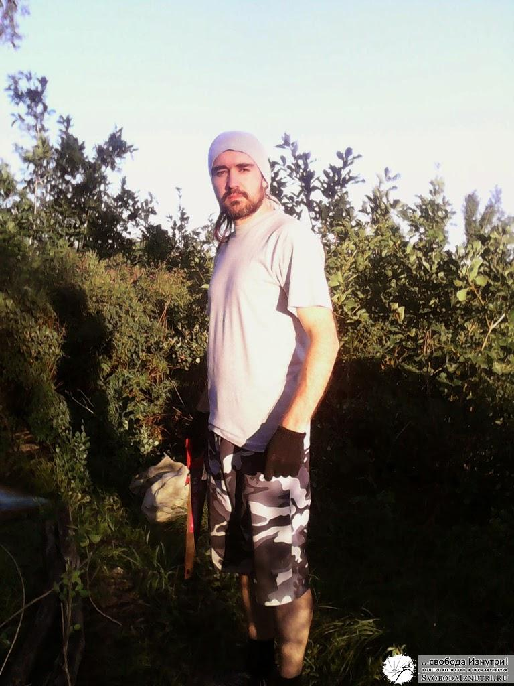](http://svobodaiznutri.ru/wp-content/uploads/2014/04/021.jpg "Спасибо Лёше!")

[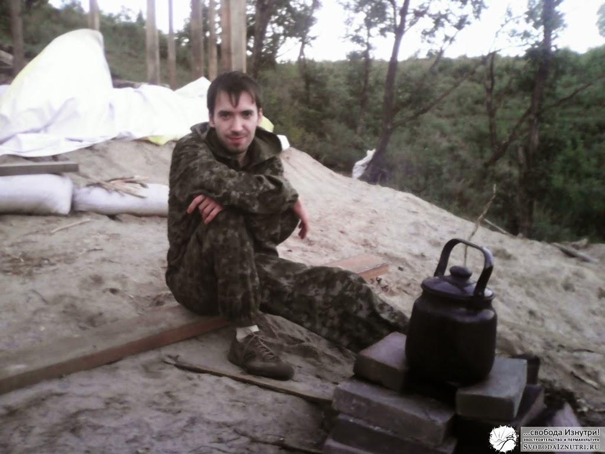](http://svobodaiznutri.ru/wp-content/uploads/2014/04/04.jpg "Спасибо Артуру!")

[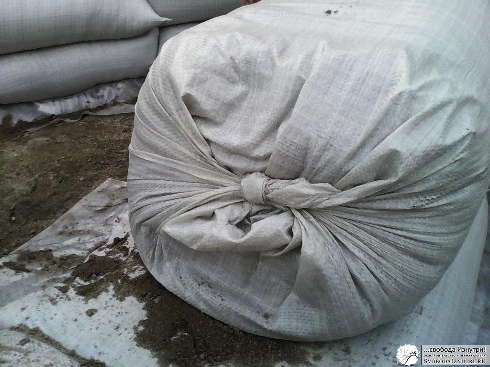](http://svobodaiznutri.ru/wp-content/uploads/2014/04/061.jpg "Грунт таскаем в мешки. Мешки завязываем.")

[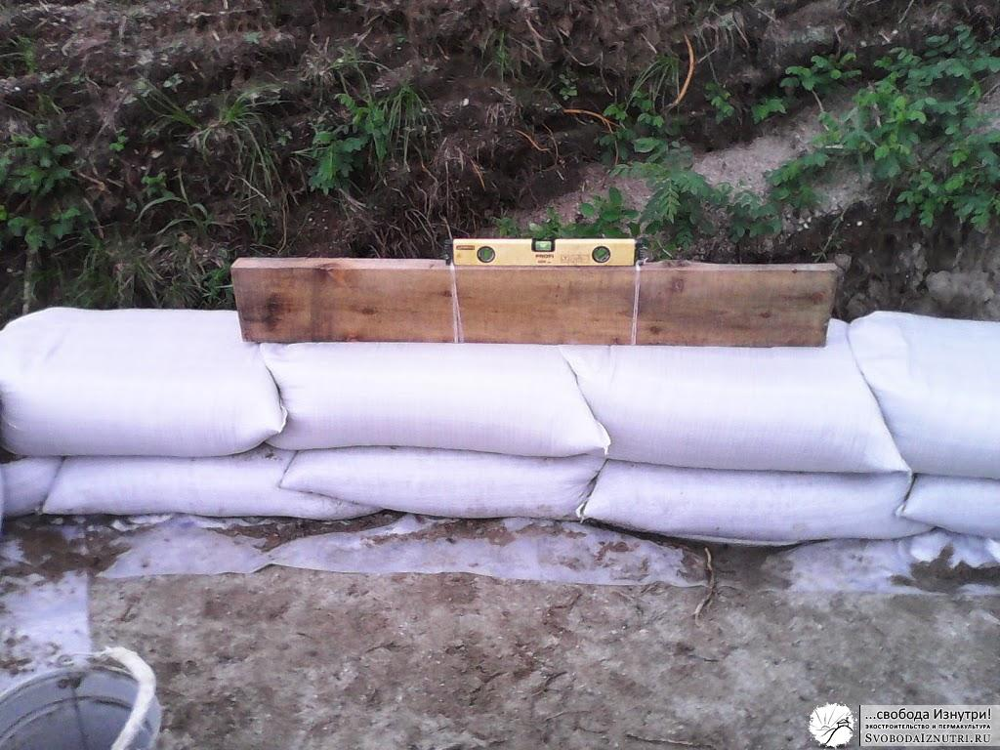](http://svobodaiznutri.ru/wp-content/uploads/2014/04/07.jpg "Не забываем проверять уровень, причём не только вдоль, но и поперёк, чтоб мешки не стремились скатиться ни внутрь, ни наружу")

[")](http://svobodaiznutri.ru/wp-content/uploads/2014/04/11.jpg "Дверная рама цепляется за стены такими вот "зубами" в трёх уровнях (снизу, посередине и сверху)")

[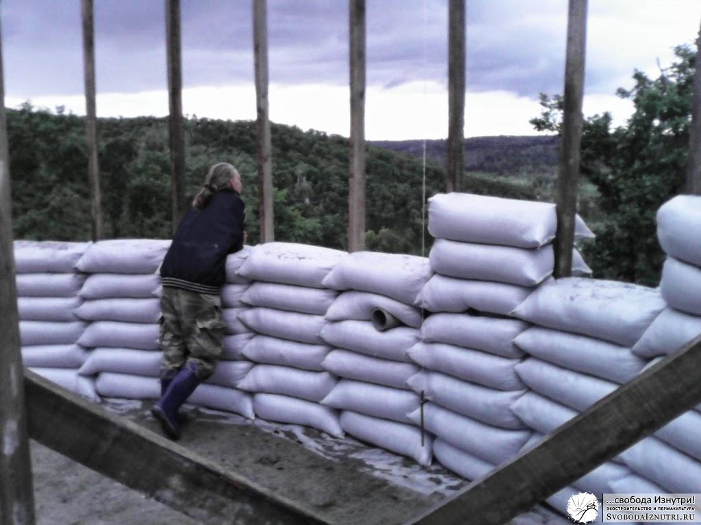](http://svobodaiznutri.ru/wp-content/uploads/2014/04/12.jpg "Не забываем мечтать и представлять как будет хорошо в будущем доме!")

[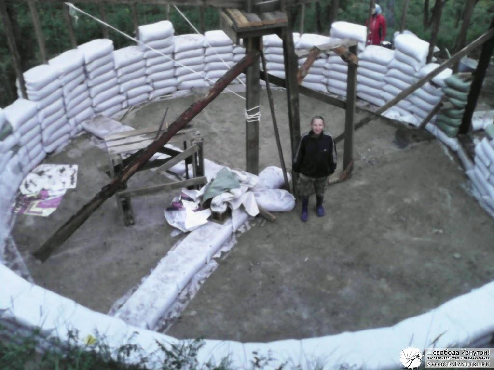](http://svobodaiznutri.ru/wp-content/uploads/2014/04/13.jpg "Вид сверху.")

[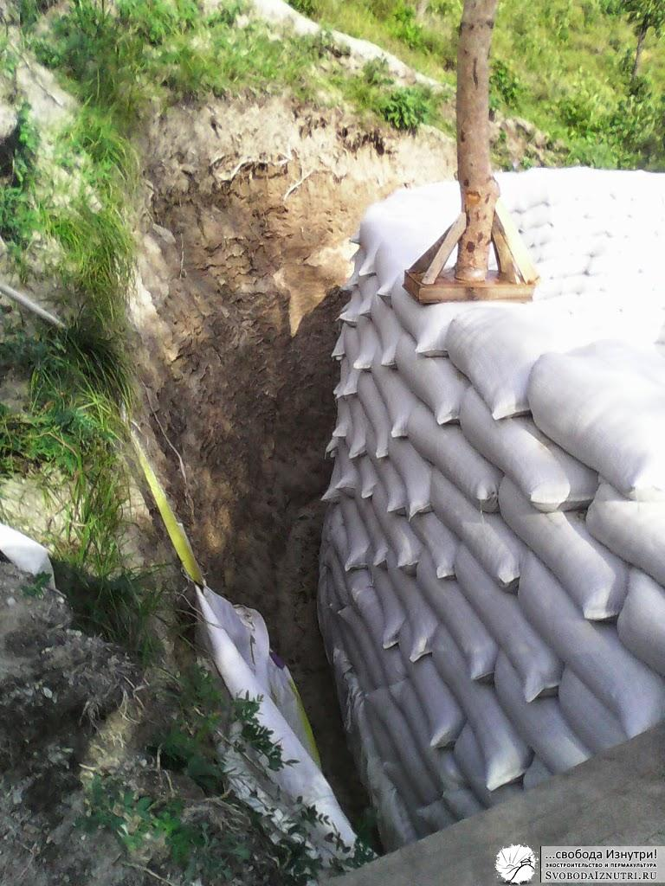](http://svobodaiznutri.ru/wp-content/uploads/2014/04/14.jpg "А стены растут! В кадре трамбовка. Обратите внимание, между стенами и землёй есть вентиляционный зазор")

[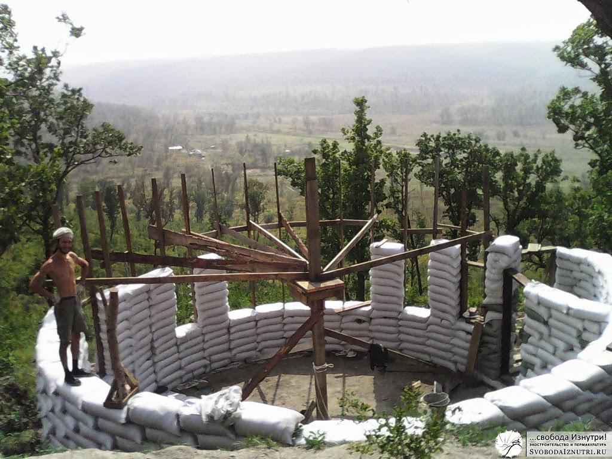](http://svobodaiznutri.ru/wp-content/uploads/2014/04/16.jpg "Финишная прямая!")

## Подводим итоги

Возведение стен заняло у нас **ровно месяц** с 23 августа до 23 сентября 2013 года. Строили в основном вдвоём с женой, но помощь друзей всё равно неоценима! Для расчётов: в разное время нам помогали от одного до четырёх человек. Если перевести в человекочасы, то примерно **10 дней помогал один человек**. Плюс, напомню, каждую пятницу с утра или в районе обеда я уезжал в город на работу, и возвращался либо во второй половине воскресения либо в понедельник. Т.е. это **2-3, а иногда и 4 дня простоя в неделю**.

Сейчас, оглядываясь назад, приходит в голову мысль: это нереально! Смотрю на стены, в них около 550 мешков, а это 3300 вёдер или **33 кубометра грунта**! И это вручную!

Но дом стоит, его можно потрогать руками. Так что реально, и ещё как! Это под силу каждому, кто захочет обеспечить себя жильём без влезания в ипотеку. Пусть наш дом небольшой (около 40 м²), но и слава Богу. Ведь отапливать его мы будем самостоятельно, а свои силы (и/или деньги), лучше сэкономить на более нужные вещи, чем просто выпустить в трубу ради понта дополнительных квадратов. Тем более что **40 м² вполне достаточно молодой семье**. Будет прибавка в членах семьи — будем достраиваться. И рельеф, и технология это позволяют.

Мы положили каждую песчинку стен своего дома своими руками. В стены вложено столько мыслей и сил, что дом в буквальном смысле **живой**. Он стал вместлищем уюта ещё до того, как на нём появились потолок и крыша. Но и без них никуда...

[Продолжение следует...](http://svobodaiznutri.ru/?p=11)
