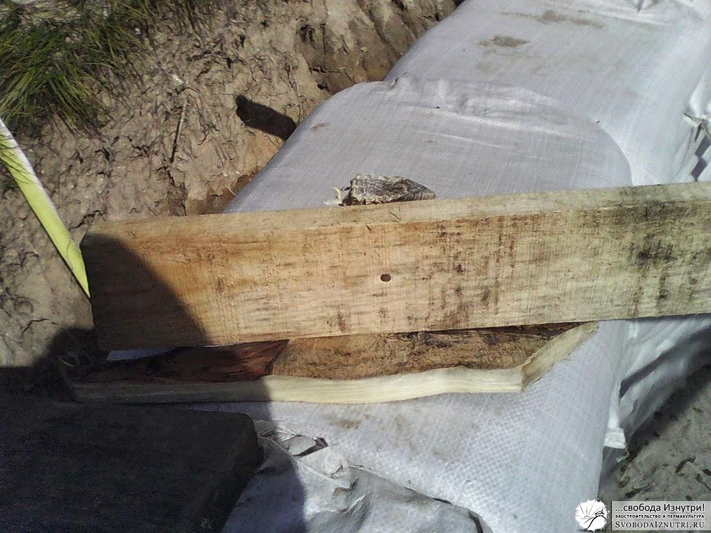

Мы [возвели стены](/stroim-iz-meshkov-s-gruntom) нашего [экодома](/dom-za-100-tysyach-rubley) и, казалось, самое тяжёлое — позади. Всего-то делов: сделать перекрытие и крышу. Но была одна загвоздка: наш дом [круглый](/zachem-ya-zakruglil-svoy-dom), да ещё и [вкопан в холм](/zachem-ya-zakopal-svoy-dom), а потому обычные варианты крыш нам не подошли бы.

Вариантов выбора было немного: либо закруглённая односкатная крыша, либо круглая шатровая крыша. Признаюсь честно, сделанный нами выбор мы считаем ошибкой, которая в последствие довольно дорого нам обошлась... Нет, крышу не унесло ветром. Просто на крышу и перекрытие мы потратили гораздо больше денежных и — главное — временных ресурсов, чем планировали, и это очень сильно изменило наши планы. Но прошлого не изменить. Можно лишь проанализировать процесс принятия решений, чтобы избежать проблем в будущем.

## Принятие решения

[, опоры крыши, в том числе столбы (2), стены (3), перекрытие (4), жёлоб, отрезающий воду (5)")](/wp-content/uploads/2014/04/skat1.jpg "На чертеже: крыша (1), опоры крыши, в том числе столбы (2), стены (3), перекрытие (4), жёлоб, отрезающий воду (5)")

Изначально мы с женой хотели простую закруглённую **односкатную крышу** (справа). Она довольно просто и быстро делается, её легко обсчитать и ещё проще крыть, ведь получается плоскость. Минусы: из-за зруглой формы дома нужно было продумать как обыграть боковые фронтоны, и эта картина никак не складывалась у меня в голове. Усугублялось это тем, что для опирания односкатной крыши необходимо было несколько столбов, которые бы сильно ограничили планировку дома. Плюс, у отца, профессионального строителя, было своё мнение, и не прислушиваться к нему мы не могли.

[, опоры крыши, в том числе центральный столб (2), стены (3), перекрытие (4), жёлоб, отрезающий воду (5)")](/wp-content/uploads/2014/04/skat2.jpg "На чертеже: крыша (1), опоры крыши, в том числе центральный столб (2), стены (3), перекрытие (4), жёлоб, отрезающий воду (5)")

Отец считал, что если сделаем односкатную крышу, то вся вода, которая будет течь по холму, будет протекать и по нашей крыше, и жёлоб (5) не поможет. Если же сделать **шатровую**, то эта вода будет замечательно обтекать и крышу, и дом. Ещё одним фактором, более всего лично меня подкупившим, было **наличие чердака**, который получается при сооружении шатровой крыши. Не столько за дополнительное пространство для размещения всякого хлама, сколько за возможность обслуживать перекрытие. Плюс, можно обойтись одним, центральным, столбом. Да и визуально такая крыша выглядит более эстетично.

Сложив все факторы, **решение было принято в пользу шатровой крыши**. Появившийся технологически центральный столб (про него уже [писал](/stroim-iz-meshkov-s-gruntom)) предопределил циркулярное перекрытие. Это когда все балки перекрытия идут от стен к центру.

## Пиломатериал или брёвна?

Ещё один вопрос, не дававший нам покоя: **из чего делать балки и стропила?** Из пиломатериала или брёвен? С одной стороны, пиломатериал дешевле, да и к тому же мы не нашли в продаже брёвна диаметром 100-150 мм, а 400-миллиметровые нам продавать отказались. С другой стороны, в шаговой доступности от нас находится лес из монгольского дуба и чёрной и белой берёзы, который не просто можно, но и нужно было проредить.

Чем нас привлекали брёвна? Во-первых, в наших глазах они гораздо красивее пиломатериала. Во-вторых, они гораздо прочнее. Плюс, засчёт круглой формы из них можно изготавливать **ресипрокальные** **конструкции крыши** (ещё пишут "реципрокальные" — самоопирающиеся). Если вы про них ничего не слышали — поищите, почитайте. Вид такой крыши изнутри можно увидеть на картинке этой статьи. Самое главное их достоинство помимо внешнего вида — они могут нести невообразимо огромный вес, причём без всякого центрального столба. На эту тему мы даже провели эксперимент на спичках:

[, но и довольно сильное давление рукой на кружку сверху. При этом сломалась только одна спичка. Впечатляющий результат!")](/wp-content/uploads/2014/04/IMG_20130914_184758.jpg "Конструкция из спичек выдержала не только кружку с чаем (соотнесите вес спичек и кружки), но и довольно сильное давление рукой на кружку сверху. При этом сломалась только одна спичка. Впечатляющий результат!")

Но все виды ресипрокальных крыш, которые мы нашли в интернете, были **симметричными**. Плюс, все точки опоры на стены находились **в одной плоскости**. Нам же необходимо было сделать **несимметричную крышу с точками опоры на разной высоте**. Плюс, не всё было ясно с нашим огромным южным окном... Как поведёт себя такая неравномерная ресипрокальная конструкция? Ни у нас, ни у знающих людей, с которыми консультировались, не было внятного ответа на этот вопрос.

Последней каплей было мнение отца о том, что деревья из нашего леса вряд ли будут обладать необходимыми прочностными качествами, да и, вероятнее всего, со временем будут гнить. Сейчас, проведя ряд экспериментов, я понимаю что это не так в обоих случаях. Но в тот момент данных эксперимента у меня не было, а его проведение заняло у меня более полугода. Поэтому мы **склонили свой выбор в сторону пиломатериала**. Но, признаюсь честно, мы до сих пор мечтаем о такой крыше. И если мне доведётся строить ещё один дом — я приложу все усилия, чтобы его крыша была ресипрокальной.

## Шатровое перекрытие

Балки перекрытия мы делали из 4-хметровой доски сечением 100х25. Кому-то это покажется мало, но на деле этого оказалось достаточно. Тем более что балки шли с шагом 50-60 см вместо обычных 100-120 см. На площадке центрального столба все 40 балок не поместились, поэтому **делал врезки** (см фото ниже).

Балки **зашивались горбылём**. Получалось довольно красиво, почти как ресипрокальная крыша. Но законченный рисунок перекрытия мы увидели только после завершения крыши. Сначала закрыли только те места, которые необходимы для работы над крышей, а уже потом доделывали перекрытие.

Интересный момент: на этапе возведения стен нам с женой было лень класть ещё один ряд мешков, и мы решили сделать **шатровое перекрытие**. Уровень стен у нас получился на 20 см ниже уровня площадки, врезанной в центральный столб для опирания балок перекрытия. Так что балки лежали не в плоскости, а **под углом около 5°**. В привыкшем к прямым углам мозгу это создаёт интересное **ощущение искривлености пространства**, которое не передаст ни одна фотография.

[Продолжение следует...](/krysha-dlya-ekodoma-2)
