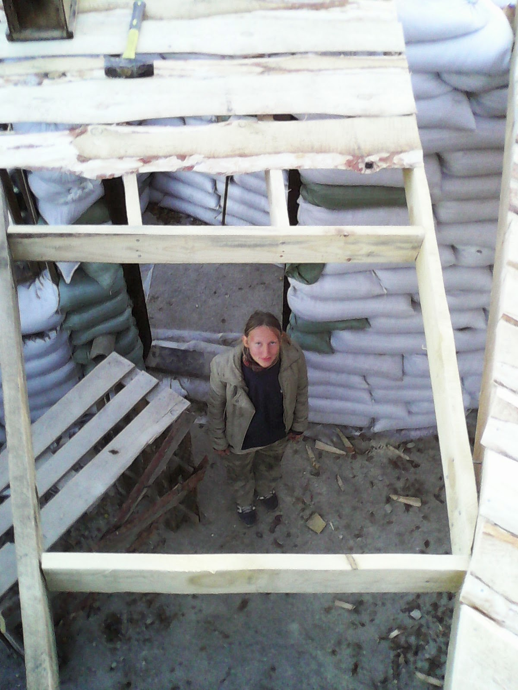

Эта статья — продолжение [предыдущей](http://svobodaiznutri.blogspot.ru/2014/04/krysha-dlya-ekodoma-1.html). Если не читали предыдущую, вы не узнаете почему мы приняли именно такое решение конструкции крыши и какие варианты рассматривали.

Тем же, кто читал, напомню: закончили мы на том, что сделали часть перекрытия, которая была необходима для удобства работы над крышей. Чтоб как можно скорее защитить дом от дождей и снегов, и все остальные работы заканчивать уже в сухости и тепле. Но не всё шло так, как хотелось бы...

## Крыша

Конструкция крыши была крайне неоднородна. Балки перекрытия, выходящие на юг, выступали за стены дома на 80 см. Эту цифру я вычислил так, чтобы зимой Солнце светило в дом, а летом выносы крыши отсекали его. Подробнее об этом уже писал [здесь](http://svobodaiznutri.blogspot.ru/2013/12/blog-post_4382.html). На концы этих выступающих балок опирались половины южных стропил. Южные стропила состояли из двух частей: 4-хметровое стропило от центрального столба к торчащим из стен [рожкам "чёртиков"](http://svobodaiznutri.blogspot.ru/2014/04/stroim-iz-meshkov-s-gruntom.html), и ещё одно (около 120 см) от чёртика на вынесенные концы балок перекрытия.

Северная часть состояла из прямых стропилин 6-метровой длины (сбивал две 4-хметровые доски 150х25 с нахлёстом 2 метра), опирающихся одним краем на центральный столб, а другим на край котлована. Лежали не на земле: несколько слоёв полиэтилена для гидроизоляции, площадка из куска горбыля, пропитанная отработкой, да и концы стропил, хоть они и из листвяка, обработкой пропитал, на всякий случай. Место нахлёста также опиралось на столбик, сбитый из доски 100х25 и куска горбыля. Столбики опирались на стену.

Был вопрос где разместить вход на чердак. Сначала думали сделать люк из дома, но по совету отца отказались от этой затеи: люк надо хорошо утеплять, но как ни утепляй — через щели будут теплопотери. Был вариант сделать подъём на чердак из вентзазора (который между стенами дома и котлована). Но мы поняли, что когда придёт время утеплять перекрытие (а утеплять планировали соломой, сухими листьями или опилом) — подъём материала на перекрытие будет отнимать много времени. В итоге приняли решение сделать вход на чердак с восточной стороны крыши.

## Цикл

Работая с односкатной крышей, работаешь с **одной большой плоскостью**. И эту плоскость можно зашить любым плоским материалом: хоть доской, хоть фанерой, хоть чем ещё. Но когда имеешь дело с шатровой крышей, как у нас, работать приходится с множеством небольших плоскостей. В нашем случае их было более 50-ти. И **зашивать приходится каждую плоскость отдельно**, а для этого приходится пилить материал, которым кроешь.

А чтобы распилить, необходимо **измерить**. В случае с односкатной крышей, с параллельными стропилами, один раз замеряешь — и пилишь в промышленных масштабах. Либо даже не пилишь, а кладёшь 4-хметровые доски не распиливая. Но когда стропила идут под углом друг другу, размер постоянно меняется. Да, можно рассчитать эти углы и напилить заранее доски разного размера. Но у нас была не строганная доска, а горбыль. И каждая горбылина имеет свою ширину, свою форму "горба" и даже свою конфигурацию (см. картинку поста).

Приводит это к тому, что **замерять нужно каждую отпиливаемую и прибиваемую досточку**, причём в двух местах (стропила не параллельны). Выглядит это так: замерил, замерил, переместился к месту пиления, замерил, замерил, отпилил, переместился к месту прибивания, взял молоток, взял гвоздь, прибил. Далее цикл повторяется, периодически прерываясь на поднос очередной горбылины для распиливания и её замер...

## От зелёного к чёрно-белому

Описанный способ не просто долог — он ВЕЧЕН. **Немного цифр**: закончили стены 23 сентября, перекрытие зашивали таким способом до середины октября, а северную (и немного южную) часть крыши — до ноября. Пока зашивали — цвет природы сменился сначала с зелёного на коричневый, а потом и на чёрно-белый: пошёл первый снег.

Не уверен, что вы сможете представить чувства, которые испытывает при виде падающего снега человек, 5 месяцев строивший дом с целью успеть его **доделать к зиме**. Сказать, что мы с женой унывали — значит не сказать ничего.

И только-только уныние начало перетекать в отчаяние, как, к нам пожаловала служба скорой психологической помощи в виде нашего друга и соседа Ромы на своей вороной кобыле. Не важно что мы говорили друг другу. Важно то, что в результате беседы было принято решение закрыть зияющие пустотой оконные проёмы остатками полиэтилена, чтобы в доме было потеплее. Взять силы в кулак, оптимизировать всё что можно оптимизировать, и **продолжить работу**.

[Продолжение следует...](http://svobodaiznutri.ru/krysha-dlya-ekodoma-3/)
