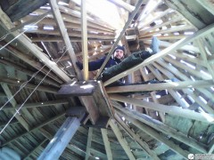

Итак, [сделали часть перекрытия, начали зашивать крышу, а тут — снег](http://svobodaiznutri.blogspot.ru/2014/04/krysha-dlya-ekodoma-2.html)! Про перипетии жизни в недостроенном доме в зимний период расскажу в следующий раз, а сегодня — про хорошее. Про то, что на следующий день опять установилась солнечная погода и снег благополучно стаял. Ну а раз так, пора доделывать крышу!

Как помните, это был очень сложный и длительный процесс: замерить, отпилить, прибить, замерить... Необходимо было как-то оптимизировать процесс, чтобы дело двигалось быстрее. А то ведь солнечные дни не вечны и за первым снегом может придти и второй...

## Оптимизация

Напомню, северную часть крыши мы зашивали, распиливая горбыль на небольшие доски и прибивая их сразу к балкам. Учтя этот опыт, на востоке, юге и западе **была предпринята попытка оптимизации**. Решил сначала набить обрешётку из тех же горбылин (см. картинку поста), а потом на эту обрешётку класть непиленный горбыль повдоль: параллельно (или почти параллельно) стропилам. Так придётся гораздо меньше пилить, а значит и меньше измерять, да и бегать туда-сюда.

Особенно радовало, что **к нам на помощь приехал сам Миша Курлапов**! Приехал на велосипеде, который был благополучно оставлен зимовать у нас. Миша, велосипед забирать будешь?

Также на помощь приезжала уже помогавшая нам при возведении стен Катя. Работа закипела! Девчёнки окоряли горбыль и трудились по хозяйству, Мише был поручен ответственный участок крыши с запада, я работал над входом на чердак с востока. Новый, оптимизированный способ хоть и требовал несколько больше материала, но зато **времени на него уходило как минимум в полтора (а то и в два) раза меньше**.

 

## Сложности

Не всё шло гладко. Возросла скорость работы, но возрасла и скорость использования материала. **Горбыль стал стремительно подходить к концу.** Привезти — целая история, которую поведаю в следующем абзаце. Но люди-то на линии, конвейер ждёт. Поэтому я принимаю волевое решение **разбирать дом на дереве**, [служивший нам верой и правдой](http://svobodaiznutri.blogspot.ru/2014/01/jizn-na-dereve.html) всё это время. Ненадолго это спасает ситуацию, но покупать горбыль всё же пришлось...

Купить — одно, а привезти — другое. В 2013 году у нас в Амурской области было сильнейшее наводнение, и в связи с дождями все подступы к нашему дому поразмывало так, что даже 4WD автомобилю там было делать нечего. **Только трактор!** Довезти любой груз нужно было сначала до деревни, а уже потом перегружать на [упоминавшегося ранее](http://svobodaiznutri.blogspot.ru/2014/01/poisk-mesta-pod-dom-2.html) 25-сильного монстра советской промышленности.

Но главным нашим врагом был, как и у французов в 1812-м и у немцев в 1941-м, **генерал мороз**. В одних рабочих перчатках руки мёрзли. В двух — всё равно мёрзли, но уже можно было жить. Гвозди с каждым днём становилось брать всё труднее и труднее. За первым снегом пошёл и второй, и третий. Нужно было срочно закрывать крышу. **И мы закрыли её.** Пусть не полностью, пусть частично запасёнными рекламными баннерами, частично купленным полиэтиленом для теплиц (толстый и прочный), частично купленной ветроизоляцией, но критичные места крыши были перекрыты. А за крышей последовала и **доделка перекрытия**.

 

## Работа над ошибками

Что ж, «И опыт, сын ошибок трудных, И гений, парадоксов друг, И случай, бог изобретатель.» — лучше Пушкина и не скажешь. В прошлой статье я писал, что мы считаем решение о шатровой крыше ошибкой. Пришла пора рассказать что я имел ввиду.

Долго набивать горбыль, большой расход материала для зашивания (горбыля) и покрытия (баннеры, полиэтилен, изоспан, позже рубероид), сложно обсчитывать количество необходимых материалов — всё это **недостатки шатровой крыши**. Если бы мы решили делать односкатную крышу, мы бы набили гобыль в разы быстрее чем даже оптимизированным способом (практически не нужно было бы ничего пилить), мы бы точно знали площадь крыши и могли рассчитать количество всех материалов. Да и самих материалов уходило бы гораздо меньше. В очередной раз мы убедились в этом всём когда решили покрыть крышу ещё и рубероидом, но это история, которую я расскажу несколько позже...

А пока нам предстояло собрать последние силы в кулак, и сложить, наконец, печь. А также вставить окна и двери, утеплить перекрытие. Короче, **подготовиться к зиме**...

[Продолжение следует...](/ekostroitelstvo-v-zimniy-period/ "Экостроительство в зимний период")
