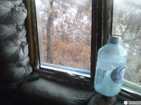
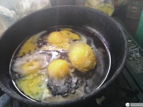

Вы когда-нибудь ночевали в палатке при температуре внешнего воздуха -20°C? Мы — да! Это был не экстремальный туризм забавы ради. Это было экстремальное экостроительство!

Стояла задача достроить дом и зимовать уже в нём. Над домом [только-только](http://svobodaiznutri.ru/krysha-dlya-ekodoma-3/ "Крыша для экодома. Часть третья.") появилась крыша, которую покрыли чем попало, только-только зашилось перекрытие (но между досками горбыля зияли щели), а на улице уже окончательно выпал снег... Как жить, да ещё и строиться в таких условиях? А вот так! Жить было возможно в первую очередь благодаря палатке и спальнику. Мало кто знает, но палатку можно довольно быстро прогреть огнём обычной свечи. У нас же была ещё и портативная газовая плитка, которой мы не только грели вечерний чай, но и устраивали в палатке настоящие тропики. Спальник у нас был двухместный, "Берлога". Вроде как он рассчитан на -20°C, но уже при ноле нам его было мало, и спальник накрывался сначала одним пуховым, а потом ещё и двумя шерстяными одеялами. С таким пирогом нам было не просто тепло, даже жарко.

## Окна

Но в палатке мы проводили лишь вечер и ночь, днём нужно было достраивать дом. Для начала необходимо было по-максимуму сохранять в нём тепло. Ветер, гуляющий через отсутствующие окна мало соотносился с этой концепцией, и потому в качестве временного варианта все окна были затянуты полиэтиленом. Жизнь сразу стала на порядок приятнее!

Тем же полиэтиленом затянули и дверь. Но над ней (а также над одним из окон) было немаленькое отверстие. Некоторое время назад Катя экспериментировала с изготовлением соломенных блоков вручную, и чудесным образом сделанный ей блок идеально подошёл по конфигурации к этому отверстию. Блок обтянули пароизоляцией (о ней ниже) и он идеально закрыл ещё одну брешь в нашей обороне. Для дырки над окном с ноля был оперативно изготовлен такой же соломенный блок.

И тут - звонок! Заказанные неделю назад окна готовы! Доставка организовалась как-то сама собой, заодно приобрели самую морозостойкую монтажную пену, какую нашли (обычную можно наносить только при температуре выше ноля, эту до -20°С), и окна были благополучно установлены. Кстати, стоит сказать, что из 9 окон в нашем доме только 2 открывающихся, остальные глухие. И глухие были заказаны без рам, просто стеклопакетами. Сравните: за открывающееся окно с рамой мы заплатили 4800 рублей, за стеклопакет без рамы такого же размера — 950 рублей (глухое окно с рамой — около 4000 рублей). Как вам такая экономия?

Проблем было две: на два окна не хватило денег, а имеющиеся окна не до потолка, над ними дыры 60х60см. В прошлом году мы утепляли дом, в котором тогда жили, и с того времени у нас осталось некоторое количество полистирола. Да, полистирол — совсем не эко, но нам уже было не до хорошего. И полистирол оказался весьма кстати, с его помощью вторая проблема была решена быстро и эффективно. Не купленные два окна же остались с полиэтиленом.

## Печь

Окна окнами, но необходимо где-то брать тепло внутри дома. И нас опять выручает мой отец. Он привозит настоящее сокровище - буржуйку! Буржуйка маленькая, старая, ржавая, без дверки и поддувала, но зато с трубой, загнутой на 90 градусов. Т.е. трубу как раз можно вывести через одно из полиэтиленовых окон. О, это сладкое слово - буржуйка! У нас появился настоящий очаг, у которого мы проводили вечера в разговорах о жизни и дальнейших планах.

Но тепло было только возле буржуйки, ведь теплый воздух, поднимаясь наверх, безпрепятственно уходил через щели между горбылём, которым было зашито перекрытие. Поэтому мы купили рулон пароизоляционной плёнки, которой и застелили перекрытие. Планировалось потом сверху для утепления накидать соломы, но с ней можно было и повременить. С чем повременить было нельзя - так это со строительством нормальной кирпичной печи. Ведь буржуйка остывает как только перестаёшь топить, а топить её 24 часа 7 дней в неделю всю зиму было бы совершенно невозможно.

Кирпич для печи был завезён уже давно, ещё в сезон дождей. Я уже говорил, что завезти к нам груз можно только трактором. Так вот, тогда дороги были в таком состоянии, что пришлось толкать и трактор. Причём гружёный кирпичом и в гору! И самое весёлое в этой истории то, что у нас это получалось! Но помимо кирпичей для печи необходим и глинопесчаный раствор, которого я заготовил целую ванну из накопанных неподалёку глины и песка, ну и воды.

## Вода

Технической воды после дождей у нас было полно, мы насобирали её впрок в различные ёмкости типа баков и ванн, стоявших на улице. Но генерал мороз не дремал, каждую ночь стремясь изменить агрегатное состояние их содержимого. И воду для глинопесчаного раствора пришлось добывать, раскалывая двухсантиметровый слой льда.

Слава Богу, после описанных выше мероприятий, в доме было теплее чем на улице, но не настолько, насколько хотелось бы. Питьевую воду, завезённую в дом в избытке, тоже каждую ночь прихватывал ледок. Приходилось на ночь согревать термос кипятка, чтобы с утра пить чай, а не грызть лёд, закусывая заваркой. Днём же лучи Солнца как рукой снимали корку льда с поставленных на подоконник бутылок с водой, пока не случилось...

Ночью температура редко опускалась ниже -10°C, днём же нередко поднималась выше ноля даже на улице. Понижение температуры было плавным, и ничего не предвещало беды. Но однажды, по-моему 23-го ноября, ночью бахнуло минус двадцать. Мы, лёжа в спальнике под пирогом одеял, даже не почувствовали это. Неладное мы почуяли, когда с утра обнаружили на палатке вместо инея корку льда. Конденсат выпадал на внутреннюю часть палатки каждое утро. Примерно до ноября он был просто каплями воды, потом превратился в капли воды в перемешку с инеем. Но вот корку льда мы увидели впервые.

Оделись, вылезли из палатки. Смотрим — вся питьевая вода полностью заледенела. Ничего, у нас есть термос с кипятком! По обыкновению поставили заледеневшие бутылки на подоконик и сели пить чай. Чай оказался не таким горячим, как обычно, но мы вполне себе нормально позавтракали. Ну, думаю, буду печку класть. Надо набрать раствора в ведро. Подхожу к ванне раствора, а она...

## Замёрзла!

Я прикинул сколько уйдёт дров на то, чтобы топить буржуйку достаточно долго, чтоб растопить ванну, и прикидки были неутешительными. Нет, теоретически это было возможно. Но необходимо было заготавливать, пилить и колоть дрова и одновременно класть печь, причём в таком ритме жить неделю, а то и полторы. Но самое главное — не факт что следующей ночью ванна не замёрзнет опять. Ещё и всю ночь топить?

В общем, строившаяся пять месяцев подряд семейная пара и так исчерпала все силы, и физические, и психологические. И воли делать последний рывок без гарантий, что эти усилия не будут напрасны — просто не было. Но был и другой важный фактор: большинство из последних решений были приняты с расчётом на скорость реализации, а не на надёжность. Слишком многое пришлось бы потом переделывать, а это дополнительные физические, материальные и временные затраты.

Так что мы приняли решение, которое откладывали до последнего. Консервация. Нам было куда вернуться в городе, но дело усугублялось тем, что у нас собака и кошка. Та комната, поселиться в которую планировалось, не могла принять вместе с нами ещё и наших мохнатохвостатых друзей. Так что всю зиму мы через день возвращались в наш домик покормить их и провести время с ними, в своём доме, на своей земле.

На момент написания этой статьи мы уже разконсервировались и начали строительный сезон 2014 года, так что [продолжение следует](http://svobodaiznutri.ru/postroit-sebe-dom-mif-ili-realnost/ "Построить себе дом: миф или реальность")!
