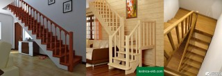

Планируя свой будущий дом, важно понимать: **конструктив, заложенный на этапе проектирования, будет очень сложно менять в процессе строительства и тем более после его завершения**. Множество факторов, которые нужно учесть в этом непростом деле - гораздо проще решаются продуманным конструктивом, а не увеличением бюджета и решениями-«костылями».

"Костыли" - так я называю действия, которые не решают пробему дёшево и эффективно, а просто частично избавляют от её последствий. Мы при строительстве своего дома не избежали необходимости применения пары таких "костылей". Надеюсь, у читателя получиться обойтись без них.

Я уже в подробностях писал об особенностях планировки дома, которые делают заметный вклад в его комфортность и оптимизацию затрат на строительство и обслуживание: [ориентация по Солнцу](/orientiruem-dom-po-solntsu/ "Ориентируем дом по Солнцу"), [вкопанность и обваловка](/zachem-ya-zakopal-svoy-dom/ "Зачем я закопал свой дом?"), [круглая форма](/zachem-ya-zakruglil-svoy-dom/ "Зачем я закруглил свой дом?"), [инерционность](/inercionnye-i-bezinercionnye-doma/ "Инерционные и безинерционные дома") и [размеры](/idealniy-razmer-doma/ "Идеальный размер дома"). Захотелось развить эту тему и поговорить о вроде бы мелочах, но также вносящих немалый вклад. То, о чём я буду писать - плод моих собственных наблюдений, размышлений и опыта проектирования. Не факт что вы найдёте эту информацию где-то ещё. Так что можно сказать, что информация уникальная! :) На этой нотке пафоса перейдём к оптимизации вашего будущего дома!

<!-- READMORE -->

## Коридоры и "коридоры"

В статье, посвящённой выбору размера дома, я говорил, что **удобство и скорость перемещения по дому любого размера зависит от грамотности его планировки**. Мало кто задумывается об этом, но за целую жизнь можно набегать по дому не одну тысячу километров. Если у вас сидячая работа и вы вместо того, чтобы, скажем, заняться бегом хотите максимизировать перемещения по дому - используйте этот совет в обратную сторону.

Но если вы цените своё время и вам жалко тратить его на лишние сто шагов каждый день, то есть решение. Итак,нужно ходить между комнатами, а также по каждой комнате. Так что в **любом доме есть "коридор", даже если он не является коридором с двумя стенами по бокам**. Соответственно, в этом "коридоре" не может стоять никакая мебель, ведь она будет мешать перемещению. А раз нельзя поставить мебель, то получается, что это уже не полезная площадь дома, а балластное пространство. Но ведь это балластное пространство нужно отапливать и обслуживать наравне с полезными площадями!

Чтобы таких балластных пространств было меньше, **необходимо, чтобы все коридоры и "коридоры" располагались в центре дома**. Для примера и простоты понимания возьмём круглый дом площадью 40 м², внутренний радиус 3,5 метра (такой дом у нас). Длина его внешних стен составляет 22 метра. Такое расстояние необходимо будет пройти если мы перемещаемся между самыми удалёнными друг от друга комнатами по периметру дома. Но мы ходим не только из самых дальних комнат, так что возьмём среднее расстояние за 10 метров. Если же ходить не по периметру дома, а по его центру, то это среднее расстояние составит около 5 метров, что в два раза меньше! Это же правило подходит и к домам прямоугольной и вообще практически любой формы. Оно же относится к проектированию не только дома, но и к меблировке отдельных комнат. Посмотрите на свой проект, поразмышляйте. Уверен, вы отвоюете несколько полезных квадратных метров!

## Лестница

Мой дом - одноэтажный, и этим я решил все проблемы с лестницей. Но чем же плоха лестница, какие с ней могут быть проблемы? А тем, что занимает много места. 3-5 квадратных метра, умножаем на количество этажей. **В двухэтажном доме лестница оттяпает 6-10 м², и при площади дома в 50 м² это почти 20% площади!** Повторюсь, эту площадь нужно построить, а затем отапливать и обслуживать. Сократить все эти расходы на 20%, а то и больше, учитывая расходы на конструкции межэтажного перекрытия и несущих его элементов - можно просто убрав из проекта второй этаж, а с ним и лестницу.

Но если без неё никак не обойтись, вот **несколько советов как сделать лестницу более эффективной**:

1\. **Прямая лестница занимает меньшую площадь чем поворотная**. При высоте этажа в 3 метра и высоте ступени в 20 см, необходимо 15 ступеней. Средняя ширина ступени колеблется от 25 до 30 см. Возьмём для примера 27 см. Прямая лестница с такими ступанями имеет площадь 4 м², поворачивающая на 90 градусов должна дополнительно иметь площадку примерно в 1 м² (зависит от ширины лестницы), поворачивающая на 180 градусов должна иметь площадку примерно в 2 м². То есть, сделав прямую лестницу вместо поворотной, можно заполучить в своё распоряжение дополнительные 2 квадратных метра!

2\. **Ещё более эффективная в плане пространства - круговая лестница**. Это когда есть столб, а вокруг него ступени. **Но помните, что может понадобиться поднять на второй этаж крупногабаритный груз**. Например, диван или пианино. В этом случае такая лестница становится самой неудобной в мире. Хуже только приставная. Что, заказывать кран чтобы засунуть пианино в окно? А если окно слишком маленькое? Но если речь идёт о прямой, но скруглёной ластнице (например, вдоль стены круглого дома) - этот недостаток к ней не относится.

3\. **Пространство под лестницей не должно пропадать зря.** Туда с успехом можно встроить полки, шкафчики, или даже целую комнату. Например, туалет или кладовую. Пара квадратных метров в плюс!

4\. **Лестницу лучше делать возле или вдоль северной стены дома**. Окна нужнее в жилых комнатах, а больше света и меньше теплопотерь будет если эти окна выходят на юг. Да и в самих комнатах теплее будет, если они будут с юга. Но у дома есть и северная стена. Так лучше пусть она соседствует с помещениями, в которых люди не находятся постоянно, а значит можно позволить чуть более низкую температуру, чем в остальном доме. Эти помещения будут своеобразным тепловым "буфером" для жилых помещений дома. Эту роль могут сыграть кладовая, котельная, другие хозяйственные помещения и - лестница. Особенно если эта лестница закрытая.

5\. **Помещение лестницы лучше делать закрытым**. Тёплый воздух стремиться подняться вверх, на второй этаж. Может получиться что на первом этаже всегда холодно, а на втором всегда жарко. Решение этой проблемы может потребовать дополнительных вложений в доработку системы отопления. Конечно, самое простое решение: душно спать - открыл окно, проветрил комнату. Но тепло-то улетело. А ведь за это тепло заплачено собственным трудом (деньги - тоже эквивалент собственного труда). Делая помещение лестницы закрытым, мы существенно снижаем уход тёплого воздуха на второй этаж. Полностью выровнять температуру на первом и втором этажах вряд ли получится: на втором всегда теплее. Но лучше пусть эта разница будет в пару градусов, чем в 5-10.

## Второй свет

Сколько ни закрывай помещение лестницы, но если в доме есть второй свет, тёплый воздух благополучно улетит наверх. **Второй свет - это когда отсутствует межэтажное перекрытие в каком-то месте дома**, и получается что комната находится как бы одновременно на двух (или нескольких) этажах. Чаще всего второй свет делают над гостинной, чтобы создать ощущение огромного пространства.

Огромного пространства, которое улетает коту под хвост! Арифметика простая: если гостинная в 15 м², то, делая над ней второй свет, мы уменьшаем полезное пространство дома по 15 м² на этаж. Более нерациональное использование пространства мне даже сложно представить. **При высоте этажа в 3 метра мы вешаем на системы отопления и вентиляции дополнительные 45 кубических метров!**

Если хочется ощущения большого пространства - существуют и другие способы, более гуманные по отношению к коту, под хвостом которого места на все 45 кубометров может не хватить. **О, это волшебное слово - дизайн!** Большие окна (или даже вся южная стена из стекла), чуть более высокие или наклонные потолки, скруглённые углы, много белого цвета, цветовые акценты в нужных местах, определённые конфигурации расположения мебели - вот неполный список способов визуально увеличить пространство помещения. Самое приятное в этих способах - за них не нужно будет ежемесячно отстёгивать сумму денег или другим образом тратить свои драгоценные силы и время. И кошачье отделение общества защиты животных скажет вам за это спасибо! :)

## Выводы: квадратные метры, даром

**Как увеличить площадь своего дома на 20-30 м², не заплатив ни копейки?** _"Что за чушь? Это невозможно!"_ - скажет любой обыватель, и даже строитель. А ведь это очень просто: сделать корридоры в центре дома (+5 м²), разместить туалет под лестницей (+2 м²), сделать прямую лестницу вместо поворотной (+2 м²), либо вообще отказаться от второго этажа, а с ним и от лестницы (+6-10 м²), и от второго света над гостинной (+15 м²).

Вроде бы и немного: тут пара квадратов, там пара квадратов. Но **в совокупности меры по оптимизации могут дать огромный прирост полезной площади дома. А вместе с этим снизить затраты на строительство, отопление и прочее обслуживание этих 20-30 квадратов.**

Не знаю как вас, но меня цифры впечатляют! Коли впечатляют и вас - поделитесь статьёй с друзьями, подарите им 20-30 м² площади! Если же у вас тоже возникнут какие-то идеи по оптимизации - не стесняйтесь высказать их в комментариях. Может, вы подарите кому-то квадрат-другой!

У меня ещё остались невысказанные мысли на эту тему, их озвучу [в следующий раз](/bolshie-melochi-planirovania-doma-2/ "Большие мелочи планирования дома. Часть 2").
