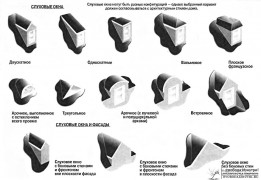
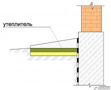

В [прошлый раз](/bolshie-melochi-planirovanya-doma-1/ "Большие мелочи планирования дома. Часть 1") мы начали анализировать кусочки паззла под названием "проектирование своего будущего дома" и нам удалось лёгкими движениями и совершенно даром прибавить 20-30 квадратных метров к площади дома. Сегодня предлагаю ещё одну порцию мер по оптимизации. Даёшь ещё халявных квадратных метров и уменьшение затрат на строительство и обслуживание!

Снизить стоимость дома и будущие затраты на его обслуживание на 20-30% - вполне реально. Нужно просто знать болевые точки, на которые давить! Итак, приступим!

<!-- READMORE -->

## Санузел

Санузел - это туалет и ванная комната, совмещённые в одном помещении. Есть ли какая-то выгода от этого совмещения? Разумеется, да. В прошлый раз я уже говорил про необходимость "коридоров" - пространств, по которым мы ходим. Нужны такие "коридоры" не только дому в целом, но и отдельным комнатам. В том числе туалету и ванной. Проницательный читатель уже понял ход моих мыслей: **зачем выделять квадратный метр в туалете плюс квадратный метр в ванной, если можно выделить квадратный метр (или полтора) в санузле?** Да, экономия небольшая, всего квадратный метр, или даже его половина. Но дело не только и не столько в экономии пространства.

**Санузел просто по-человечески удобней**. После посещения туалета мы все (я надеюсь) моем руки. Т.е. **посещение туалета - это всегда посещение и ванной комнаты**. Но зачем эти лишние хождения по комнатам с хлопньем дверями и щёлканьем выключателями освещения? Конечно, можно сделать раковину в туалете и мыть руки там, но это дополнительная площадь и плюс к затратам. Можно же просто объединить туалет с ванной в одно помещение! Пожалуй, **единственный минус такого решения - если занята ванна, то не сходишь в туалет и наоборот**. Но этот минус проявляется только если семья большая, и то изредка. Вообщем, решайте сами.

## Кухня и санузел

Что общего между кухней и санузлом? Вероятно, у читателя сразу возникает мысль: "И то, и другое связано с едой. На кухне мы кушаем, а в санузле..." Да, оба помещения связаны с едой, но также они **связаны и с водой**. Точнее, с водоснабжением. **А также с канализацией**. Ну а где водоснабжение - там влажность, а значит **и вентиляция**.

Некоторые устраивают в доме сложную систему из труб водоснабжения, канализации и вентиляции. Но лишние метры труб - это деньги и время на установку, да и проектирование такой сложной системы требует затрат. Но можно поступить проще. Однажды я был в строящемся доме, в котором и **вентиляция, и водоснабжение, и канализация были встроены в стену между кухней и санузлом**. Более эффективное решение трудно себе представить: в стену на высоте примерно в метр вмурована труба водоснабжения, из неё в одну сторону выходит кран в ванную, в другую - на кухню. И то же самое с вентиляцией под потолком и канализацией под полом. Шикарно. Так что **если разместить кухню и санузел по соседству друг с другом, то можно шлёпнуть одним выстрелом сразу трёх зайцев**!

## Межэтажное перекрытие и тёплый пол

Последнее время многие кладут в межэтажное перекрытие минеральную вату, нынче это модно. На вопрос: "Зачем?" - обычно толком ничего сказать не могут. Самый внятный ответ, который я получал - "Для утепления и заодно звукоизоляции". Хммм...давайте разберёмся. В прошлый раз я упоминал, что на втором этаже всегда теплее, ведь тепло стремится подняться вверх. Также месяца четыре назад я писал, что если речь заходит об отоплении посредством воды, то тёплый пол - решение гораздо более эффективное чем батареи.

Можно ли использовать свойство тепла подниматься наверх чтобы сделать тёплый пол без сложной системы труб, да и вообще без каких либо трат времени или сил? Можно! Скажите мне, зачем утеплять пол второго этажа? Изолироваться от тепла, поднимающегося с первого? Что за, извините, бред? **Если мы не утеплим пол второго этажа, то автоматом получим на втором этаже тёплый пол!** Минеральная вата стоит денег, и немалых, так зачем же тратиться на неё, чтобы осложнять себе жизнь? А **если хочется звукоизоляции - гораздо эффективней использовать обычный песок**, который может быть и у вас на участке, и тогда не будет стоить ни копейки. Слоя в 3 см песка в деревянном перекрытии достаточно, чтобы создать достаточную звукоизоляцию от топота табунов детей на втором этаже. Тех, кто боится, что на голову будет сыпаться песок, успокою: естественно, прежде чем рассыпать по перекрытию песок, необходимо постелить какую-то плёночку вроде ветро- или пароизоляции.

## Мансарда

Опять же, в последнее время стало довольно популярным делать второй этаж мансардным. Мансарда – это жилое помещение, расположенное на чердаке, образуемое скатами крыши. На первый взгляд это - эффективно, ведь вместо строительства второго этажа экономятся площади и уменьшается строительный объём. Но если взглянуть повнимательнее, то выявится несколько спорных моментов.

Во-первых, мансардные помещения гораздо сложнее в строительстве чем отдельно крыша и отдельно второй этаж. Особенно стоит обратить внимание на **слуховые окна: их сооружение и утепление - крайне нетривиальная задача**. Во-вторых, наклонная поверхность имеет большую площадь чем её проекция на плоскость. Попросту говоря, **утеплителя в мансардную крышу нужно положить гораздо больше чем в обычное плоское перекрытие**. Раза в полтора, а то и в два. Т.е. **гораздо проще и дешевле сделать полноценный второй этаж, чем обрезанный мансардный**. Плюс, выбор мансарды убирает буферную зону между теплом жилых помещений и зимним морозом - чердак.

## Чердак и тамбур

О, это ужасное слово - конденсат! В жилых помещениях всегда присутствует влажность. Соприкасаясь с холодными предматами, влажный воздух оставляет на них капли влаги - конденсат. И **чем реще перепад температуры - тем больше конденсата**. Железный замок входной двери, напрямую связывающей дом и улицу, очень активно конденсирует на себе влагу. И может случится, что ключ в замочную скважину без чайника с кипятком засунуть не получится... Также если между влажным воздухом и холодом улицы находится утеплитель вроде минеральной ваты - он будет напитываться конденсирующейся водой, и по мере этого процесса терять свои теплоизоляционные качества. Именно поэтому минеральную вату защищают различными плёнками - теми же пароизоляцией, ветроизоляцией и прочими.

Ладно, защитили утеплитель от конденсата, но влага-то никуда из воздуха не делась. Её нужно куда-то утилизировать, и это требует соответствующей системы вентиляции. Но из-за резкой разности температур вентиляция в зимний период либо начинает работать с двойной силой, либо работает в обратную сторону и поэтому обычно затыкается. Хоть и не полностью, а просто чтоб ограничить выход столь драгоценного тепла. Да и проблему с инеем на дверном замке не решили... Короче, чем выдумывать всякие умные словечки типа "рекуперация вентиляции", проще **создать между теплом дома и холодом улицы буферную зону: тамбур на входе в дом (его также называют "сени") и чердак над перекрытием**. Это простое и эффективное решение проверено веками: если вы живёте не на юге, а в средней полосе, то обратите внимание на старые здания. Вряд ли среди них вы найдёте хоть одно с мансардой вместо чердака. И наверняка в каждом будет тамбур.

## Цоколь и отмостка

До 30% тепла дом теряет через землю. Да, можно утеплить пол, но стены-то тоже сосут холод из земли. Отличный метод борьбы с этой проблемой - вкапывание дома в склон и обваловка, и об этом я уже написал [отдельную статью](/zachem-ya-zakopal-svoy-dom/ "Зачем я закопал свой дом?"). Но не всегда есть возможность закопаться. В таких случаях есть ещё два решения, которые можно использовать как вместе, так и поотдельности: цокольный этаж и отмостка.

**Цокольный этаж**, в простонародье именуемый подвалом, как и тамбур с чердаком, **тоже может играть роль теплового буфера между промёрзшим грунтом и полом первого этажа**. Можно сделать там погреб для хранения богатого урожая, можно обустроить там технические помещения типа котельной или гаража, и не обязательно делать цокольный этаж большой высоты - лишь бы голову не пригибать когда ходишь. Но если хочется сделать там полноценные жилые помещения, то придётся изрядно поутепляться.

Но как ни утепляйся, при бóльшей разнице температуры за бортом и внутри, тепло будет уходить быстрее. И здесь нам на помощь приходит утепление отмостки. Знаете ли вы, что на глубине 10 метров температура никогда не опускается ниже +10°С? И **если утеплить отмостку вокруг дома на расстояние, равное глубине промерзания грунта в вашем регионе, то температура на фундаменте не будет опускаться ниже ноля**. Меньше разница температур - меньше теплопотерь - меньше затрат на отопление! Мне рассказывали как один товарищ, долгое время отапливался электрическим котлом, и, после утепления отмостки, стал получать счёт на электричество в два раза меньше прежнего. Не знаю насколько история достоверна, наверняка цифру округлили, но даже если расходы уменьшились в полтора раза - это уже серьёзный повод задуматься об отмостке.

## Простые рещения

Нет ничего проще чем принять решение: сделать не так, а вот так. **Пока не начата стройка - это не будет стоить ни копейки**. Но, приняв решение и реализовав его, изменить что-то либо будет стоить немалых усилий и затрат, либо будет невозможно вовсе. Именно поэтому планирование - самый важный этап. И пренебрежение проверенными временем решениями (моими или чьими-то ещё) не сулит ничего хорошего. Это не угроза, это предупреждение. :)

Разумеется, окончательное решение принимать вам. Важно, чтобы решение это было взвешенным и продуманным, а не ветренным и эмоциональным "потому что я так хочу". Да, бывает, что интуиция подсказывает что-то с уровня эмоций. Но также у всех нас есть свои "хотелки", свои идеализации и зачастую банальный недостаток информации. Разобрать где эффективное решение, а где не подкреплённая ничем отсебятина - не всегда просто. Ведь **нужно быть честным не перед кем-то, а перед самим собой**, и некоторые идут к этой способности целую жизнь.

Но на то мы и люди, и, надеюсь, человеки, а не обезьяны, чтобы проявлять волю и разум. Успехов в этом нелёгком, но очень благодарном деле! Наградой за труды станет дом, в котором приятно жить. Дом, о котором мы все мечтаем.
