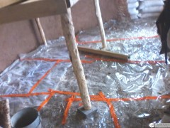
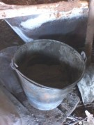

**Прошло более месяца с момента возобновления работы над нашим экодомом.** Напомню, к концу ноября у нас были готовы стены (пока не оштукатуренные), крыша (временно покрытая чем попало) и перекрытие (пока не утеплённое). Плюс, были вставлены 7 окон из 9.

Планировали продолжить работу над домом в середине апреля. Но обстоятельства сложились таким образом, что город выдал нам волшебного пенделя и катапультировал на стройплощадку уже в первых числах апреля. Ответственность за обеспечение нашей семьи денежными средствами взяла на себя Катя, а я **уволился с работы и с головой погрузился в стройку.**

<!-- READMORE -->

За прошедшее время сделано вроде бы и не так много, но и немало. Концепция работ была такова: **как можно скорее создать хотя бы одно подготовленное для комфортного проживания помещение**. Надоела палатка, надоела постоянная пыль от грунта (пола ещё нет), надоело ощущение стройплощадки, а не уюта домашнего очага. Но прежде чем наводить марафет, необходимо было подлатать крышу.

## Крыша

За зиму полиэтилен, баннеры и ветроизоляция порядком поистрепались. Лучше всего себя чувствовали баннеры. Хотя эти остатки былой роскоши в общем-то выполняли свою функцию отвода воды, но крышу нужно было делать. Напомню, дом мы хотели [украсить зелёной кровлей](/zachem-ya-zakopal-svoy-dom/ "Зачем я закопал свой дом?"). Но, оценив необходимый для этого объём работ, на семейном совете было **принято решение отсрочить озеленение и пока просто постелить что-то получше полиэтилена**.

**Выбор пал на рубероид**, как на самый дешёвый, но при этом достаточно проверенный материал. Рулон в 15 м² КПП (аббревиатура означает на картоне, покрытый пылью, подкладочный) стоил что-то около 400 рублей. На наши 150 м² крыши мы постелили 12 рулонов, так что **расходы составили 6000 рублей** с учётом клея для рубероида, которым планировалось проклеить стыки и замазать гвозди, которыми рубероид прибивался к доскам крыши. В итоге мы получили то, чего хотели: обезопасили себя от дождей на несколько месяцев, по прошествии которых необходимо было делать уже финальный вариант крыши. Подкладочный рубероид обычно сверху покрывают кровельным, поэтому он не рассчитан на длительное воздействие ультрафиолета. Но больше нескольких месяцев нам было не нужно, так что это не было проблемой.

**Проблемы возникли с клеем.** Оказалось, что его нельзя использовать при углах крыши более 20°. Но это полбеды. Практика показала, что на высыхание ему требуется около двух месяцев! Но клей куплен и вскрыт, так что наносил его на нашу крышу с углом более 20° и смотрел как он течёт с неё... Не то чтобы он совсем не склеивал, но держались стыки довольно слабо, сильный ветер разрывал незасохнувшую склейку на раз. Да и гвозди тоже держали не ахти как, ветер то и дело пытался поднять и оторвать рубероид. На помощь пришли кирпичи, в изобилии заготовленные на печку, полсотни штук спасли положение. На протяжении уже двух месяцев они отлично справляются с задачей не дать рубероиду улететь в тёплые края, даже при ураганном ветре (они у нас тут случаются довольно часто).

## Штукатурим!

От воды вроде бы защитились, но нужно было ещё и защитить стены от ветра. Дом у нас [из мешков с грунтом](/stroim-iz-meshkov-s-gruntom/ "Строим из мешков с грунтом"). За 8 месяцев мешки на внешней стороне южной стены ожидаемо превратились в труху, терзаемые ультрафиолетом и добиваемые когтями наших зверей. Любопытно, но прогнозы скептиков, что так будет везде, а не только с открытыми Солнцу мешками, не оправдались. Все остальные стены чувствуют себя замечательно, выглядят и ведут себя почти как свежеположенные. Но **на юге грунт, открытый всем ветрам и когтям, уже местами стал потихоньку осыпаться**. Никакого экстрима, совсем чуть-чуть. Но лучше не давать ему лишнего повода и закрыть штукатуркой. Что мы и делаем в данный момент.

Как я сказал, хочется как можно скорее создать одно хотя бы относительно чистое жилое помещение. Поэтому работы по штукатурке ведуться не только снаружи, но и внутри. В настоящий момент заштукатурена стена одной комнаты. Кстати, **мы покрываем стены глиняной штукатуркой**. Давно мечтали, и вот стены приобретают приятный красно-коричневый оттенок! Почему именно самодельная глиняная, а не "профессиональная" покупная - из за [удивительных свойств необожжёной глины](/glina-i-glinobeton/ "Глина и глинобетон. Удивительные свойства и их применение"). Рассказ про технологию приготовления и нанесения глиняной штукатурки достоин отдельной подробной статьи, что и сделаю в ближайшее время.

## Тёплый пол

Не раз уже я [хвалил тёплый пол](/otoplenie-passivnie-doma-i-vodyanoe-otoplenie/ "Отопление. Пассивные дома и водяное отопление") и говорил что хочу сделать такой в своём доме. Причём греть его планирую солнечным водонагревателем. Благо, их сейчас в продаже полно любых конструкций и размеров. Но и трубы на тёплый пол, и солнечная водогрейка стоят денег, которых сейчас нет. Но и ждать пока появятся деньги - неохота. Пыль достала, и мы приняли компромиссное решение. Сначала **решили в местах, где чаще всего ходим** (будущие прихожая и кухня), **положить всё те же кирпичи**, без дела ждущие своего часа. Решение совсем временное, но проблему пыли оно решило на 80%.

**Но в будущей спальне мы всё же решили залить пол**. По плану у нас так: гидроизоляция, по ней стелим слой стеклянных бутылок (без раствора), по бутылкам ветроизоляционную плёнку, на плёнку сверху арболитовую стяжку (опилки+песок+цемент), на арболит трубы тёплого пола, а поверх - глиняная стяжка. Бутылки и арболит - для утепления. Изначально думали стелить два слоя бутылок, а поверх трубы и глину, но практика показала, что без раствора 2 слоя не держатся, бутылки елозят туда-сюда, да и много их уходит. Так что остановились на одном слое бутылок + арболитовая стяжка.

Как уже сказал, **финишное покрытие пола планируется сделать из глины.** Но на полу она сохнет чудовищно долго (около месяца при условии очень жаркой погоды), поэтому пока решили ходить по арболиту, а заглинобитим потом, когда потеплеет, да и мы сами будем к этому морально готовы. :)

**Арболит - довольно тёплая штука**. Обычно делают два слоя: утеплительный (1 цемент, 1 песок, 10 опилки) и финишный (1 цемент, 2 песок, 2 опилки). Мы остановились на промежуточном варианте: чтобы и ходить можно было, и чтоб утеплял - 1 цемент, 2-4 песок, 6-10 опилки. Интервалы указал потому, что не всегда удавалось правильно дозировать: то высыпешь полмешка опилок, то 2/5, то 3/5, то воды перельёшь и сушишь смесь песком (опилками не сушил, т.к. они были в ограниченном количестве, впритык). Но я использовал это как повод к эксперименту: более прочный раствор (больше песка) сыпал в места, где будем чаще ходить, а более тёплый (больше опилок) - ближе к внешним стенам. Но по ощущениям при хождении разницы нет вообще. Таким образом мы сделали черновой пол в будущей спальне.

## Царские полати

Что вы слышали про полати? Лично я мало что слышал, пока не увидел воочию у соседей. Любопытно, что сначала полати сделал один сосед, а потом его примеру последовал другой. И пока на дошла очередь до работы над спальней, я вообще никак не ассоциировал себя с полатями. Их как будто не существовало для меня. Но вот в очередной раз мы с Катей сели обсуждать будущую планировку спальни, и ею было произнесено это слово - "полати". Я сначала брыкался, отнекивался, по привычке думая что это какой-то архизм. Но **когда начал смотреть трезвым взглядом, плюсы полатей и минусы кроватей стали очевидны**.

**Кто из нас не любит большие кровати?** Естественно, все любят развалиться, раскинув ноги и руки в стороны. Но при этом если поставить огромную кровать, то места в комнате практически не останется. Да и что значит - огромную? 200 на 160 см? Но на такой тоже не сильно развалишься вдвоём. В любом случае **кровать, как и другую мебель, я хотел не покупать, а делать своими руками**: не охота нюхать формальдегид из фанеры и дсп, охота приятно пахнущее и, как минимум, не вредящее здоровью дерево. Но выпиливать конструктив кровати с многочисленными пазами - гораздо сложнее сбивания четырёх столбов с палубой. Да и кровать нужно делать поровнее, поаккуратнее, поквадратнее, а то "люди засмеют". Наши же полати - криволинейной формы с гранями 220, 240, 200 и 190 см полезной площади, и стесняться тут совершенно нечего, ведь так из-за [круглой формы нашего дома](/zachem-ya-zakruglil-svoy-dom/ "Зачем я закруглил свой дом?"). Кстати, мы поскромничали: у соседей полати 2х3 и 2х4 метра...

Но огромные площади брачного ложа - это лишь один из трёх плюсов. **Второй плюс - увеличение полезной площади дома ровно на площадь полатей**. Ведь они как бы являются вторым этажём, и под ними можно сделать кладовку или даже целую детскую комнату, как у одного из наших соседей. Да, потолок невысок, но для детей — в самый раз. Им комфортно и уютно, и родители не спотыкаются об игрушки, разбросанные по всей хате... Высота наших полатей - 125 см, и при моём росте в 180 я не испытываю никаких проблем во время перемещения по ним и под ними, и тем более во время сна.

**Третьий плюс полатей - столбы.** _"Какой же это плюс, если столбы в помещении стоят?"_ - спросите вы. Ответ: они подпирают перекрытие и тем повышают надёжность конструкции дома. И если быть до конца справедливым, то столб всего один: двумя гранями (тремя столбами) полати соприкасаются со стенами, поэтому "торчит" всего один. Мы с Катей шутим, что за прошлый строительный сезон настолько привыкли жить [на палубе, подвешенной на деревьях](/pro-jizn-na-dereve/ "Про жизнь на дереве"), что одичали и даже в доме кровать подвесили между деревьями. Кстати, при сооружении палубы был опробован новый для меня способ защиты дерева. Отец привёз паяльную лампу и мы **обожгли доски полатей до хрустящей корочки, при этом проявилась вся текстура дерева, вся его красота**.

## Шаг за шагом

Посмотришь на сделанное со стороны и кажется, что как-то мало для двух месяцев. Но со стороны всегда так, кажется что _"Да чего тут делать-то, за полчаса управлюсь!"_. Но когда берёшься и делаешь (а **делать стараешься хорошо, ведь для себя**), то оказывается, что вместо получаса ковырялся весь рабочий день.

А дело в том, что постоянно при планировании **вылезают неучтённые факторы**, о которых и не подозревал вследствие отсутствия опыта. Но, как гласит китайская поговорка, _"Шаг за шагом достигнем цели"_. Так что двигаемся в сторону цели короткими перебежками, позволяя себе устраивать перерывы в работе: чтоб вдохнуть полной грудью окружающую природу, осмыслить произошедшее за последнее время и поразмышлять над будущим. Вообщем, **понаслаждаться жизнью**. В конце концов, именно для этого мы переехали из города в глушь лесов, на свой холм!
