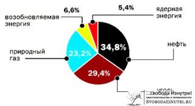
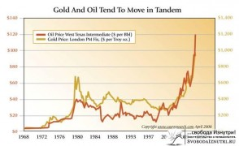
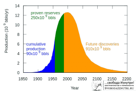
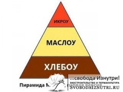
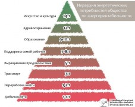
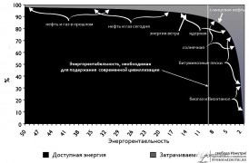

Довольно часто в диалогах с разными людьми на тему жизни в городе и за городом приходится слышать уйму доводов и в ту, и в другую сторону. Понятно, что если человеку хочется жить в городе, то его не переубедишь переехать на землю. И наоборот.

Но есть факторы, о которых не расскажешь в диалоге в двух словах. Факторы, которые в настоящий момент мало кому заметны из простых людей, привыкших работать пять дней в неделю, по вечерам смотреть сериалы или кино и заниматься каким-то хобби в выходные. Люди привыкли не заморачиваться. Вот только такая привычка не заморачиваться может сыграть злую шутку с её обладателем.

Возьму на себя смелость нарушить ваше душевное спокойствие, господа незаморачивающиеся. Посмотрим на ситуацию со стороны, "с высоты птичьего полёта", ткскзть. Попробую писать как можно проще, но предупреждаю, сегодня будет много графиков и умные термины.

<!-- READMORE -->

#### Энергия

Полтора-два века назад всё производство и вся экономика всех стран мира держалась на силе рабов и животных. Но то время безвозвратно прошло, и теперь роль рабов выполняет электроэнергия. Есть даже термин в экономике "электрический раб" — это затраченная электроэнергия, исчисляемая в количестве рабов, необходимых для выполнения той же работы. **Всё производство планеты зависит от энергии**, получаемой в основном от сжигания углеводородов (нефть, уголь, газ), немного из ядерного топлива и других источников (картинка справа).

Формулировки простые, ясные, и даже заезженные. Но что за ними стоит? А то, что производство и доставка любой вещи зависит от энергии. И в этом списке не только бытовая техника, стройматериалы, сырьё, но и — внимание — продовольствие (картинка слева). Всё **современное сельское хозяйство зависит от углеводородов**. Нет соляры — поля не засеяны, всё съели вредители, урожай не собран. А и собран — то не доставлен в ваш магазин, и вы его не купите. И останетесь голодными. И умрёте. Понятно, что я утрирую, но у меня для вас плохие новости: **ископаемое топливо заканчивается**.

 _"Эка невидаль, новость сказал!"_ — съехидначаете вы. Поехидничали, а теперь посмотрим на график справа.

Из него становится ясно, что даже по взвешенно-оптимистичным прогнозам **к 2050 году добыча нефти упадёт более чем в два раза** (!) от современного нам уровня 2014 года. _"Перейдём на ядерную энергию!"_ — скажете вы, но я вас огорчу: уран-235 и 238 кончается теми же темпами, с торием тоже пока не всё ясно. Самое интересное, что в приведённом графике уже учтено то, что будут разведаны новые месторождения, скорость нахождения, их ценность и энергорентабельность тоже будут падать.

#### Энергорентабельность

Есть над чем подумать, не правда ли? Но это ещё не всё. Есть термин **"energy return on investment" (EROI)**, который дословно переводится "возврат энергии от инвестиций", или, если литературно, "энергорентабельность". Чтобы добыть топливо тоже тратиться энергия. Чем больше энергии тратиться на добычу топлива, тем ниже энергорентабельность. Посмотрите на график слева.

**Энергорентабельность ВСЕХ ресурсов снижается, и снижается довольно быстро.** А теперь давайте попробуем перейти в практическую плоскость. Какое отношение это имеет к нам с вами?

Помните [пирамиду потребностей Маслоу](http://ru.wikipedia.org/wiki/%D0%9F%D0%B8%D1%80%D0%B0%D0%BC%D0%B8%D0%B4%D0%B0_%D0%BF%D0%BE%D1%82%D1%80%D0%B5%D0%B1%D0%BD%D0%BE%D1%81%D1%82%D0%B5%D0%B9_%D0%BF%D0%BE_%D0%9C%D0%B0%D1%81%D0%BB%D0%BE%D1%83)? Чтобы не загружать вас, упростим её до карикатуры справа.

По мере снижения энергорентабельности добываемого топлива, человечеству сначала придётся отказаться от красной икры, а потом и от сливочного масла на бутерброде. Дай Бог, чтоб на хлеб хватало.

Думаете, такие жёсткие изменения будут не скоро и лично вас не коснуться? Ошибаетесь. Добыча (а с ней и потребление) нефти упадёт в два раза только эдак к 2050-му (через 35 лет). Но засчёт снижения энергорентабельности новых месторождений цена на топливо вырастет не в два, а в 4-5 раз. Уже сейчас цена на топливо медленно, но верно ползёт вверх, и **реальные изменения в жизни вы почувствуете** уже к 2030-му, а это будет **всего-то через 15 лет!**

Что в нашей жизни сыграет роль икры на бутерброде, а что масла, от которых придётся отказаться — на картинке слева.

Картинка красноречиво намекает, что скоро вы уже не сможете смотреть новую серию очередного блокбастера каждый вечер. И без того уже унылое качество блокбастеров будет снижаться, ведь на них будет выделяться всё меньше денег... Да и ладно блокбастеры — будет дорожать продовольствие и будет снижаться его качество. **В таких условиях наличие участка земли для обеспечения продовольственной безопасности своей семьи становится не блажью, а насущной необходимостью.** Посмотрите на энергорентабельность разных видов топлива в настоящий момент на картинке справа и обратите внимание, что даже ядерная энергия по энергорентабельности частично уже скатилась ниже уровня, необходимого для поддержания современного уровня цивиллизации.

#### Хорошо в деревне

Имея ввиду вышенаписанное, я достаточно давно понял, что **нужно готовить плацдарм для жизни своей семьи уже сейчас**. Ведь имея на руках ребёнка, а то и нескольких, построить себе дом за городом в условиях стремительного дорожания всего, в том числе стройматериалов — очень тяжёлая задача. Поэтому мы с женой взялись за дело уже сейчас, до того как мы станем родителями.

Что-то я сегодня вас пугал и пугал, но совсем забыл сказать про другие причины нашего переезда на землю. И они просты и понятны каждому: **чистый воздух, красивые виды вокруг, тишина, спокойствие, благодать!** А учитывая, что мы с группой единомышленников хотим создать экопоселение и тщательно подбираем соседей — **мы обеспечиваем в будущем хорошую атмосферу для воспитания своих детей**.

Как раз когда я готовил эту статью, в моей ленте новостей вКонтакте как будто специально проскочила та картинка, которую можно увидеть слева. Картинка говорит сама за себя.

Быть может, завтра тайные последователи дела Теслы откроют миру свободную энергию в неограниченных количествах и всё, о чём я написал выше, не произойдёт. И слава Богу, если так оно и случиться — тогда **моя семья просто получит свой дом в красивом месте и мои дети будут играть в лесу, окружённые ароматами цветов, пением птиц и нормальными соседями**. И я не услышу шума перфоратора за стеной тихим воскресным утром. А самое главное — я буду уверен, что моя земля накормит мою семью, и отжившие своё деревья в нашем лесу согреют нас зимой.

Не уверен, что убедил хоть кого-то из скептиков, но я хотя бы попытался. Понятно, что каждый свой выбор делает сам и приоритеты расставляет по-своему. Но предупреждён — значит вооружён. Удачи всем нам. Вне зависимости от того, как будут развиваться события, я знаю: **всё будет хорошо**.

Основной источник графиков и цифр: [eroi-of-global-energy-resoruces.pdf](/wp-content/uploads/eroi-of-global-energy-resoruces.pdf)
