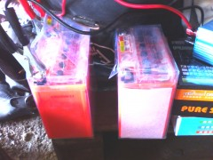
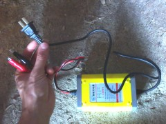
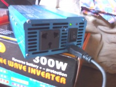
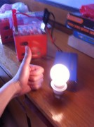

**В нашем экодоме появилось электричество!** Вот сижу, пишу эту статью на планшете, и уже не боюсь, что если он сядет, то придётся ехать в город заряжаться. Теперь достаточно дотянуться до розетки - и всё!

Но пока наша система электрификации неполноценна, она так же зависит от поездок в город, просто появилась возможность автономить около двух недель. Но неполноценность системы не помешает мне поделиться с вами хорошим настроением и поразмышлять о планах на её развитие, да и вообще **об электрификации загородного дома**.

#### Обеспечить себя электричеством

К моменту, когда наша молодая семья столкнулась с проблемой обеспечения себя электричеством, **перед нашими глазами был пример соседа, к которому уже провели линию из деревни**. В общем-то мы тоже можем подключиться к этой линии, и это даже довольно дёшево (до 10 т.р.), но бюрократически эта процедура очень долгая и в нашем случае займёт около года.

Но год этот куковать без лампочки Ильича мы не хотим, и **решили отыскать автономное решение**. А их на сегодняшний день доступно только два: либо ветер, либо Солнце. Я давно хочу сделать ветряк своими руками (примерно [такой](http://www.mirodolie.ru/node/2372 "Самодельный вертикальный ветряк") - по ссылке очень интересная статья, рекомендую), но это требует времени, а оно сейчас целиком уходит на доделку дома и подготовку его к зиме. Напомню, у нас эксперимент с жизнью и стройкой на 10-15 т.р. в месяц на двоих, поэтому раскидываться деньгами на покупку ветряка бюджет не позволяет. Но вот на небольшую солнечную систему - хватит.

Учитывая суровое ограничение в средствах, **было принято решение взять недорогую систему, которая бы работала прямо сейчас, но при этом имела возможности к расширению**. Какой бы по мощности ни была система, в ней обязательно будут присутствовать источник заряда (солнечная панель, ветряк) и аккумулятор, который будет этот заряд складировать.

#### Аккумуляторы

Общение с электриками и чтение интернетов выявили, что **основная проблема современной альтернативной энергетики - аккумуляторы**. Они - самое слабое звено любой современной автономной системы, либо подлежащее частой замене, обслуживанию, но недорогое, либо не требующее обслуживания, долгоживущее, но дорогое.

Обычные щелочные автомобильные аккумуляторы дёшевы, но в автономной системе долго не проработают. Плюс, во время работы они выделяют вредные для человека и при этом взрывоопасные газы, так что требуют отдельного вентилируемого помещения. Несколько лучше дела обстоят с гелевыми аккумуляторами на стекловолоконных пластинах (AGM): они герметичны, не выделяют газов, но для солнечной системы также нежелательны, т.к. боятся глубокого разряда. **Лучшее, что в настоящий момент может предложить альтернативным энергетикам рынок - гелевые аккумуляторы (GEL).** Они не выделяют газов и не требуют отдельного помещения, не обладают памятью и не боятся разряда, но стоят дороже своих собратьев.

Но скупой платит дважды, и **мы решили не пожалеть средств именно на гелевый аккум**. А хитрость в том, что мы взяли два вот таких, небольших и по габаритам, и по весу (около 4 кг каждый), чтобы в экстренных случаях можно было с лёгкостью отнести его к соседу, подзарядить. И экстренный случай наступил сразу, т.к. оказалось, что одновременно привезти и аккумуляторы, и солнечную панель из соседнего Китая наши друзья, живущие там, не могли: и габаритно, и тяжело...

#### Заряжаем

Покупку солнечной панели мы решили отложить на месяц, а пока пользоваться аккумуляторами в таком режиме: **пока первый работает, второй заряжается**. Первый сел - понесли заряжать, принесли заряженный второй. Взяли [вот эти](http://item.taobao.com/item.htm?spm=2013.1.0.0.D3n2HV&id=17048389779&scm=1007.10115.744.0&pvid=196547b5-e5c4-46d9-983b-cc197834a961) аккумуляторы, позиционирующиеся для электромотоциклов - 2 штуки по 9000 мА/ч (12-вольтовые).

Вроде бы и маловато, но, учитывая темпы расхода нами электричества, **замена будет происходить не чаще чем раз в неделю**. Пока мы не вошли во вкус и используем аккум лишь для зарядки двух телефонов (вместе около 1600 мА/ч) и планшета (3200 мА/ч). В ближайшей перспективе в списке потребителей появятся несколько светодиодных лампочек и нетбук с батареей на 4400 мА/ч.

Ещё раз повторюсь, **решение с тасканием временное, пока не придут солнечные панели**. А пока будем заряжать от розетки соседа или в городе, т.к. всё равно туда ездим раз в неделю, и вес аккумов позволяет это делать не напрягаясь.

Для зарядки аккумулятора от розетки мы приобрели [соответствующее устройство](http://item.taobao.com/item.htm?spm=a1z10.1.w1028-1680798748.2.KyTKvi&id=18605699086), выдающее 12В 2А. Самое то для наших аккумов. Кстати, вроде бы примерно такими же устройствами восстанавливают свинцово-щелочные1 аккумы.

#### Заряжаемся

Как я уже упоминал, аккумуляторы 12-вольтовые постоянного тока, и **чтобы получить 220 вольт переменного, нужен инвертор**. Был соблазн сразу взять мощный на киловатт-полтора "на вырост", но цены кусаются. И, по расчётам, все электроприборы, которые мы планируем использовать, одновременно тянут ватт 200-250. Так что остановились на [таком](detail.tmall.com/item.htm?spm=a230r.1.14.46.3CC4ca&id=18508229283) инверторе 300 ватт в номинале (600 в пике).

По заверениям производителя, этот инвертор потянет и дрель, и стиральную машину, и холодильник. Заявления смелые, но вряд ли он сможет делать это одновременно, да и холодильник разве что небольшой (хотя, большой нам и не нужен). Но нам и этого достаточно, ведь **электричество необходимо нам пока лишь для работы телефонов, планшета, нетбука и пары лампочек**.

Кстати, на этом инверторе есть не только розетка для 220-вольтовых приборов, но и USB-порт (5 вольт 2 ампера) для зарядки гаджетов, что очень удобно. Ведь **на каждом этапе преобразования накапливаются потери**, и чем меньше этих преобразований - тем лучше. Приходилось бы сначала 12 вольт преобразовывать в 220, и потом 220 в 5, а так сразу 12 в 5.

#### Перспективы развития

В ближайшее время **планируем докупить солнечную панель на 100 ватт и контроллер**. Контроллер - это штука, которая управляет процессами зарядки аккумуляторов и расхода заряда. В этот же контроллер в перспективе воткнётся ещё панель (возможно и не одна) и самодельный ветряк, когда до него дойдут руки. Вероятнее всего, и аккумуляторов докупить придётся, на этот раз уже не маленьких мобильных, а стационарных, больших и жирных.

Из потребителей потом появятся ещё с десяток лампочек, мощный рабочий ноутбук, студийные мониторы (профессиональные колонки, необходимые мне для работы. Это будет самый прожорливый потребитель в доме), возможно что-то ещё. Думаю, что **мощность системы будет расти вместе с нашими аппетитами на электричество**. Там, глядишь, придётся и инвертор взять помощнее...

Но тем система и хороша - можно повышать её мощность по мере необходимости. Самое интересное - я раньше боялся лезть в тему альтернативной энергетики, т.к. в электричестве можно сказать ничего не понимаю. Но всё оказалось просто в понимании и **доступно в приобретении**: 2 гелевых аккумулятора на 9Ач, зарядное устройство для них и инвертор на 300 ватт (600 в пике) **вместе с доставкой обошлись нам в 3500 рублей**. Красота!

#### Выводы

Альтернативная энергетика становится всё более доступной для бытовых нужд простых смертных. Особенно если ваши аппетиты умеренны и вы не собираетесь электричеством топить дом. З**адача обеспечить себя электроэнергией и не зависеть от центральных сетей и прихотей чубайсов - более чем реализуемая и посильная для молодой семьи.** Чувство свободы и независимости преследовало меня пока я вёз аккумуляторы домой и достигло своего пика когда я в первый раз зарядил телефон не в городе, а в своём экодоме. Это ощущение многого стоит, и я желаю когда-нибудь испытать его и вам.

**В качестве курьёза:** после того, как пришли наши аккумуляторы, мой брат показал штуку, которую недавно приобрёл. Это был литий-ионный аккумулятор размером с маленькую книжку на 30000 мА/ч (по факту около 16500, что тоже крайне неплохо) с возможностью одновременной зарядки двух устройств (например, телефон и планшет), для чего прилагается куча разъёмов (miniUSB, microUSB, iPad, nokia), возможностью зарядки его от розетки, и - внимание - с встроенной солнечной панелью и весом всего в 261 грамм! И купил брат его всего за тыщу рублей! **Если б мы знали о существовании таких девайсов до того, как заказали аккумуляторы, мы бы пока вполне обошлись таковым.**

Но я даже доволен, ведь это незнание подтолкнуло нас к началу сборки системы обеспечения нас альтернативным электричеством! Может даже получится, что мы решим не подключаться к деревенской линии и быть полностью независимыми от центральных сетей... Посмотрим, время покажет. Статья подошла к концу, планшет жалуется, что осталось меньше 10% заряда. Пойду ставить его на зарядку!

\[1\]: В комментариях поправляют, что свинцово-щелочных аккумуляторов нет, а есть свинцово-кислотные.
