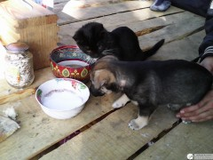
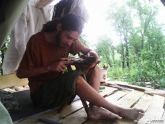
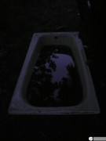
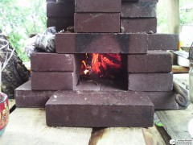
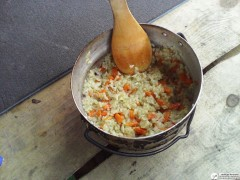
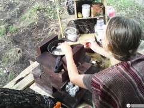
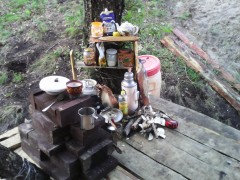
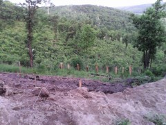
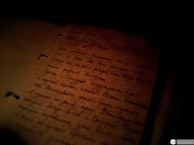

**Всё думал о чём бы написать, чтоб вам интереснее было.** И вроде бы прошлая неделя была очень продуктивной и богатой на приключения, но писать про нашу возню с соломой почему-то не хочется: пока не ясно чем дело кончится, так что история бы получилась с открытым финалом...

...и вот неожиданно сегодня вечером, листая нашу семейную тетрадь-для-записей-чертежей-и-вообще-всего-подряд, наткнулся на свою старую писанину. Вроде как попытка вести дневник. Не знаю почему, но написание дневника не заладилось, и в записях были только четыря дня. Но какие дни! 1, 2, 3 и 4 июля 2013 года! **Это ж ровно год и две недели назад!** В-общем то написанное там уже было переработано в статьи и опубликовано. Но в статьях — сухая информация, а **в страницах дневника — настоящая жизнь!** С ленью, эмоциями, планами и мыслями о будущем. И вдвойне интересно перечитывать это, когда то самое будущее уже наступило! Воображение рисует перед глазами картину, как лет эдак через дцать я буду перечитывать эти строки и скупая отеческая слеза будет блестеть в уголках глаз...

Хоть и очень хочется, но не буду комментировать — подробно сделал это в статьях. Есть пара непонятных для вас моментов, если возникнут вопросы — отвечу. Текст не правил, привожу как есть. Фотографии, сделанные в те самые дни, приведу не по ходу пьесы, а в самом конце, чтоб не отвлекали. **А теперь прошу в машину времени, поехали!**

> "**\[1.07.2013 пн\]**
> 
> Приехал только вечером, т.к. сводил "Сухпес".
> 
> Сходили в гости к Ваньке с Илонкой.
> 
> !В воскресение купили за 5 рублей собаку! Наш Тризор!
> 
> **\[2.07.2013 вт\]**
> 
> После рабочих выходных сил (и желания) рыть не было. Хоть была отличная погода (солнца нет, но нет и дождя, плюс ветер хороший), решили устроить выходной.
> 
> Пумка с Тризором подружились. Едят с одной миски, играют. Начали воспитывать пса. Воспитывается, умный. Сразу научился в туалет на улицу ходить. Ввели традицию каждый вечер гулять с Тризором. Пумке традиция понравилась, гуляет вместе с нами, но только по кустам, короткими перебежками с попутными прыжками по деревьям.
> 
> Весело.
> 
> **\[3.07.2013 ср\]**
> 
> дождь лил почти весь день, так что опять выходной.
> 
> К концу дня дождь перестал, немного покопались. Заправил и наточил все ножи.
> 
> Кончается газ, поэтому провели эксперимент с ракетной печкой. Штук 15 кирпичей, засыпали песком. Тяга через 10 минут отличная, сварили отл. гороховую кашу.
> 
> **\[4.07.2013 чт\]**
> 
> Опять дождь. Забыл вчера написать про "пузыри" — плёнка на крыше набрала воды и образовались они самые — пузыри. Сливали каждый по очереди в тазик, а потом в ванну. И так раза 3-4 за день.
> 
> Сегодня утром та же история. Уже полная ванна набралась. Надо припереть вторую (стоит наверху, у кучи горбыля).
> 
> Т.к. Ракетная печь была встроена в вал дома, из-за начавшихся после обеда работ (погода распогодилась) была демонтирована.
> 
> И газ кончился. Пришлось колхозить печь прямо на палубе. Большая, добротная. По сравнению с "ракетной" очень долго раскочегаривалась (около получаса), зато потом горела будь здоров! И тепло долго держала. Пока топилась сделали плов, нажарили хлебцов из манки и нагрели полый термос кипятка. Плюс залили водой ячневую крупу и поставили внутрь печи, а топку и дымоход печи плотно закрыли кирпичами. Думаем, к утру каша будет готова!
> 
> Утром заправлял топор (долго и тяжело), а после обеда немного покопали. Начали делать заборчик для грунта (тот грунт, который из дома вытащим, чтоб по склону не рассыпался, и чтобы площадка выравнивалась. Вбили "столбы" из горбылин, и вылезли комары и загнали нас в палатку."

