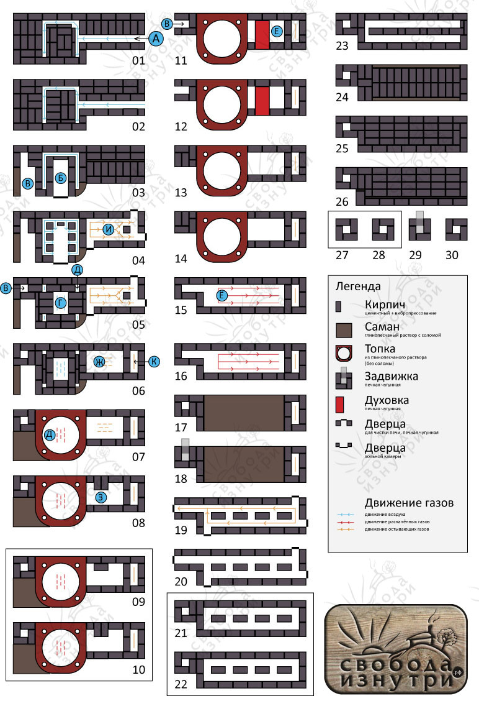

Ох, как долго многие из вас ждали этого момента!

Наконец, у меня появилось время систематизировать данные по нашей чудо-печке. Что за печь? Если не в курсе, у нас получилась [вот такая печь](/sohataya-chudo-pech/ "Сохатая чудо-печь"). Про всю теорию, которую я применил в этой печи, читайте здесь: [1](/otoplenie-pechi-gollandki-i-russkie/ "Отопление. Печи. Голландки и русские"), [2](/otoplenie-pechi-kolpakovye-i-dvuhkolpakovye/ "Отопление. Печи. Колпаковые и двухколпаковые"), [3](/raketnye-pechi-i-verhniy-rozjig/ "Отопление. Печи. Ракетные печи и верхний розжиг"), [4](/otoplenie-pechi-vneshniy-pritok-i-vtorichniy-vozduh/ "Отопление. Печи. Внешний приток и вторичный воздух"). Ну а для тех, кто уже это всё читал, без лишних слов перейду к объяснению принципа её работы, основываясь на чертеже (ниже). Скажу сразу, расположение кирпичей на чертеже не совпадает с реальной печкой. Совпадают первые 2-4 ряда, и то не на 100%.

Почему так? Потому что чертёж придумывался сидя за компом. А когда дошло до дела — оказалось что положить кирпич так, как на чертеже — не представляется возможным, либо это возможно, но существвенно снижается надёжность конструкции. В первую очередь это касается перекрытий. Но об этом расскажу в другой статье, практической. А пока я призываю вас отнестись к чертежу просто как к наброску, по которому можно понять принцип работы печи.

Для краткости сразу договоримся, что если я пишу "**05**" — это я имею ввиду ряд под номером 05. **Оговорка для тех, кому статья прилетела на почту**. В статье много разметки, которая может не отобразиться в письме. Так что если вот эта буква **А** у вас не в голубом кружке, лучше откройте статью в браузере: [открыть в браузере](/chertyozh-pechi-i-printsipy-raboty/)

#### Принцип работы

[Открыть чертёж в другой вкладке](/wp-content/uploads/Печка-2014-2.jpg)

На **01** и **02** воздух заходит в печь. Заходит с улицы А.

На **03** располагается зольная камера Б, а также начинается сушилка для дров В.

На **04** воздух с улицы заходит в зольную камеру, чтобы затем зайти через колосник Г на **05**. Но часть воздуха уходит в воздуховоды Д — они ведут в верхнюю часть зольной камеры, реализуя подачу вторичного воздуха.

В на **05** - это не дымоход, а просто воздуховод, который немного нагревается и создаёт движение воздуха через сушилку для дров В, начинающуюся на **03**. Воздуховод этот заканчивается на **11**\-**12**. Сушилка перекрывается саманом, начиная с **07**, подробно об этом в практической статье.

Итак, воздух зашёл в колосник Г, после чего на **07** поступил в топливную камеру Д, где происходит горение. Топка изготовлена из глинопесчаной смеси без соломы. Топка круглая и купольная. Как это было реализовано на практике — опять таки, в практической статье.

**09** и **10** обведены в рамку — это обозначает, что эти ряды кладутся в цикле столько раз, сколько будет необходимо. Конечную высоту топки я не знал, поэтому и количество рядов до её верха было не ясно, и потому не было ясно на каком ряду располагать духовку Е — поэтому она занимает всего 2 ряда (**11** и **12**), хотя в реальности их гораздо больше.

Итак, топливо сгорело, и раскалённые газы устремляются вверх. Это не отражено на чертеже, но выходя из топки 14 они проходят через колосниковую решётку, котороая очень сильно нагревается и участвует в дожиге. Пройдя через колосник, на **15** и **16** газы заходят в первый колпак Ё. После этого они упираются в перекрытие первого колпака (оно на **17** и **18**) и идут вниз через **14-13**, затем обтекают духовку Е на **12-11**, и затем опускаясь до **05** и **04**, где И уходят в дымоход К.

По дымоходу они поднимаются начиная с **06** и до **19**, где входят во второй колпак, который заполняют и текут к дымоходу. Высота второго колпака — тоже величина плавающая. Я не знал какой высоты мне хочется печку, и потому **21** и **22** тоже заключил в цикл. На практике второй колпак был реализован совершенно иначе, без кирпичей посередине.

На **24-26** — перекрытие второго колпака и печи, а **27-30** - дымоход, в котором расположена задвижка, открытая во время работы печи и закрываемая после её окончания.

Таков обычный режим работы печи. Но есть и второй режим, который можно условно назвать "летний" или режим растопки.

#### Летний режим

Летний режим аналогичен предыдущему описанию до момента выхода Ё раскалённых газов из топки на **15-16**. На чертеже газы идут вправо, но если открыть задвижку, нарисованную на **18**, то газы направляются налево. Они текут прямиком в дымоход, минуя первый и второй колпаки.

В этом режиме тяга печки в разы сильнее, и его целесообразно использовать при розжиге. И, как только труба дымохода как следует разогреется, задвижку на **18** можно закрывать. Кстати, задвижка в реальности развёрнута в другую сторону, но об этом тоже в практической статье.

Пока оставлю вас разбираться с чертежом. В близжайшее время продолжу рассказ практической статьёй, с фотками и выводами из полученного опыта.

До скорого!

[Читать продолжение](/kak-sdelat-chudo-pech-1-podgotovka/ "Как сделать чудо-печь. Часть 1: Подготовка")
