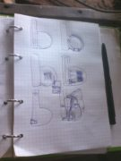
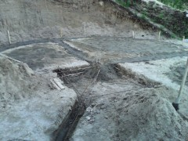
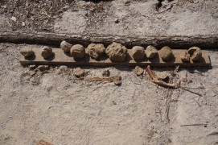

Итак, некоторое время назад я поделился примерными чертежами нашей чудо-печи, и теперь пришло время от теории перейти к практике.

В связи с катастрофической нехваткой времени решил, что лучше разбить информацию на несколько небольших статей — с этим решением мне было психологически проще взяться за титанический труд по переработке всего материала, связанного с печью. Его много, поверьте.

Но не будем терять времени! Поехали!

#### Подготовка

**Печь — очень серьёзное инженерное сооружение.** Причин тому несколько. Во-первых, печь обладает немалым весом, что уже накладывает свой технический отпечаток. Во-вторых, помимо просто веса, необходимо учесть ещё очень много факторов: теплоёмкость, состав раствора, особенности конструкции. И, в-третьих, печь — центральная часть жизни дома — это домашний очаг, да и один из самых видных объектов в доме, что накладывает и эстетические требования.

Человека без опыта в печном деле весь этот клубок неизвестных переменных приводит в ступор. Даже не знаешь с какой стороны подступиться к решению этой непростой головоломки. Но дорогу осилит идущий, так что начнём разведку боем.

Учитывая весь этот ворох технических задач, самый ответственный этап — это подготовка. Для начала необходимо спланировать размещение печи в доме. В идеале — спланировать дом под печь. Мы планировали и печь, и дом во время [рытья котлована](/vredniy-ekskavator-ili-roem-kotlovan-vruchnuyu/ "Вредный экскаватор или Роем котлован вручную!"). Планировали вчерне, а детали дошлифовывались потом. Что имею ввиду? Помню, что я расчитал по какой-то советской методичке (уж извините, не помню по какой) какой площадью поверхности должна обладать печь, чтобы отапливать дом в 40 квадратов, и примерно прикинул какую площадь на плане дома эта печь будет занимать. Получалось примерно 2 м².

С этими данными мы рисовали проект дома. Мы просто знали, что печь будет занимать 2 м², знали как примерно она должна располагаться (с какой стороны дрова загружать). Упрощало задачу то, что мы знали где хотим сделать отверстие под дымоход, и так как эта точка была неизменна, вся остальная конструкция и занимаемая ею площадь крутилась вокруг этой оси.

#### Опять подготовка

Так, мы определились с размещением. Теперь нужно подготовить поверхность. Я слышал много рекомендаций, что фундамент печи и фундамент дома не должны быть одним целым. В принципе, всё логично: морозное пучение заставляет гулять только стены, а печь (и главное — дымоход, как самый высокий объект) стоит на тёплом неподвижном грунте.

Но так получилось, что мы объединили их. Получилось это потому, что печь мы размещали максимально близко к центру (это общее правило: чем ближе печь к центру дома, тем равномернее будет температура в доме), но к этому же центру сходились три луча фундамента, и один из них как раз проходил под печью. Так что пришлось плиту печного фундамента объединять и заливать вместе с фундаментом дома.

И тут начинается самое интересное. Во время заливки я ошибся в расчётах и плита была залита на 10 см меньше по обоим сторонам. Ошибка вскрылась когда я уже собирался класть печь и выложил на сухую первый ряд. Я был в шоке: печь не помещалась на фундаменте. Что делать?!!

Но меня успокоил отец. Сказал, всё нормально: зальём сверху ещё сантиметров 5, с арматурой, и печь будет прекрасно стоять. Хоть основная плита и была залита на 10 см меньше, но я закладывал по 3 см выноса фундамента с каждой стороны, так что печке не хватало всего 4 сантиметров, чтобы уместиться. По идее, печь будет стоять даже если эти 4 см будут висеть в воздухе: ширина нашего кирпича — 12,5 см, так что остальными 8,5 см печь будет опираться на фундамент. Но она не будет висеть — она упрётся на плиту, хоть и не такую толстую, но плиту. Да и плита, в конце концов, не в воздухе висит, а лежит на песчаном и хорошо уплотнённом грунте.

#### Кирпичи

Ну и, прежде чем возводить печь, необходимо запастись всеми необходимыми материалами! Как я неоднократно говорил, отец у меня — профессиональный строитель. В ту пору он и его товарищи имели мини-заводик по производству цементных кирпичей методом вибропрессования. Точнее, они только-только его запустили и пока проводили эксперименты по составу кирпича и различным добавкам (влияющие на на цвет, прочность, характеристики застывания раствора, стойкость к морозу и низким температурам, а также к резким сменам температур). От экспериментов осталось много тестовых кирпичей, разных по свойствам и размерам, примерно 1500 штук. Вот эти 1500 штук и оказались в нашем распоряжении.

Про то, что цементный кирпич не принято использовать в кладке печей, я [уже рассуждал](/sohataya-chudo-pech/ "Сохатая чудо-печь") и сейчас не буду на этом останавливаться. Но стоит ответить на могущий возникнуть у некоторых читателей вопрос: "Ты чтоли клал печь из непонятно каких по прочности и температуростойкости кирпичей?" Отвечаю: я отсеивал кирпичи по прочности. Я не уделял этому отдельное время. Просто при перемещении кирпичей, я особо с ними не церемонился. Примерно с 50 кипрпичей от такого обращения сломались. Те, кто прошли испытание, оказались в кладке.

Ну а теперь касаемо температурной стойкости. Тут бы прочитать лекцию про сорта глины и известняка, из которой делают цемент, но кому интересно сами почитают в интернетах. Но мне было достаточно информации отца о том, что кирпичи всех экспериментальных групп проходили такой тест: их нагревали паяльной лампой докрасна, после чего бросали в воду, в воде держали несколько часов, после чего выносили на мороз. Цикл повторялся около 10 раз. Ко мне попали лишь те кирпичи, которые прошли этот тест. Если среди читающих есть печники, всё равно скептически относящиеся к цементным кирпичам, спрошу: а вы хоть раз проверяли таким образом те кирпичи, из которых кладёте печки?

#### Глина

Глине в нашей печи отведено особое место. Ведь из неё делался не только раствор, но и целиком выкладывалась топка и перекрытие первого колпака. Поэтому я ответственно подошёл к составу глинопесчаного раствора и потратил время на эксперименты. В моём случае работали составы от 1/2 до 1/3 глина/песок. Как мерял? Просто сделал несколько шаров разного состава диаметром примерно 5 см, дал две недели на высыхание, после чего всял молоток каменщика и попытался отколоть кусок от каждого из шаров. Прочнее всего оказались именно составы 1/2 и 1/3.

Если кому мой способ проверки кажется недостаточно надёжным, читайте книги "Дом из самана. Философия и практика" ([читать онлайн](https://docs.google.com/viewer?a=v&pid=sites&srcid=ZGVmYXVsdGRvbWFpbnxnb3R0ZXJiaWxkMjN8Z3g6N2FkNjhmNjc2ZjFmN2MyZQ "Дом из самана: Философия и практика - читать онлайн"), [скачать](https://sites.google.com/site/gotterbild23/%D0%94%D0%BE%D0%BC%20%D0%B8%D0%B7%20%D1%81%D0%B0%D0%BC%D0%B0%D0%BD%D0%B0.pdf?attredirects=0&d=1 "Дом из самана: Философия и практика - скачать")) и "Глинобетон и его применение" ([читать онлайн](https://sites.google.com/site/gotterbild23/%D0%93%D0%BB%D0%B8%D0%BD%D0%BE%D0%B1%D0%B5%D1%82%D0%BE%D0%BD%20%D0%B8%20%D0%B5%D0%B3%D0%BE%20%D0%BF%D1%80%D0%B8%D0%BC%D0%B5%D0%BD%D0%B5%D0%BD%D0%B8%D0%B5%20%28%D0%BC%D0%B8%D0%BD%D0%BA%D0%B5%29.djvu?attredirects=0 "Гернот Минке "Глинобетон и его применение" - читать онлайн"), [скачать](https://sites.google.com/site/gotterbild23/%D0%93%D0%BB%D0%B8%D0%BD%D0%BE%D0%B1%D0%B5%D1%82%D0%BE%D0%BD%20%D0%B8%20%D0%B5%D0%B3%D0%BE%20%D0%BF%D1%80%D0%B8%D0%BC%D0%B5%D0%BD%D0%B5%D0%BD%D0%B8%D0%B5%20%28%D0%BC%D0%B8%D0%BD%D0%BA%D0%B5%29.djvu?attredirects=0&d=1 "Гернот Минке "Глинобетон и его применение" - скачать")) — там приведены другие, более научные способы.

Кстати, совсем забыл: эксперименты я проводил дважды, ведь работал с глиной из двух разных источников. Сначала мы штукатурили глиной, которую добыли сами неподалёку от дома. Состав с ней был 1/2. А потом была [история с самосвалом глины](/celiy-samosval-gliny/ "Целый самосвал глины"). Вторая глина оказалась прочнее, так что в печке использовалась только она.

На этом на сегодня откланяюсь. [Продолжение](/kupol-pechi/) будет как только появится время.
