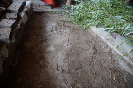
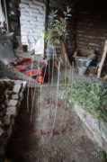
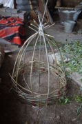
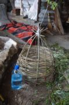
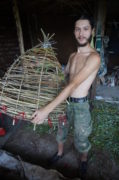

Появилась свободная минутка, решил потратить её на продолжение печной темы.

Напомню, я уже [выкладывал чертёж нашей печи](/chertyozh-pechi-i-printsipy-raboty/ "Чертёж нашей печи и принципы её работы") и [описал подготовку к её изготовлению](/kak-sdelat-chudo-pech-1-podgotovka/ "Как сделать чудо-печь. Часть 1: Подготовка"). Но был упущен один важный момент подготовки, который и раскрою сегодня.

<!-- READMORE -->

### Почему именно купол?

Я уже писал, что перечитал очень много разнообразной литературы на печную тему, и заметил интересную деталь: в тех печах, где стараются достигнуть максимальной эффективности сгорания, топочные камеры имеют либо циллиндрическую, либо куполообразную, либо вообще почти сферическую форму. Сами посмотрите на устройство доменных, мартеновских и других промышленных печей.

Физика проста: во время горения топлива стены топочной камеры нагреваются и начинают излучать жар, тем самым участвуя в процессе горения, помогая ему. И круглая форма топки позволяет наиболее равномерно распределить это излучение.

_«Почему же тогда круглые и купольные топки не применяют в бытовых печах?»_ — спросите вы. Во-первых, применяют. Точнее, применяли. Почитайте про [устройство русской печи](/otoplenie-pechi-gollandki-i-russkie/ "Отопление. Печи. Голландки и русские") и вот он — колпак. Ну а сейчас то ли просто печники стали ленивыми, то ли печное дело превратилось в прибыльный бизнес — достоверно сказать не могу. Но понятно, что класть печь из кирпича и технологичней, и проще, и в идеале надёжней (не ошибёшься с составом глинопесчаного раствора для кирпичей, ведь ты их покупаешь, да и скрепляющий кирпичи раствор тоже продаётся в магазинах). Написал "в идеале", т.к. качественные характеристики производимого ныне кирпича гораздо хуже таковых у кирпича старого, дореволюционного. Если вы не знали, то современные печники часто "охотятся" за старыми домами, идущими под снос, чтобы разобрать на кирпичи печь, и из этих кирпичей сложить другую.

Но это упрощение работы печника не идёт на пользу качеству печи, и особенно это вредит тяге. **Дым не любит углов**, т.е. при движении раскалённые газы должны встречать как можно меньше углов и вообще резких поворотов. А кирпичная печь — это углы, углы, и ещё раз углы. Да, последнее время часто встречаются проекты, где углы скруглены, и это хорошо. Но вот топки-то всё едино делают прямоугольными.

Так что самым неясным пятном во всём проекте печи для меня была круглая топка купольной формы. Как её сделать?

### Как сделать

Изучая литературу, я нашёл два способа сделать топку купольной формы. Первый применялся как раз в русских печах: большой мешок наполняли песком, клали на под печи, тщательно утрамбовывали. Вокруг ставилась опалубка, в которую послойно утрамбовывали глинопесчаный раствор — т.е. печь "били". Ну а по завершении конструкции давали высохнуть, набрать прочность, после чего мешок развязывали и песок ссыпали. Получался купол, повторяющий форму мешка.

Но есть и другой способ, и его доныне применяют при изготовлении тандыров и т.п. печей. Заключается он в плетении корзины требуемой формы. Принцип тот же: корзина задаёт форму топочной камеры, её облепляют глинопесчаным раствором. После высыхания конструкции и начала эксплуатации печи корзина выгорает.

Оба способа имеют свои плюсы и минусы. При первом способе печь сохнет гораздо дольше, ведь мешок с песком препятствует циркуляции воздуха. Но при втором способе печь нельзя "бить", т.к. корзина пружинит. Я долго не мог определиться каким способом воспользоваться. И сделал как обычно — провёл эксперименты.

### Эксперименты

Сначала мы слепили песчаный купол без всяких мешков (фото в начале статьи), для прочности песок немного смачивали. Сверху покрыли его мокрыми газетами, чтобы отделить песок от раствора, сверху налепили раствор. Результаты: выложить из песка высокий купол проблематично. Купол получается сплюснутой формы. Это, в общем-то не плохо. Но из-за этого он, во-первых, занимает бОльшую площадь и, во-вторых, обладает меньшей геометрической прочностью. Что это значит? Это значит, что когда мы начали выгребать песок (высыхания раствора не ждали), купол провалился внутрь гораздо раньше чем мы дошли даже до его середины.

Способ с корзиной нас с Катей, честно говоря, пугал. Немудрено: нужно заготовить материал (в нашем случае это была ива), и потом из этого материала как-то плести корзину, но мы этого не умеем, и т.д. На практике всё оказалось гораздо проще чем казалось. Примерно час-полтора ушло на сбор достаточного количества материала, примерно пятнадцать минут заняла подготовка материала (очистка от листьев) и примерно полчаса — плетение корзины. Да и сам процесс плетения оказался прост как валенок.

Мы делали так: на грунте (пола в доме ещё не было) начертили круг искомого диаметра (какого диаметра хочется топку), в центре и по периметру вбили небольшие отрезки арматуры (диаметр точно не помню, меньше 10 мм, длина — чтоб крепко сидели и торчали сантиметров на 10-15). К арматуре шерсяными нитками привязали длинные ветви, которые связали на нужной высоте скотчем, получив "рёбра скелета" той формы, которой будет топочная камера. После этого просто плели "враспор", чтобы каждый следующий ряд плетения давил на ребро с противоположной стороны. На самом деле я объясняю сложнее чем это есть на самом деле. Как только возьмётесь — всё сразу станет ясно. При необходимости нужные фрагменты, особенно нижнюю часть корзины, мы дополнительно связывали шерстяными нитями. Почему шерстяными? Напомню, корзина потом будет выгорать, и пластик не только будет вонять, но и скорее всего осядет на стенках дымоходов и колпаков. Мы использовали красные нити, так что на фото их хорошо видно. Если что, скотч, скрепляющий рёбра в верхней части, мы сняли, когда корзина уже была залеплена глиной.

Корзина получилась применимая, хоть и довольно кривенькой формы. Но когда мы её измерили, оказалось, что она меньше чем нужно. Мы просто ошиблись с диаметром. Недолго думая, я разобрал корзину. Удивительно, но этот процесс занял меньше минуты — разрезаешь скотч и через верхнюю часть корзины всё плетение снимается вообще без напрягов.

Провели повторные замеры и повторили процесс, только более внимательно и вдумчиво. Корзина получилась больше и ровнее. На этот раз она была чуть больше чем планировалось, но в пределах разумного. **Диаметр круга, в который втыкаются арматурины, должен быть примерно на 3-4 см меньше искомого.** Когда завершили вторую корзину, нам пришло в голову, что плести корзину с нечётным количеством рёбер скорее всего проще и быстрее (обе наши были с чётным).

### Что дальше

Имея корзину, у меня было чёткое представление какой высоты и формы будет топка. Дальше оставалось [приступить к кладке печи](/kak-sdelat-chudo-pech-3-praktika/).
