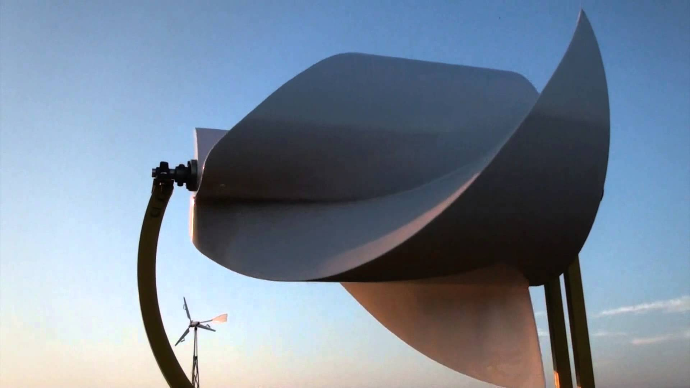
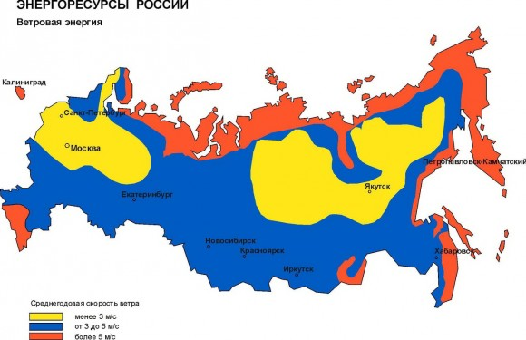

Никак не найду времени разгребать материалы, чтоб написать следующую статью по печке. И тут мне подкинули информацию, которой не могу не поделиться.

Сегодня речь пойдёт про зелёное электричество — энергию ветра. Конкретнее, про решение под названием "Ротор Онипко".

<!-- READMORE -->

Самым большим недостаком работы ветряков часто является нехватка стабильной силы ветра. Есть и другие недостатки: шумность, небезопасность быстро вращающихся лопастей, сложность обслуживания. Частично эти проблемы решают вертикальные ветряки: они менее шумные (но всё же шумные), чуть более безопасны и проще обслуживаются (вся механика находится снизу).

Среди разных моделей реализации вертикальных ветряков есть мой любимчик, который я думал собрать самому. Советским инженером К.А.Угринским ещё до войны был разработан профиль лопасти... Короче, не буду давать подробности. Они очень хорошо описаны [в этой статье](http://www.mirodolie.ru/node/2372 "Самодельный вертикальный ветряк"), там же есть реализация, готовые к скачиванию чертежи и море рассуждений.

Но есть и другие интересные решения. С каждым днём их появляется всё больше. У меня есть пара знакомых, которые утверждают, что их коллега вроде как разработал какую-то хитрую модель ветряка и сейчас идут испытания. Вроде как планируется даже крупносерийный выпуск. Посмотрим как у них дело пойдёт, может даже напишу потом про их изыскания.

Но сегодня расскажу про ротор изобретателя Алексея Онипко.

#### Ротор Онипко

В интернетах пишут, что ротор этой конструкции уже не единожды представлялся на разных конференциях и изобретательских конкурсах. И даже был признан лучшей разработкой в мире в сфере «зеленой» энергетики и удостоен гран-при «Зеленый Оскар» на Всемирном конкурсе по возобновляемой энергетике в Нюрнберге в 2013 году.

Главным преимуществом ветряка конструкции Онипко является возможность получения энергии даже при скорости ветра 0,1 м/с. Для сравнения, горизонтальные лопастные ветряки начинают нормально крутиться только при скорости 3 м/с. И, если что, среднегодовая скорость ветра по разным регионам России колеблется в пределах 2-6 м/с.

Таким образом, возможность получения энергии даже при скорости ветра 0,1 м/с — огромный плюс ротора Онипко. Вырабатываемая им энергия возрастает с увеличением скорости ветра примерно до 15 м/с. Затем коэффициент падает, что уже не важно, так как такие ветра бывают редко и не бывают долгими. В среднем трехметровый ротор за месяц может произвести около 300 киловатт-часов электроэнергии.

#### Преимущества и недостатки

Еще одно преимущество ротора Онипко — это его бесшумность. Турбина работает на скорости до 100 оборотов в минуту, а это очень мало по сравнению с обычными ветряками. Это значит, что ротор не просто тише — он ещё и безопасней. Как для владельцев и их детей, так и для разного рода живности типа птиц.

Бесшумность и эффективная работа турбины достигается засчёт особой формы ротора. Кстати, вычитал что эту форму испытывают в качестве гребного вала для применения на суднах и мини-ГЭС, а также в качестве измерителя скорости ветра — последнее красноречиво намекает на чувствительность турбины к ветру.

Но, как всегда бывает, есть в этой конструкции и недостатки. Первое, что бросается в глаза лично мне — необходимость ориентации ротора по ветру. Хотя, учитывая чувствительность турбины к ветру и низкий порог выработки энергии, простейшего механизма кручения может и хватить.

Вообщем, надо пробовать и экспериментировать.

На последок вот вам занимательное видео с участием ротора Онипко.

<iframe src="https://www.youtube.com/embed/dOnFZOh7FHk" width="560" height="315" frameborder="0" allowfullscreen="allowfullscreen"></iframe>
