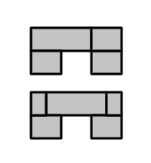
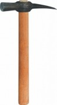

Ну вот мы и подошли к практике! Самое интересное уже позади: [чертежи](/chertyozh-pechi-i-printsipy-raboty/ "Чертёж нашей печи и принципы её работы"), [планирование](/kak-sdelat-chudo-pech-1-podgotovka/ "Как сделать чудо-печь. Часть 1: Подготовка"), [технология изготовления купола](/kupol-pechi/ "Как сделать чудо-печь. Часть 2: Купол печи").

В интернете полно материала по практике кладки печей и каминов: и статьи, и книги, и видео. При желании можно стать профессиональным печником не выходя из дома. Так что не вижу смысла писать просто ещё одну статью об этом. Больше хочется остановиться на самых важных моментах, которые мне самому были не до конца ясны, пока сам не сложил печь.

Постараюсь сильно не растекаться мыслью по древу: на это нет времени. Да и ваше время сэкономлю. Как говорится, буду краток.

#### 1\. Раствор должен быть чуть пожиже.

Удобнее всего мне было работать с раствором, который был чуть жиже чем я планировал изначально. Плюсы более жидкого раствора:

- его быстрее и проще замешивать,
- при этом замешивается он более равномерно,
- требуется меньше сил и времени, чтобы вывести каждый кирпич в уровень — достаточно пары-тройки лёгких постукиваний (резиновой киянкой). Легче удары — меньше влияния на соседние кирпичи, да и меньше шансов поломать кирпич.

В совокупности эти плюсы приводят к тому, что и работа идёт быстрее, и устаёшь меньше, и кладка получается ровнее. Да ещё и раствора меньше уходит. Так что поэкспериментируйте с количеством воды. Но тут главное не переборщить: помните, чем больше воды в растворе, тем сильнее он усыхает.

Кстати, мы использовали нестандартный способ замешивания раствора, но об этом лучше не рассказывать, а показывать. Посмотрите в кино, когда я его домонтирую.

#### 2\. Просеивать или не просеивать?

Принцип такой: если просеивать песок и глину, то ряды можно делать тоньше. Да — раствора уйдёт меньше, да — значит и печь быстрее высохнет, и усадка меньше будет. Но на просеивание уходит масса времени, да и с тонкими швами приходится больше париться по поводу ровности кладки.

Т.к. у нас кирпичи были все немного разного размера ([об этом уже писал](/kak-sdelat-chudo-pech-1-podgotovka/ "Как сделать чудо-печь. Часть 1: Подготовка")), я заключил, что нам нужна бóльшая толщина швов, чтобы нивелировать этот эффект. Это позволило не тратить время на просеивание. Да, периодически попадались камешки (из за этого даже пару кирпичей сломал). Но по факту был немалый прирост производительности, особенно в сочетании с более жидким раствором.

Плюс, более толстые швы прощают отсутствие опыта кладки печей. Хотя, конечно, решайте сами.

#### 3\. Перекрывающие кирпичи должны опираться с двух сторон!

Когда я работал над чертежом, я сам допустил ошибку, планируя опирать кирпич так, как на правой картинке сверху. Правильно так, как снизу.

Не утверждаю, что так делать нельзя. Можно. Собственно, я и не думал что так можно пока не увидел чертежи печей, где применяется именно такой способ. Но на практике, да ещё и в сочетании с более жидким раствором, это сильно усложняет жизнь. Это была одна из веских причин, по которой чертёж не совпадает с реальной кладкой нашей печи. Впрочем, лучше перечислить плюсы второго способа:

- Опирание надёжней, поэтому кирпич никуда не едет,
- не нужно временно класть на край перекрывающего кирпича другой, для равновесия (а значит он не будет мешаться под руками и не нужно убирать его потом, что экокомит массу времени и нервов),
- не нужно ждать высыхания раствора прежде чем класть на перекрывающий кирпич следующий.

Минусом такого способа перекрытия является то, что необходимо колоть кирпич для получения половинок (которые по краям от перекрывающего кирпича во втором случае). И это приводит нас к следующему пункту.

#### 4\. Колоть кирпич легко.

Собственно, на использование первого способа перекрытия меня натолкнула именно мысль, что колоть тяжело. И что я не смогу делать это без болгарки или другого подобного электроагрегата.

Ребята, это всё чушь. Кирпич колется просто, как раз-два-три:

- Берём кирпич,
- Берём молоток каменшика (картинка слева).
- Кладём кирпич на ровную жёсткую поверхность.
- Острой частью молотка каменщика намечаем бороздку по всей линии планируемого раскалывания. Чем аккуратнее и ровнее будет линия, тем аккуратнее и ровнее (а также с большей вероятностью, что в нужном месте) расколется кирпич. **Внимание! Будут лететь осколки и подниматься пыль. Лучше одеть защитные очки.**
- Кладём кирпич на край ровной жёсткой поверхности, чтобы край поверхности совпадал с линией раскола.
- Крепко удерживая кирпич, **слегка** бьём тупой частью молотка каменщика по висящей в воздухе половине. Бьём несколько раз, каждый раз в новом месте, постепенно наращивая силу удара.
- Если всё сделано правильно и кирпич не имеет внутренних трещин, мы получим две достаточно ровные половинки.

Из написанного может сложиться впечатление, что это долго и сложно. На самом деле к последним рядам кладки у меня на раскалывание кирпича уходило секунд 10-15. Удобнее и быстрее наколоть себе половинок (да и любых других необходимых форм) впрок, чтобы потом не отвлекаться.

В итоге наколоть половинок и использовать перекрытие вторым способом получается гораздо быстрее чем не колоть половинки и мучаться с первым.

#### 5\. Каждый кирпич ровняйте с помощью уровня!

Сначала мне казалось, что это долгое и нудное занятие, которое только отнимает время. Но по факту если использовать более жидкий раствор — времени тратиться минимум. Повторюсь, пара лёгких постукиваний киянкой.

Кстати, побочный эффект от использования уровня: тратиться меньше раствора.

#### 6\. Дымоходы должны быть максимально гладкими!

Заравнивайте все внутренние неровности и швы. Времени на это практически не тратится, но на будущую тягу печи это влияет очень сильно.

#### 7\. Используйте прокладки для печных дверей!!!

Последний по счёту, но не по важности совет. Мы им пренебрегли: при лепке купола мы сделали так, что печная дверца соприкасается с куполом. Это была наша самая большая ошибка.

Дело в том, что при топке печная дверца сильно нагревается (у нас даже докрасна) и из-за этого существенно увеличивается в размерах. Высохший глинопесчаный раствор тоже увеличивается при нагреве, но это увеличение столь мало, что можно сказать его нет совсем. В итоге получается, что дверка распирает окружающую глину. В лучшем случае это приведёт лишь к тому, что окружающий дверку раствор раскрошится (вокруг дверки появится щель). В худшем (нашем случае) в дополнение к появлению щели — треснет кладка.

Ничего критичного, печью можно пользоваться, но при погоде, способствующей ухудшению тяги, через трещину на куполе слегка сифонит дым. А вокруг дверки образовалась щель До 2-х сантиметров (в самом большом месте)! Сам бы не поверил, если бы не видел своими глазами.

Чтобы избежать того, что придётся делать нам (лёгкий ремонт купола и косметику навести), не поскупитесь и сделайте прокладку между дверкой и куполом (или кирпичной кладкой). Топочная дверка не должна соприкасаться с глиной или кирпичами! Повторюсь, щель до 2-х сантиметров, так что не скупитесь и обматывайте вашу дверку как следует.

Для этого можно использовать либо асбестовый шнур, либо специальные прокладки из фольги и минеральной ваты. Что лучше — не знаю. Надо пробовать.

#### На сегодня всё.

Всё, время кончилось. Не успел рассказать всё, что планировал, так что ждите продолжения.
