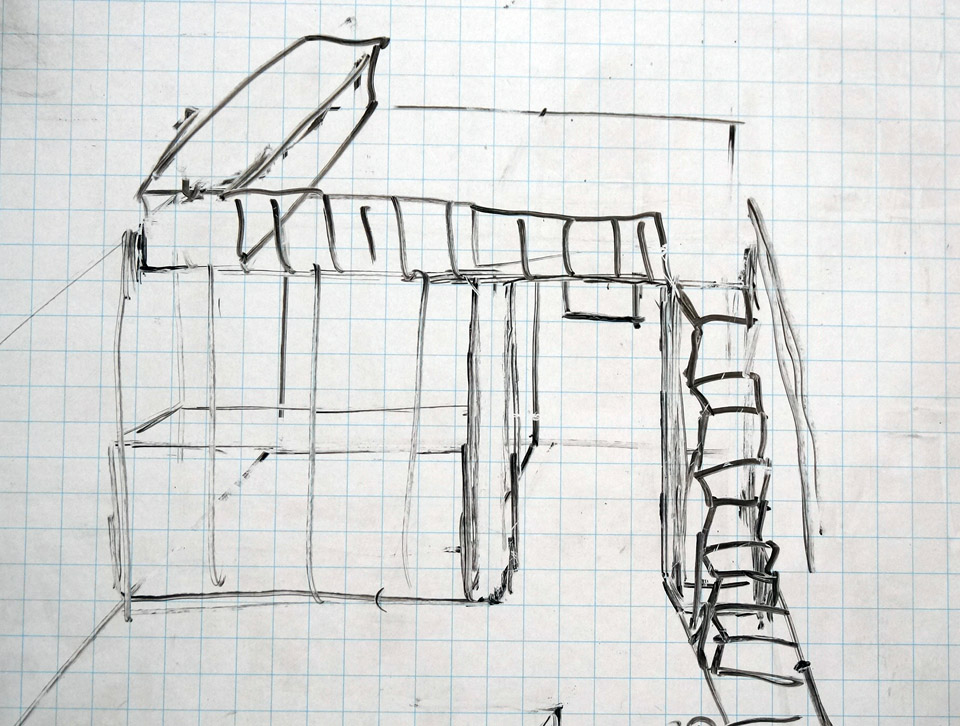

Все вы давно ждёте момента, когда же я расскажу про нашу планировку. Этот волнительный час настал!

Ну, почти... :)

А почему почти — читайте дальше.

**Внимание! Много больших фотографий!**

<!-- READMORE -->

Я не просто так рассказывал [про микродома](/planirovka-chast-1-vertikalnoe-myshlenie-i-ideya-mikrodomov/) и дал [21 совет по оптимизации пространства дома](/planirovka-chast-2-idei-optimizatsii-i-21-sovet/). Сделал я это, конечно, чтобы познакомить вас с информацией о микродомах. Но была и другая причина — я тянул время! :)

А тянул время я потому, что мы с Катей долго не могли придти к планировке, которая бы устроила нас обоих. Признаюсь честно, к таковой мы не пришли до сих пор. Но мы провели несколько этапов оптимизации и пришли к варианту, который нравится нам на 90%. Есть в нём недостатки, но как обойдём их — пока окончательно не решено. Несмотря на это, считаю важным и нужным ознакомить вас с нашим процессом. Уверен, многим он будет очень полезен.

Сразу оговорюсь: **не считаю, что наша методика идеальна и подойдёт всем**. У каждого свои запросы, свои условия и предпочтения. Наш процесс решает наши задачи в соответствии с нашими требованиями. У вас же требования могут быть иными, а с другими входными данными процесс может пойти в совершенно другом направлении.

Также скажу, что **неплохо для начала повдохновляться** — посмотреть фотографии и видео с различными планировками, разными конфигурациями расположения мебели. Подсмотрите те варианты, которые нравятся вам, почерпните идеи, зарядитесь, определитесь с общей концепцией, сформулируйте требования. Ну а дальше можно подойти системно и тщательно продумать своё будущее жилище.

## Этап 1. Габариты и "коридоры"

Первое, что стоит сделать — это **определиться с предметами мебели и другими объектами, которые вам необходимы**. Записывайте всё: и кровать, и стулья, и лестницы, и входную дверь, и ванну, и всё остальное. Причём нужно сразу определиться во-первых **с габаритами** каждого объекта, и, во-вторых, **с минимальным "коридором"**, который необходим для удобного доступа и взаимодействия с объектом.

**Пример 1:** рабочий стол с габаритами 100х60 см, перед ним нужно место шириной минимум 50 см, чтобы к нему подходить и сидеть за ним. **Пример 2:** шкаф-купе для одежды габаритами 60 см в ширину и от 40 см до бесконечности в длину. Перед ним нужно минимум 70 см.

В примере 1 приведены габариты стандартного стола, который продаётся в любом мебельном магазине. Точно так же можно отталкиваться и от стандартных габаритов любой продаваемой в магазинах мебели. Можно как целиком полагаться на них, так и просто ориентироваться, а потом уже проектировать мебель полностью под себя и свои размеры. Но при этом помнить, что различные детали для мебели изготавливают стандартных размеров. Мы используем промежуточный вариант: часть мебели будем приобретать, часть — делать сами.

Теперь по "коридорам". Обратите внимание: перед столом нужно минимум 50 см. Этот размер я вычислил экспериментально. При таком размере "коридора" стул очень ограниченно выдвигается, но сидеть вполне комфортно. Если же у стола отсутствуют ножки (например, он вмонтирован в стену), то и садиться за стол вполне удобно. Ну а если речь о столе для работы стоя — а я хочу сделать что-то вроде трансформера, чтобы можно было работать и сидя, и стоя — то вообще не возникает никаких вопросов.

> Зачем нужен стол для работы стоя — можно почитать [здесь](http://planet-standup.ru/) и [здесь](https://vk.com/planet_standup), а об опыте пользования таким столом — [здесь](https://megamozg.ru/post/4562/) и [здесь](http://mastersbox.com/zachem-ya-vstal-rabota-stoya/). Если поищите сами, найдёте массу материала на эту тему.

У шкафа же коридор - минимум 70 см. Эта цифра тоже взята не с потолка: мы определили её для себя опытным путём. Разумеется, это минимум. При возможности — лучше увеличить эту цифру. Но тогда вырастет и размер вашего дома со всеми вытекающими побочными эффектами в виде дополнительных затрат на стройку: как денег, так и времени.

Если затраты вас не пугают, можете руководствоваться не минимумами, а "среднемумами". 120 см - очень комфортная ширина и для лестницы, и для проходов, так что подойдёт и для стола, и для шкафа. **Важная деталь: когда выбираете минимумы, ориентируйтесь на самого крупного и высокого человека в семье.**

По завершении первого этапа у вас должен быть **список мебели и предметов, с габаритами и необходимыми "коридорами"**. Если сложить их площадь, то уже можно понять примерную квадратуру вашего будущего жилища. Разумеется, в процессе проектирования она может измениться как в большую, так и в меньшую сторону.

## Этап 2. Тетрис и решение уравнения с миллионом неизвестных

Думаю, многие из вас играли в "Тетрис". Теперь у вас есть возможность поиграть в него той мебелью, список которой у вас составлен на прошлом этапе. Как именно вы это будете делать — решать вам. Есть четыре варианта:

- Рисовать плоские планы на бумаге, маркерной доске или в какой-либо векторной программе (Adobe Illustrator, Corel Draw, Inkscape и др.).
- Спроектировать объёмные модели в какой-либо программе для 3D-моделирования. Например, Sketchup или ArchiCAD.
- Сделать объёмные модели мебели из бумаги или других материалов и поиграться с ними.
- Подвигать реальную мебель в вашем нынешнем жилище, чтобы визуально представить будущий дом.

Можно идти по этим пунктам последовательно, можно в обратном порядке, можно хаотично — как удобнее вам, ведь это крайне творческий процесс. Обязательно **купите удобный блокнот: в твёрдой обложке, с пружиной** (чтоб листы можно было полностью загибать и они не мешали, а также чтоб можно было их вырывать), **и листочками в клетку** (клетка - будет метр, полметра, два метра - как захотите). Нам удобно использовать блокнот 15х10 см с 5 мм клеткой. Также неплохо приобрести самую дешёвую маркерную доску. Мы купили даже не доску, а маркерную картонку 34х48 см всего за 250 рублей и она оказалась очень удобной. Можно вдвоём сесть на диван или даже лечь в кровать (короче, принять любое удобное положение), положить эту "доску" на коленки и размышлять вместе, делая зарисовки. Наша доска двухсторонняя, причём одна сторона в клетку (1 см х 1 см), а другая - просто белая.

> Важный момент: вариантов расположения мебели бесчисленное множество. Поэтому ваша задача как можно скорее снизить в этом уравнении количество неизвестных, для чего ввести в уравнение "константы", ограничения.

Изначально я взял в качестве константы внутреннюю ширину дома в 3 метра. Исходил из стандартной длины пиломатериала в 4 метра для балок перекрытия (3 м. помещение + ширина двух стен + свесы крыши с двух сторон < 4 м.). Это именно то, что я называю технологичностью: материал проще (а значит дешевле) перевезти, меньше пилить, нет перерасхода. Если пользоваться 4-хметровой доской для организации, например, 5-метрового перекрытия, то нужно сращивать доски (перерасход на нахлёсты), плюс использовать доску или брус большего сечения (опять перерасход), плюс желательно где-то около центра опирать перекрытие на столбы или стену (этого хотелось избежать, почему - объясню позже). Ну а если же рассчитывать на 6-тиметровый пиломатериал, то сразу утыкаешься в массу сложностей по его транспортировке.

Введение ограничения в три метра сразу предоставило нам замечательный плюс. Дом, который мы сейчас снимаем, имеет 3.5 метра внутренней ширины. И у нас появилась возможность визуально отделить 50 см помещения (развесили на растяжках одеяла и простыни), после чего подвигать мебель, либо её заменители, располагая как в будущем доме. Это дало массу вдохновения и мы в короткое время определились с первой планировкой.

## Планировка номер раз

Стоит сказать, что параллельно планировке я продумывал и каркас. В этом варианте толщина стен составляет 10 см. Сразу оговорюсь, что эволюция конструкции каркаса нашего домика — большая и важная тема, и я напишу про это отдельную статью. Но вернёмся к планировке. Одна клетка - 25 см х 25 см площади дома. Размер дома 6х3 метра.

1. кухонная поверхность
2. душ
3. стиральная машина
4. компостный туалет
5. рабочий стол. Огромный, шириной 2 метра.
6. кровать
7. диванчик
8. шкаф

Почему-то на кухне не нарисован столик. Предполагается наличие хранилища внутри кровати (6). Диванчик (7) должен раскладываться, образуя кровать для гостей. Учитывая очень ограниченное место, хранить вещи практически негде. Именно поэтому предполагалось сделать утеплённую мансарду высотой чуть больше метра, на которой хранить сезонную одежду и обувь. Т.е. делается сплошное перекрытие (потолок 240 см), в котором оставляется люк. Подняться на мансарду можно с помощью лестницы, расположенной на стенке санузла (ниже компостного туалета), с доступом из коридора.

**Плюсы:** Экстремальная простота. Мансарду не обязательно утеплять сразу - при отсутствии средств это мероприятие можно отложить. Кухня соседствует с санузлом, сэкономим на трубах водоснабжения и канализации. **Минусы:** Самый главный минус - это теснота как физическая, так и визуальная. К тому же если не утеплять мансарду сразу, то придётся утеплять и перекрытие, а это перерасход средств. Также к минусу Катя отнесла отсутствие полноценной ванны.

Малая ширина позволяла существенно оптимизировать технологию строительства (напомню, минимальная стоимость и технологичность — [основные заданные условия](/planiruem-buduschuyu-stroyku/)). Можно было на земле собрать две торцевые стены и 9 "чёртиков", т.е. конструкций, каждая из которых состоит сразу из двух стоек стен, балки пола, балки перекрытия и стропильной пары. А потом просто поднять эти стены и чёртики, соединить, разукосить, т.е. получить готовый каркас за несколько дней. Не понаслышке знаю, как сложно (а значит и долго) работать на высоте с балками перекрытия и стропилами. Вариант с чёртиками сводит работу на высоте к минимуму, а значит существенно экономит время.

Этот вариант дома был построен мной в Sketchup и детально проанализирован. Мне пришла в голову отличная идея: поменять санузел и кухню местами. Таким образом можно было визуально увеличить пространство, объединив "кухню" со "спальней" в одно помещение. При желании можно было бы и отказаться от дивана на кухне, ведь можно сидеть и на кровати. Но диван нам нужен, т.к. мы знаем насколько он важен для отдыха (это поймут лишь те, у кого его долгое время не было).

Катя выдвинула новое требование: ванна вместо душа. Плюс, мы взвесили все за и против, и решили что хотим разделить наши рабочие пространства (два небольших рабочих стола вместо одного огромного). Покрутили-повертели варианты расположения, и поняли, что без увеличения внутренней ширины до 3.5 метров не обойтись. Так родилась следующая планировка.

## Планировка номер два

1. входная дверь (между точками 120 см)
2. окна (3 штуки). Предполагается наличие 4-го небольшого окошка в санузле.
3. кровать
4. диван
5. столик (мы его уже даже купили, икеевский площадью 55х55, высотой 45 см)
6. мой рабочий стол (огромный, 150х70 см)
7. кухня
8. санузел (снизу ванна, справа стиральная машина, слева компостный туалет)
9. шкаф-купе.

Чёрная полоска, протянувшаяся от "южной" стены к кухне левее шкафа-купе (9) — это доски чернового пола. Левее - они 4-хметровые, правее - чуть меньше двух метров. Юг условный, как будет повёрнут дом к Солнцу - вопрос для нас вторичный.

Толщина стен также 10 см. Стоит отметить очень примерную планировку всей "южной" стены . Если укоротить рабочий стол и дверь нарисовать не 120, а 90 см, то шкаф-купе может стать длиной хоть в 4 метра. Правда, нужно не забыть про зону прихожей. Катино рабочее место предполагается разместить под "восточным" окном, ей будет достаточно небольшого подъёмного столика и полочек. Кухня шириной 1.6 метра, но на случай если этого будет мало, можно сделать небольшой столик (он нарисован на "северной" стене между кухней (7) и диваном (4) ). В этом варианте также предполагалось наличие утеплённой мансарды и лестницы с люком (расположение люка - на оси между дверью и северным окном).

Нам этот вариант очень нравится, и его плюсы по сравнению с первым очевидны: существенно просторней, больше места для хранения.

Но когда мы стали размышлять над тем, как этот проект можно оптимизировать, первое что пришло в голову — отказаться от мансарды. Ну а коли мы отказываемся от такого большого хранилища, его нужно как-то компенсировать. И тут нам на помощь пришли микродома с их полками и антресолями. Чтобы место не пропадало зря, я предложил такое расположение антресолей (антресоли - закрашенные области):

Обратите внимание, внутреннее пространство уже равно трём метрам в ширину и чуть больше 5.5 м в длину. Это потому, что я передумал каркас и толщина стен стала 20 см (15 см каркас + обшивка доской толщиной 2.5 см с двух сторон).

Но Катю этот вариант не устроил. По её мнению, антресоли загромождают пространство. Сказала — давай искать другие решения. Что поделаешь, начали искать. И нам пришло в голову сделать вместо кучи антресолей — один лофт. Типичное решение для микродомов.

Выглядеть он должен примерно так:

Разумеется, лестница — это не просто лестница. Это такой криволинейный шкаф с множеством полочек, а первые пару ступенек одновременно служат сиденьями для прихожей. Высота от пола до балок лофта - 190-200 см (мой рост 182 см). От поверхности лофта до перекрытия - 110 см. Выпирающая часть в левой части лофта на предыдущей картинке - это увеличенная высота потолка над ванной. Это было моё требование, т.к. с моим ростом принимать душ в 2-хметровом пространстве - занятие не из приятных.

Плюсы лофта, которые приходят в голову:

- существенно больше места
- можно сделать гостевую или даже хозяйскую спальню - а это освободит очень много места в жилой комнате
- можно сделать детскую игровую зону

Стоит отметить, что Катя предложила поменять местами кухню и шкаф-купе (шкаф - в жилую комнату, а кухню - под лофт). Лично мне это решение не очень нравится, т.к. это 1) визуально уменьшит размер жилого помещения (по последней картинке можно увидеть как будет схематично выглядеть и кухня, и шкаф-купе), 2) увеличит длину водопроводных и канализационных труб и 3) лишит возможности отделять коридорчик под лофтом шторкой — ведь так он превращается в гардеробную, давая возможность переодеться даже в присутствии дома гостей. Так что по этому пункту мы пока не приняли окончательного решения.

Ещё у меня вызывает вопрос увеличившееся пространство над жилой комнатой: оно стало не 240 см, а 330 см. Эта цифра складывается из высоты до балок лофта в 200 см, затем балки+настил 15+5 см, затем 110 см высоты лофта. Топить этот воздух - дополнительные затраты. Но опускание потолка в этой зоне - усложнит конструкцию (дом будет строиться дольше) и увеличит необходимое количество утеплителя (увеличение стоимости дома). Пожалуй, этот вопрос самый главный. И ответ на него пока в процессе.

## Процесс

Мы с Катей двигались по пунктам с одной стороны хаотично, с другой последовательно. Мы то рисовали эскизы в блокноте, то развешивали одеяла и простыни, разграничивая пространство, то размышляли за маркерной доской, то бродили по построенной в Sketchup 3D-модели дома, то опять садились за маркерную доску. Бывает, я долго ворочаюсь, не могу заснуть, а потом беру блокнот с ручкой и размышляю, рисуя эскизы. Единственное, чего мы ещё не делали — бумажную модель будущего дома с мебелью. Её мы отложили на потом, когда определимся.

Короче, процесс идёт. Говорить, что это последние варианты — рано. Может быть, вы дадите несколько дельных советов, которые натолкнут нас на какие-то идеи оптимизации. А может, мы решим полностью переделать планировку. В любом случае, до начала стройки ещё масса времени и всё ещё может измениться - в том числе и технология строительства. Тем более что мы хотим на всякий случай спроектировать ещё один вариант домика с габаритами 2.5х6 метра, чтобы его можно было транспортировать — ведь это предоставляет массу бонусов, хоть и отнимает пространство...посмотрим!

Главное одно - я показал как мы размышляем над планировкой. Повторюсь, не утверждаю что наш процесс идеален, но он имеет право на существование и кому-то поможет сэкономить время и нервы. А на сегодня, пожалуй, хватит. Статья и так получилась объёмной.

До скорой встречи!
