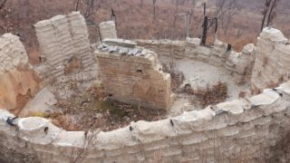
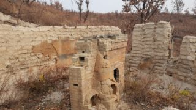
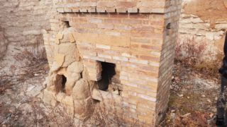

Надеюсь, вы прочитали нашу историю и знаете, что наш экодом был уничтожен [лесным пожаром](/fire/). Всё, что осталось - это стены и печь.

С того момента прошло уже три с половиной года, и я был уверен, что стены уже разрушились под воздействием дождей и ветра. Но оказалось, они стоят!

<!-- READMORE -->

Мы возвели [наши стены](/stroim-iz-meshkov-s-gruntom/) с некоторым нарушением технологии. По правилам, соотношение глины к песку должно быть в пределах 1 к 2-4 в зависимости от свойств глины. Мы в целях экономии времени использовали грунт без какой либо обработки. В нём соотношение глина/песок было примерно 1/8, и я считал, что это соотношение будет работать, если хорошо защитить его от влаги и ветра крышей и штукатуркой. И практика показала, что в этом я был прав.

Однако, я был уверен, что если оставить такие стены в открытом виде, то они разрушатся в течение максимум 2-3 лет. С удовольствием вынужден признать, что тут я ошибся.

Буквально вчера мне прислали фотографии руин нашего дома в нынешнем их состоянии. Удивительно, но стены стоят в почти неизменном состоянии!

Для сравнения посмотрите на [состояние дома сразу после пожара](/fire/).

Да, верхушки стен изрядно размыты дождями а плоскости сточены эрозией. Но стены-то стоят! Лично для меня это сюрприз. Я был уверен, что сейчас остатки от дома представляют из себя просто кучи грунта. Действительно разрушились только столбики между окнами с правой стороны.

Также удивительно, что печь не разобрана полностью. Кирпичи изъяты только из трубы и второго колпака.

Думаю, эта информация будет полезна тем, кто уже построил или ещё только размышляет о строительстве дома из мешков. Думаю, вопрос о том, надёжна ли эта технология, можно считать закрытым, если даже стены, построенные с её нарушением, не разрушились за 3 года. Укрытые от дождя и ветра крышей и штукатуркой, они могут стоять десятилетиями. Ну а если в этих стенах жить и следить за ними, то веками стоять будут.
